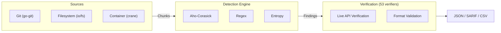

# Leakwatch

> Next-generation secret scanning platform — fast, accurate, open source.

**Leakwatch** is a high-performance security tool that detects, verifies, and reports leaked secrets (API keys, passwords, certificates) in codebases, Git histories, and container images.

---

## Why Leakwatch?

| Feature | Leakwatch | TruffleHog | Gitleaks |
|---------|-----------|------------|----------|
| **License** | MIT | AGPL-3.0 | MIT* |
| **Secret Verification** | Yes (53 verifiers) | Yes | No |
| **Container Scanning** | Yes | Yes | No |
| **Aho-Corasick** | Yes | Partial | No |
| **Entropy Analysis** | Hybrid | Yes | Filter |
| **YAML Custom Rules** | Yes | No (Go) | TOML |
| **SARIF Output** | Yes | Yes | Yes |

**What makes Leakwatch different:**
- **Verification + MIT license** — A unique combination in the open source world
- **84% verification coverage** — 53 of 63 detectors have live API or format validation verification
- **Hybrid detection engine** — Low false positives with Aho-Corasick + Regex + Entropy
- **Easy extensibility** — YAML for simple rules, Go plugin for advanced ones
- **Single binary, zero dependencies** — Runs on every platform

---

## Quick Start

### Installation

```bash
# Homebrew (macOS/Linux)
brew install cemililik/tap/leakwatch

# Go install
go install github.com/cemililik/leakwatch@latest

# Docker
docker run --rm -v $(pwd):/scan ghcr.io/cemililik/leakwatch:latest scan fs /scan

# Binary download
curl -sSfL https://github.com/cemililik/Leakwatch/releases/latest/download/leakwatch_$(uname -s)_$(uname -m).tar.gz | tar xz
```

### Usage

```bash
# Scan filesystem
leakwatch scan fs /path/to/project

# Scan Git repository (full history)
leakwatch scan git /path/to/repo
leakwatch scan git https://github.com/org/repo.git

# Scan container image
leakwatch scan image nginx:latest

# Show only verified secrets
leakwatch scan git . --only-verified

# Output in SARIF format
leakwatch scan fs . --format sarif --output results.sarif

# Scan since last commit (for CI/CD)
leakwatch scan git . --since-commit HEAD~1

# Scan AWS S3 bucket
leakwatch scan s3 my-bucket --prefix config/

# Scan Google Cloud Storage bucket
leakwatch scan gcs my-bucket --prefix secrets/

# Scan Slack workspace
leakwatch scan slack --token xoxb-... --channels general,engineering

# Scan multiple repos in parallel
leakwatch scan repos https://github.com/org/repo1.git https://github.com/org/repo2.git --parallel 5

# Include remediation guidance (rotation steps, doc links)
leakwatch scan fs . --remediation
```

---

## Supported Secret Types (63 detectors)

| Category | Detector | ID | Severity |
|----------|----------|----|----------|
| **Cloud — AWS** | Access Key ID | `aws-access-key-id` | Critical |
| **Cloud — GCP** | Service Account Key | `gcp-service-account` | Critical |
| **Cloud — Azure** | Storage Connection String | `azure-storage-key` | Critical |
| **Cloud — Azure** | Entra ID Client Secret | `azure-entra-secret` | Critical |
| **Cloud — Cloudflare** | API Token | `cloudflare-api-token` | Critical |
| **Cloud — DigitalOcean** | Personal Access Token | `digitalocean-token` | Critical |
| **Cloud — Heroku** | API Key | `heroku-api-key` | Critical |
| **Cloud — Vercel** | API Token | `vercel-token` | High |
| **AI/ML** | OpenAI API Key | `openai-api-key` | Critical |
| **AI/ML** | Anthropic API Key | `anthropic-api-key` | Critical |
| **AI/ML** | Hugging Face Token | `huggingface-token` | Critical |
| **AI/ML** | DeepSeek API Key | `deepseek-api-key` | Critical |
| **DevTools** | GitHub PAT | `github-token` | Critical |
| **DevTools** | GitHub OAuth Token | `github-oauth-token` | Critical |
| **DevTools** | GitLab PAT | `gitlab-pat` | Critical |
| **DevTools** | Bitbucket App Password | `bitbucket-app-password` | Critical |
| **DevTools** | NPM Token | `npm-token` | High |
| **DevTools** | PyPI Token | `pypi-api-token` | High |
| **DevTools** | RubyGems Key | `rubygems-api-key` | High |
| **DevTools** | Docker Hub PAT | `dockerhub-pat` | Critical |
| **CI/CD** | CircleCI Token | `circleci-token` | High |
| **CI/CD** | Terraform Cloud Token | `terraform-cloud-token` | Critical |
| **Communication** | Slack Bot Token | `slack-token` | Critical |
| **Communication** | Slack Webhook | `slack-webhook` | High |
| **Communication** | Discord Bot Token | `discord-bot-token` | Critical |
| **Communication** | Telegram Bot Token | `telegram-bot-token` | High |
| **Communication** | MS Teams Webhook | `teams-webhook` | High |
| **Email** | SendGrid API Key | `sendgrid-api-key` | Critical |
| **Email** | Mailgun API Key | `mailgun-api-key` | Critical |
| **Email** | Postmark Server Token | `postmark-server-token` | High |
| **Payment** | Stripe Live Key | `stripe-api-key-live` | Critical |
| **Payment** | Stripe Test Key | `stripe-api-key-test` | High |
| **Payment** | Coinbase API Key | `coinbase-api-key` | Critical |
| **Database** | Connection String (PG/MySQL/MongoDB) | `database-connection-string` | Critical |
| **Database** | Redis Connection | `redis-connection-string` | Critical |
| **Database** | Snowflake Credentials | `snowflake-credentials` | Critical |
| **Database** | RabbitMQ Connection | `rabbitmq-connection-string` | Critical |
| **Database** | Supabase Service Key | `supabase-service-key` | Critical |
| **Infrastructure** | FTP/SFTP Credentials | `ftp-credentials` | Critical |
| **Infrastructure** | LDAP Credentials | `ldap-credentials` | Critical |
| **Infrastructure** | Databricks PAT | `databricks-token` | Critical |
| **Identity** | JWT | `jwt` | High |
| **Identity** | Private Key (RSA/SSH/PGP) | `private-key` | Critical |
| **Identity** | Okta API Token | `okta-api-token` | Critical |
| **Identity** | Auth0 Management Token | `auth0-management-token` | Critical |
| **Identity** | HashiCorp Vault Token | `hashicorp-vault-token` | Critical |
| **Monitoring** | Datadog API Key | `datadog-api-key` | Critical |
| **Monitoring** | Grafana API Key | `grafana-api-key` | High |
| **Monitoring** | PagerDuty API Key | `pagerduty-api-key` | High |
| **Monitoring** | New Relic API Key | `newrelic-api-key` | High |
| **Monitoring** | Sentry Auth Token | `sentry-token` | High |
| **Security** | Snyk API Key | `snyk-api-key` | High |
| **Security** | Twilio API Key | `twilio-api-key` | Critical |
| **Secrets Mgmt** | Doppler Service Token | `doppler-token` | Critical |
| **Feature Flags** | LaunchDarkly SDK Key | `launchdarkly-sdk-key` | High |
| **Code Quality** | SonarCloud Token | `sonarcloud-token` | High |
| **SaaS** | Shopify Access Token | `shopify-access-token` | Critical |
| **SaaS** | Notion Token | `notion-token` | High |
| **SaaS** | Linear API Key | `linear-api-key` | High |
| **SaaS** | Figma PAT | `figma-pat` | High |
| **SaaS** | Airtable PAT | `airtable-pat` | High |
| **Generic** | Generic API Key | `generic-api-key` | Medium |
| **Custom** | YAML-defined rules | user-defined | user-defined |

### Verification Coverage (53/63 — 84%)

| Verification Type | Detectors | Description |
|-------------------|-----------|-------------|
| **Live API Verification** | `aws-access-key-id`, `github-token`, `github-oauth-token`, `gitlab-pat`, `slack-token`, `openai-api-key`, `anthropic-api-key`, `deepseek-api-key`, `huggingface-token`, `sendgrid-api-key`, `mailgun-api-key`, `postmark-server-token`, `stripe-api-key-live`, `stripe-api-key-test`, `digitalocean-token`, `cloudflare-api-token`, `heroku-api-key`, `vercel-token`, `npm-token`, `pypi-api-token`, `rubygems-api-key`, `dockerhub-pat`, `circleci-token`, `terraform-cloud-token`, `discord-bot-token`, `telegram-bot-token`, `sentry-token`, `pagerduty-api-key`, `newrelic-api-key`, `grafana-api-key`, `datadog-api-key`, `snyk-api-key`, `twilio-api-key`, `doppler-token`, `launchdarkly-sdk-key`, `sonarcloud-token`, `shopify-access-token`, `notion-token`, `linear-api-key`, `figma-pat`, `airtable-pat`, `okta-api-token`, `auth0-management-token`, `databricks-token`, `bitbucket-app-password`, `coinbase-api-key`, `supabase-service-key`, `hashicorp-vault-token` | API call to provider to confirm active/inactive status |
| **Format Validation** | `jwt`, `azure-storage-key`, `azure-entra-secret`, `gcp-service-account`, `snowflake-credentials` | Structural check (decode, parse, expiry) without network call |
| **Not Verifiable** | `private-key`, `generic-api-key`, `database-connection-string`, `redis-connection-string`, `rabbitmq-connection-string`, `ftp-credentials`, `ldap-credentials`, `slack-webhook`, `teams-webhook`, `infura-api-key` | No public verification API or verification would cause side effects |

> **Can't find your secret type?** Leakwatch supports [YAML custom rules](docs/guides/custom-rules.md) — define your own detector in 5 lines of YAML without writing Go code.

---

## CI/CD Integration

### GitHub Actions

```yaml
- uses: cemililik/leakwatch-action@v1
  with:
    scan-type: git
    only-verified: true
    sarif-upload: true
```

### Pre-commit Hook

```yaml
# .pre-commit-config.yaml
repos:
  - repo: https://github.com/cemililik/Leakwatch
    rev: v0.1.0
    hooks:
      - id: leakwatch
```

---

## Configuration

```yaml
# .leakwatch.yaml
scan:
  concurrency: 8
  max-file-size: 10485760  # 10MB

detection:
  entropy:
    enabled: true
    threshold: 4.0

verification:
  enabled: true
  timeout: 10s

filter:
  exclude-paths:
    - "vendor/**"
    - "node_modules/**"
    - "**/*.lock"

output:
  format: json
  show-raw: false
```

---

## Architecture



Detailed architecture: [docs/architecture/03-ARCHITECTURE.md](docs/architecture/03-ARCHITECTURE.md)

---

## Documentation

### Architecture & Design

| Document | Description |
|----------|-------------|
| [Competitive Analysis](docs/architecture/01-COMPETITIVE-ANALYSIS.md) | Market analysis and positioning |
| [Technology Decisions](docs/architecture/02-TECHNOLOGY-DECISIONS.md) | Technology choices and rationale |
| [Architecture Design](docs/architecture/03-ARCHITECTURE.md) | Detailed architecture and interfaces |

### Standards

| Document | Description |
|----------|-------------|
| [Documentation Standards](docs/standards/00-DOCUMENTATION-STANDARDS.md) | Diagrams, formatting, and document rules |
| [Code Review Standards](docs/standards/01-CODE-REVIEW-STANDARDS.md) | Review process, checklists, finding classification |
| [Release and Distribution Standards](docs/standards/02-RELEASE-STANDARDS.md) | Version management, CI/CD, release checklist |
| [Development Standards](docs/standards/04-DEVELOPMENT-STANDARDS.md) | Code standards, testing, and CI/CD |

### Decisions (ADR)

| Document | Description |
|----------|-------------|
| [ADR Index](docs/decisions/README.md) | All architecture decisions |
| [ADR-0001](docs/decisions/ADR-0001-programlama-dili.md) | Programming language: Go |
| [ADR-0005](docs/decisions/ADR-0005-desen-eslestirme.md) | Pattern matching: Aho-Corasick hybrid |
| [ADR-0007](docs/decisions/ADR-0007-lisans.md) | License: MIT |

### Guides

| Document | Description |
|----------|-------------|
| [Getting Started](docs/guides/getting-started.md) | Installation, first scan, understanding output |
| [Configuration](docs/guides/configuration.md) | .leakwatch.yaml, environment variables, ignore files |
| [CI/CD Integration](docs/guides/ci-cd-integration.md) | GitHub Actions, GitLab CI, Jenkins, pre-commit |
| [Custom Rules](docs/guides/custom-rules.md) | YAML rule definitions, regex, entropy, keyword |
| [Container Scanning](docs/guides/container-scanning.md) | Docker/OCI image scanning, registry authentication |
| [Cloud Scanning](docs/guides/cloud-scanning.md) | AWS S3, GCS, parallel repo scanning |

### Planning

| Document | Description |
|----------|-------------|
| [Roadmap](docs/05-ROADMAP.md) | Phased development plan |

---

## Contributing

We welcome your contributions! Please see the [CONTRIBUTING.md](CONTRIBUTING.md) file.

```bash
# Set up the development environment
git clone https://github.com/cemililik/Leakwatch.git
cd Leakwatch
go mod download
go test ./...
```

---

## License

MIT License — see the [LICENSE](LICENSE) file for details.

---

## Status

> **Phases 1–8 are complete.** Leakwatch supports filesystem, Git, container, S3, and GCS scanning with 53 verifiers (84% coverage), multiple output formats, and CI/CD integration.

To track the project's progress, see the [Roadmap](docs/05-ROADMAP.md) document.
