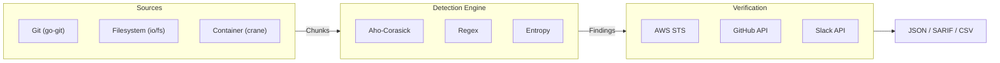

# Leakwatch

> Next-generation secret scanning platform — fast, accurate, open source.

**Leakwatch** is a high-performance security tool that detects, verifies, and reports leaked secrets (API keys, passwords, certificates) in codebases, Git histories, and container images.

---

## Why Leakwatch?

| Feature | Leakwatch | TruffleHog | Gitleaks |
|---------|-----------|------------|----------|
| **License** | MIT | AGPL-3.0 | MIT* |
| **Secret Verification** | Yes | Yes | No |
| **Container Scanning** | Yes | Yes | No |
| **Aho-Corasick** | Yes | Partial | No |
| **Entropy Analysis** | Hybrid | Yes | Filter |
| **YAML Custom Rules** | Yes | No (Go) | TOML |
| **SARIF Output** | Yes | Yes | Yes |

**What makes Leakwatch different:**
- **Verification + MIT license** — A unique combination in the open source world
- **Hybrid detection engine** — Low false positives with Aho-Corasick + Regex + Entropy
- **Easy extensibility** — YAML for simple rules, Go plugin for advanced ones
- **Single binary, zero dependencies** — Runs on every platform

---

## Quick Start

### Installation

```bash
# Homebrew (macOS/Linux)
brew install cemililik/tap/leakwatch

# Go install
go install github.com/cemililik/leakwatch@latest

# Docker
docker run --rm -v $(pwd):/scan ghcr.io/cemililik/leakwatch:latest scan fs /scan

# Binary download
curl -sSfL https://github.com/cemililik/Leakwatch/releases/latest/download/leakwatch_$(uname -s)_$(uname -m).tar.gz | tar xz
```

### Usage

```bash
# Scan filesystem
leakwatch scan fs /path/to/project

# Scan Git repository (full history)
leakwatch scan git /path/to/repo
leakwatch scan git https://github.com/org/repo.git

# Scan container image
leakwatch scan image nginx:latest

# Show only verified secrets
leakwatch scan git . --only-verified

# Output in SARIF format
leakwatch scan fs . --format sarif --output results.sarif

# Scan since last commit (for CI/CD)
leakwatch scan git . --since-commit HEAD~1

# Scan AWS S3 bucket
leakwatch scan s3 my-bucket --prefix config/

# Scan Google Cloud Storage bucket
leakwatch scan gcs my-bucket --prefix secrets/

# Scan Slack workspace
leakwatch scan slack --token xoxb-... --channels general,engineering

# Scan multiple repos in parallel
leakwatch scan repos https://github.com/org/repo1.git https://github.com/org/repo2.git --parallel 5

# Include remediation guidance (rotation steps, doc links)
leakwatch scan fs . --remediation
```

---

## Supported Secret Types

| Category | Examples | Verification |
|----------|----------|--------------|
| **AWS** | Access Key ID, Secret Access Key | Yes |
| **GitHub** | Personal Access Token, OAuth | Yes |
| **GCP** | Service Account Key, API Key | Planned |
| **Azure** | Storage Key, Connection String | Planned |
| **Slack** | Bot Token, Webhook URL | Yes |
| **Stripe** | API Key (live/test) | Planned |
| **Generic** | Private Key (RSA/SSH/PGP), JWT, Generic API Key | — |
| **Database** | Connection String (Postgres, MySQL, MongoDB) | Planned |

---

## CI/CD Integration

### GitHub Actions

```yaml
- uses: cemililik/leakwatch-action@v1
  with:
    scan-type: git
    only-verified: true
    sarif-upload: true
```

### Pre-commit Hook

```yaml
# .pre-commit-config.yaml
repos:
  - repo: https://github.com/cemililik/Leakwatch
    rev: v0.1.0
    hooks:
      - id: leakwatch
```

---

## Configuration

```yaml
# .leakwatch.yaml
scan:
  concurrency: 8
  max-file-size: 10485760  # 10MB

detection:
  entropy:
    enabled: true
    threshold: 4.0

verification:
  enabled: true
  timeout: 10s

filter:
  exclude-paths:
    - "vendor/**"
    - "node_modules/**"
    - "**/*.lock"

output:
  format: json
  show-raw: false
```

---

## Architecture



Detailed architecture: [docs/architecture/03-ARCHITECTURE.md](docs/architecture/03-ARCHITECTURE.md)

---

## Documentation

### Architecture & Design

| Document | Description |
|----------|-------------|
| [Competitive Analysis](docs/architecture/01-COMPETITIVE-ANALYSIS.md) | Market analysis and positioning |
| [Technology Decisions](docs/architecture/02-TECHNOLOGY-DECISIONS.md) | Technology choices and rationale |
| [Architecture Design](docs/architecture/03-ARCHITECTURE.md) | Detailed architecture and interfaces |

### Standards

| Document | Description |
|----------|-------------|
| [Documentation Standards](docs/standards/00-DOCUMENTATION-STANDARDS.md) | Diagrams, formatting, and document rules |
| [Code Review Standards](docs/standards/01-CODE-REVIEW-STANDARDS.md) | Review process, checklists, finding classification |
| [Release and Distribution Standards](docs/standards/02-RELEASE-STANDARDS.md) | Version management, CI/CD, release checklist |
| [Development Standards](docs/standards/04-DEVELOPMENT-STANDARDS.md) | Code standards, testing, and CI/CD |

### Decisions (ADR)

| Document | Description |
|----------|-------------|
| [ADR Index](docs/decisions/README.md) | All architecture decisions |
| [ADR-0001](docs/decisions/ADR-0001-programlama-dili.md) | Programming language: Go |
| [ADR-0005](docs/decisions/ADR-0005-desen-eslestirme.md) | Pattern matching: Aho-Corasick hybrid |
| [ADR-0007](docs/decisions/ADR-0007-lisans.md) | License: MIT |

### Guides

| Document | Description |
|----------|-------------|
| [Getting Started](docs/guides/getting-started.md) | Installation, first scan, understanding output |
| [Configuration](docs/guides/configuration.md) | .leakwatch.yaml, environment variables, ignore files |
| [CI/CD Integration](docs/guides/ci-cd-integration.md) | GitHub Actions, GitLab CI, Jenkins, pre-commit |
| [Custom Rules](docs/guides/custom-rules.md) | YAML rule definitions, regex, entropy, keyword |
| [Container Scanning](docs/guides/container-scanning.md) | Docker/OCI image scanning, registry authentication |
| [Cloud Scanning](docs/guides/cloud-scanning.md) | AWS S3, GCS, parallel repo scanning |

### Planning

| Document | Description |
|----------|-------------|
| [Roadmap](docs/05-ROADMAP.md) | Phased development plan |

---

## Contributing

We welcome your contributions! Please see the [CONTRIBUTING.md](CONTRIBUTING.md) file.

```bash
# Set up the development environment
git clone https://github.com/cemililik/Leakwatch.git
cd Leakwatch
go mod download
go test ./...
```

---

## License

MIT License — see the [LICENSE](LICENSE) file for details.

---

## Status

> **Phases 1–5 are complete.** Leakwatch supports filesystem, Git, container, S3, and GCS scanning with verification, multiple output formats, and CI/CD integration.

To track the project's progress, see the [Roadmap](docs/05-ROADMAP.md) document.
