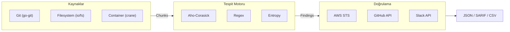

# Leakwatch

> Next-generation secret scanning platform — fast, accurate, open source.

**Leakwatch**, kod tabanlarında, Git geçmişlerinde ve container imajlarında sızan sırları (API anahtarları, parolalar, sertifikalar) tespit eden, doğrulayan ve raporlayan yüksek performanslı bir güvenlik aracıdır.

---

## Neden Leakwatch?

| Özellik | Leakwatch | TruffleHog | Gitleaks |
|---------|-----------|------------|----------|
| **Lisans** | MIT | AGPL-3.0 | MIT* |
| **Sır Doğrulama** | Evet | Evet | Hayır |
| **Container Tarama** | Evet | Evet | Hayır |
| **Aho-Corasick** | Evet | Kısmen | Hayır |
| **Entropi Analizi** | Hibrit | Evet | Filtre |
| **YAML Özel Kurallar** | Evet | Hayır (Go) | TOML |
| **SARIF Çıktı** | Evet | Evet | Evet |

**Leakwatch'ın farkı:**
- **Doğrulama + MIT lisansı** — Açık kaynak dünyasında benzersiz kombinasyon
- **Hibrit tespit motoru** — Aho-Corasick + Regex + Entropi ile düşük yanlış pozitif
- **Kolay genişletilebilirlik** — Basit kurallar için YAML, gelişmiş için Go plugin
- **Tek binary, sıfır bağımlılık** — Her platformda çalışır

---

## Hızlı Başlangıç

### Kurulum

```bash
# Homebrew (macOS/Linux)
brew install cemililik/tap/leakwatch

# Go install
go install github.com/cemililik/leakwatch@latest

# Binary indirme
curl -sSfL https://github.com/cemililik/Leakwatch/releases/latest/download/leakwatch_$(uname -s)_$(uname -m).tar.gz | tar xz
```

### Kullanım

```bash
# Dosya sistemi tara
leakwatch scan fs /path/to/project

# Git deposu tara (tüm geçmiş)
leakwatch scan git /path/to/repo
leakwatch scan git https://github.com/org/repo.git

# Container imajı tara
leakwatch scan image nginx:latest

# Sadece doğrulanmış sırları göster
leakwatch scan git . --only-verified

# SARIF formatında çıktı
leakwatch scan fs . --format sarif --output results.sarif

# Son commit'ten beri tara (CI/CD için)
leakwatch scan git . --since-commit HEAD~1
```

---

## Desteklenen Sır Türleri

| Kategori | Örnekler | Doğrulama |
|----------|----------|-----------|
| **AWS** | Access Key ID, Secret Access Key | Evet |
| **GitHub** | Personal Access Token, OAuth | Evet |
| **GCP** | Service Account Key, API Key | Planlanıyor |
| **Azure** | Storage Key, Connection String | Planlanıyor |
| **Slack** | Bot Token, Webhook URL | Evet |
| **Stripe** | API Key (live/test) | Planlanıyor |
| **Genel** | Private Key (RSA/SSH/PGP), JWT, Generic API Key | — |
| **Veritabanı** | Connection String (Postgres, MySQL, MongoDB) | Planlanıyor |

---

## CI/CD Entegrasyonu

### GitHub Actions

```yaml
- uses: cemililik/leakwatch-action@v1
  with:
    scan-type: git
    only-verified: true
    sarif-upload: true
```

### Pre-commit Hook

```yaml
# .pre-commit-config.yaml
repos:
  - repo: https://github.com/cemililik/Leakwatch
    rev: v0.1.0
    hooks:
      - id: leakwatch
```

---

## Yapılandırma

```yaml
# .leakwatch.yaml
scan:
  concurrency: 8
  max-file-size: 10485760  # 10MB

detection:
  entropy:
    enabled: true
    threshold: 4.0

verification:
  enabled: true
  timeout: 10s

filter:
  exclude-paths:
    - "vendor/**"
    - "node_modules/**"
    - "**/*.lock"

output:
  format: json
  show-raw: false
```

---

## Mimari



Detaylı mimari: [docs/architecture/03-ARCHITECTURE.md](docs/architecture/03-ARCHITECTURE.md)

---

## Dokümantasyon

### Mimari & Tasarım

| Belge | Açıklama |
|-------|----------|
| [Rekabet Analizi](docs/architecture/01-COMPETITIVE-ANALYSIS.md) | Pazar analizi ve konumlandırma |
| [Teknoloji Kararları](docs/architecture/02-TECHNOLOGY-DECISIONS.md) | Teknoloji seçimleri ve gerekçeleri |
| [Mimari Tasarım](docs/architecture/03-ARCHITECTURE.md) | Detaylı mimari ve arayüzler |

### Standartlar

| Belge | Açıklama |
|-------|----------|
| [Dokümantasyon Standartları](docs/standards/00-DOCUMENTATION-STANDARDS.md) | Diyagram, format ve belge kuralları |
| [Geliştirme Standartları](docs/standards/04-DEVELOPMENT-STANDARDS.md) | Kod standartları, test ve CI/CD |

### Kararlar (ADR)

| Belge | Açıklama |
|-------|----------|
| [ADR Dizini](docs/decisions/README.md) | Tüm mimari kararlar |
| [ADR-0001](docs/decisions/ADR-0001-programlama-dili.md) | Programlama dili: Go |
| [ADR-0005](docs/decisions/ADR-0005-desen-eslestirme.md) | Desen eşleştirme: Aho-Corasick hibrit |
| [ADR-0007](docs/decisions/ADR-0007-lisans.md) | Lisans: MIT |

### Planlama

| Belge | Açıklama |
|-------|----------|
| [Yol Haritası](docs/05-ROADMAP.md) | Fazlandırılmış geliştirme planı |

---

## Katkıda Bulunma

Katkılarınızı bekliyoruz! Lütfen [CONTRIBUTING.md](CONTRIBUTING.md) dosyasını inceleyin.

```bash
# Geliştirme ortamını kurun
git clone https://github.com/cemililik/Leakwatch.git
cd Leakwatch
go mod download
go test ./...
```

---

## Lisans

MIT License — detaylar için [LICENSE](LICENSE) dosyasına bakın.

---

## Durum

> **Proje geliştirme aşamasındadır.** Faz 1 (MVP) üzerinde çalışılmaktadır.

Projenin gidişatını takip etmek için [Yol Haritası](docs/05-ROADMAP.md) belgesine bakın.
