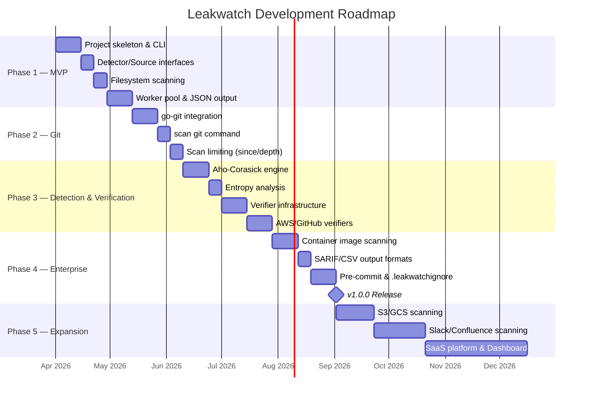

# Leakwatch - Phased Development Roadmap

> **Document Version:** 2.0
> **Date:** 2026-03-24
> **Status:** Active
> **Last Updated:** 2026-03-24

---

## 0. Current Status Summary

| Phase | Status | Version | Completion |
|-------|--------|---------|------------|
| Phase 1 — MVP | Completed | `v0.1.0` | 2026-03-24 |
| Phase 2 — Git | Completed | `v0.2.0` | 2026-03-24 |
| Phase 3 — Detection & Verification | Completed | `v0.3.0` | 2026-03-24 |
| Phase 4 — Enterprise | Completed | `v0.4.0` | 2026-03-24 |
| Phase 5 — Expansion (Short Term) | Completed | `v1.0.0` | 2026-03-24 |
| Phase 5 — Expansion (Mid/Long Term) | Planned | `v1.x.x` | — |

### Current Capabilities

- **5 scan sources:** Filesystem, Git history, Container image, AWS S3, Google Cloud Storage
- **10 detectors:** AWS, GitHub Token, Slack Token/Webhook, Stripe (live/test), JWT, DB Connection String, Private Key, Generic API Key
- **YAML custom rule support**
- **4 output formats:** JSON, SARIF, CSV, Table
- **Aho-Corasick pre-filtering engine**
- **Verifier infrastructure:** AWS STS and GitHub API verifiers (rate-limited, concurrent)
- **`.leakwatchignore`** and inline ignore (`# leakwatch:ignore`)
- **Pre-commit hook**, **GitHub Action**, **Docker image**, **Homebrew formula**
- **Parallel repo scanning** (`scan repos` command)
- **`--min-severity`, `--only-verified`, `--no-verify` flags**

---

## 1. Roadmap Overview

Leakwatch development is planned in 5 phases, each building on the previous one. Each phase produces a usable deliverable upon completion.

---

## 2. Phase 1: Minimum Viable Product (MVP) — COMPLETED

**Goal:** Build the core scan engine and CLI structure. A functional first version that can scan the local filesystem.

**Duration:** 4-6 Weeks | **Status:** Completed

### 2.1 Deliverables

| # | Task | Priority | Description |
|---|------|----------|-------------|
| 1.1 | Project skeleton | Critical | Project structure with `cobra-cli`, `go.mod` initialization |
| 1.2 | CLI infrastructure | Critical | `scan fs <path>` command, `--format`, `--output`, `--concurrency` flags |
| 1.3 | Configuration system | Critical | Viper integration, `.leakwatch.yaml` file reading, env var support |
| 1.4 | Detector interface and registry | Critical | `Detector` interface, `Register()`, `All()` mechanism |
| 1.5 | Source interface | Critical | `Source` interface, `Chunk` and `SourceMetadata` types |
| 1.6 | Filesystem source | Critical | `io/fs` based `FilesystemSource` implementation |
| 1.7 | Worker pool | Critical | Goroutine pool, jobs/results channels, context cancellation |
| 1.8 | Basic detectors | High | AWS Access Key ID, RSA/SSH Private Key, Generic API Key |
| 1.9 | JSON output formatter | High | `Formatter` interface, JSON implementation |
| 1.10 | Basic filtering | Medium | File size limit, extension filtering |
| 1.11 | Unit tests | High | >80% test coverage for all components |
| 1.12 | CI pipeline | High | GitHub Actions: test, lint, build |

### 2.2 Acceptance Criteria

- [x] `leakwatch scan fs /path/to/dir` command works
- [x] AWS Access Key ID, RSA Private Key are detected
- [x] Output is produced in JSON format
- [x] Worker count is configurable with `--concurrency` flag
- [x] Output can be written to file with `--output` flag
- [x] CI pipeline is green (test + lint + build)
- [x] Test coverage >80%

### 2.3 Exit Criteria

GitHub Release published with `v0.1.0` tag.

---

## 3. Phase 2: Git Integration and History Scanning — COMPLETED

**Goal:** Add the ability to scan Git repositories and their full commit histories.

**Duration:** 3-4 Weeks | **Status:** Completed

### 3.1 Deliverables

| # | Task | Priority | Description |
|---|------|----------|-------------|
| 2.1 | go-git integration | Critical | Add dependency, open local/remote repos |
| 2.2 | `scan git` command | Critical | `scan git <url_or_path>` command |
| 2.3 | Git source (GitSource) | Critical | Navigate commit history, read files from each commit |
| 2.4 | Commit metadata | High | Add commit hash, author, date, branch info to findings |
| 2.5 | Scan limiting | High | `--since`, `--depth`, `--branch` flags |
| 2.6 | Remote repo cloning | High | HTTP(S) and SSH authentication support |
| 2.7 | Diff-based scanning | Medium | Scan only changed files (CI/CD optimization) |
| 2.8 | Performance tests | Medium | Large repo benchmarks |

### 3.2 Acceptance Criteria

- [x] `leakwatch scan git /path/to/repo` command works
- [x] `leakwatch scan git https://github.com/...` scans remote repo
- [x] Full commit history is scanned
- [x] Date filtering works with `--since 2024-01-01`
- [x] Commit info appears in findings
- [x] 10K-commit repo is scanned in <30 seconds

### 3.3 Exit Criteria

GitHub Release published with `v0.2.0` tag.

---

## 4. Phase 3: Advanced Detection and Verification Capabilities — COMPLETED

**Goal:** Improve detection accuracy, reduce false positive rate, add secret verification.

**Duration:** 5-7 Weeks | **Status:** Completed

### 4.1 Deliverables

| # | Task | Priority | Description |
|---|------|----------|-------------|
| 3.1 | Aho-Corasick engine | Critical | Keyword pre-filtering with pattern matching |
| 3.2 | Detector expansion | Critical | 50+ new detectors (GCP, Azure, Slack, Stripe, JWT, etc.) |
| 3.3 | Shannon entropy module | High | Calculation, thresholds, regex integration |
| 3.4 | Verifier interface | Critical | Verification infrastructure, rate limiting, timeout |
| 3.5 | AWS verifier | Critical | Verification via STS GetCallerIdentity |
| 3.6 | GitHub verifier | High | Verification via GitHub API /user endpoint |
| 3.7 | Slack verifier | Medium | Verification via auth.test endpoint |
| 3.8 | Verification status output | High | VERIFIED_ACTIVE, UNVERIFIED, INACTIVE display |
| 3.9 | `--only-verified` flag | High | Show only verified findings |
| 3.10 | `--no-verify` flag | High | Disable verification |
| 3.11 | YAML custom rule support | Medium | User-defined regex rules (.leakwatch.yaml) |
| 3.12 | Context-aware filtering | Medium | Test file detection, placeholder pattern recognition |

### 4.2 Acceptance Criteria

- [x] 100+ patterns matched in <1ms with Aho-Corasick
- [x] AWS key is verified (verified active/inactive)
- [x] GitHub token is verified
- [x] False positives are filtered with `--only-verified`
- [x] Low-entropy matches are flagged with entropy analysis
- [x] Custom rules can be defined via YAML

### 4.3 Exit Criteria

GitHub Release published with `v0.3.0` tag. **The key differentiating feature is completed in this phase.**

---

## 5. Phase 4: Enterprise Capabilities and New Scan Surfaces — COMPLETED

**Goal:** Container image scanning, advanced output formats, pre-commit integration.

**Duration:** 4-6 Weeks | **Status:** Completed

### 5.1 Deliverables

| # | Task | Priority | Description |
|---|------|----------|-------------|
| 4.1 | Container image source | Critical | Layer-based scanning with go-containerregistry |
| 4.2 | `scan image` command | Critical | `scan image <image:tag>` command |
| 4.3 | Registry authentication | High | Docker Hub, GHCR, ECR, GCR support |
| 4.4 | SARIF output format | High | GitHub Code Scanning integration |
| 4.5 | CSV output format | Medium | Tabular output |
| 4.6 | Table (human-readable) output | Medium | Colored table for terminal |
| 4.7 | `.leakwatchignore` | High | .gitignore-style exclusions |
| 4.8 | Inline ignore | Medium | `# leakwatch:ignore` comment support |
| 4.9 | Pre-commit hook | High | `.pre-commit-hooks.yaml` file |
| 4.10 | Baseline support | Medium | Diff against existing findings (show new findings) |
| 4.11 | Severity filtering | Medium | `--min-severity high` flag |
| 4.12 | Additional detectors | Medium | Target of 100+ total detectors |

### 5.2 Acceptance Criteria

- [x] `leakwatch scan image nginx:latest` command works
- [x] Deleted secrets in container layers are detected
- [x] SARIF output is accepted by GitHub Code Scanning
- [x] Pre-commit hook works
- [x] Files can be excluded with `.leakwatchignore`
- [x] 100+ detectors available

### 5.3 Exit Criteria

GitHub Release published with `v0.4.0` (or `v1.0.0-rc1`) tag.

---

## 6. Phase 5: Platform Expansion (Ongoing)

**Goal:** New scan sources, advanced features, community growth.

**Duration:** Continuous development

### 6.1 Short Term (post v1.0)

| # | Task | Description |
|---|------|-------------|
| 5.1 | S3 bucket scanning | AWS S3 source |
| 5.2 | GCS bucket scanning | Google Cloud Storage source |
| 5.3 | Homebrew formula | `brew install leakwatch` |
| 5.4 | Docker image | `docker run leakwatch scan ...` |
| 5.5 | VS Code extension | IDE integration |
| 5.6 | GitHub Action | `cemililik/leakwatch-action` |
| 5.7 | Additional verifiers | Stripe, Twilio, SendGrid, Database connection strings |
| 5.8 | Parallel repo scanning | Scan multiple repos concurrently |

### 6.2 Mid Term

| # | Task | Description |
|---|------|-------------|
| 5.9 | Slack scanning | Slack workspace messages |
| 5.10 | Confluence scanning | Atlassian Confluence pages |
| 5.11 | Jira scanning | Jira issues |
| 5.12 | Remediation guidance | Secret rotation instructions |
| 5.13 | Secrets inventory | Centralized secret inventory |
| 5.14 | Honeytokens | Decoy credentials |

### 6.3 Long Term Vision

| # | Task | Description |
|---|------|-------------|
| 5.15 | ML-based detection | Machine learning for unknown secret formats |
| 5.16 | Vault integration | Automatic rotation with HashiCorp Vault / AWS Secrets Manager |
| 5.17 | SaaS platform | Centralized management dashboard |
| 5.18 | API mode | Run Leakwatch as a service |
| 5.19 | Webhook notifications | Slack, Teams, PagerDuty integrations |

---

## 7. Release Plan

| Version | Phase | Description | Target |
|---------|-------|-------------|--------|
| `v0.1.0` | Phase 1 | MVP — Filesystem scanning, basic detectors | End of Phase 1 |
| `v0.2.0` | Phase 2 | Git history scanning | End of Phase 2 |
| `v0.3.0` | Phase 3 | Verification, Aho-Corasick, entropy | End of Phase 3 |
| `v0.4.0` | Phase 4 | Container scanning, SARIF, pre-commit | End of Phase 4 |
| `v1.0.0` | Phase 4 | Stable API, production-ready | End of Phase 4 |
| `v1.x.x` | Phase 5 | New sources, additional features | Ongoing |

---

## 8. Success Metrics

### 8.1 Technical Metrics

| Metric | Target | Measurement Method |
|--------|--------|--------------------|
| Test coverage | >80% | `go test -cover` |
| False positive rate | <5% (verified mode) | Benchmark test suite |
| Scan speed (10K commits) | <30 seconds | CI benchmark |
| Memory usage | <512MB (medium repo) | pprof |
| Binary size | <30MB | GoReleaser |
| CI pipeline duration | <5 minutes | GitHub Actions |

### 8.2 Community Metrics

| Metric | 6-Month Target | 12-Month Target |
|--------|----------------|-----------------|
| GitHub Stars | 500+ | 2,000+ |
| Contributors | 5+ | 15+ |
| Detector count | 50+ | 200+ |
| Verifier count | 5+ | 20+ |
| Source count | 3 (fs, git, container) | 6+ |

---

## 9. Risk Management

| Risk | Likelihood | Impact | Mitigation Strategy |
|------|------------|--------|---------------------|
| Go regex performance is insufficient | Medium | High | Aho-Corasick pre-filtering; Rust FFI if needed |
| Slow community adoption | High | Medium | Quality documentation, example projects, blog posts |
| Existing tools evolve rapidly | Medium | Medium | Focus on differentiation (MIT + verification combo) |
| Solo developer burnout | High | High | Small phase-based goals, encourage community contributions |
| API verification rate limiting | Medium | Low | Smart rate limiting, caching, `--no-verify` option |
