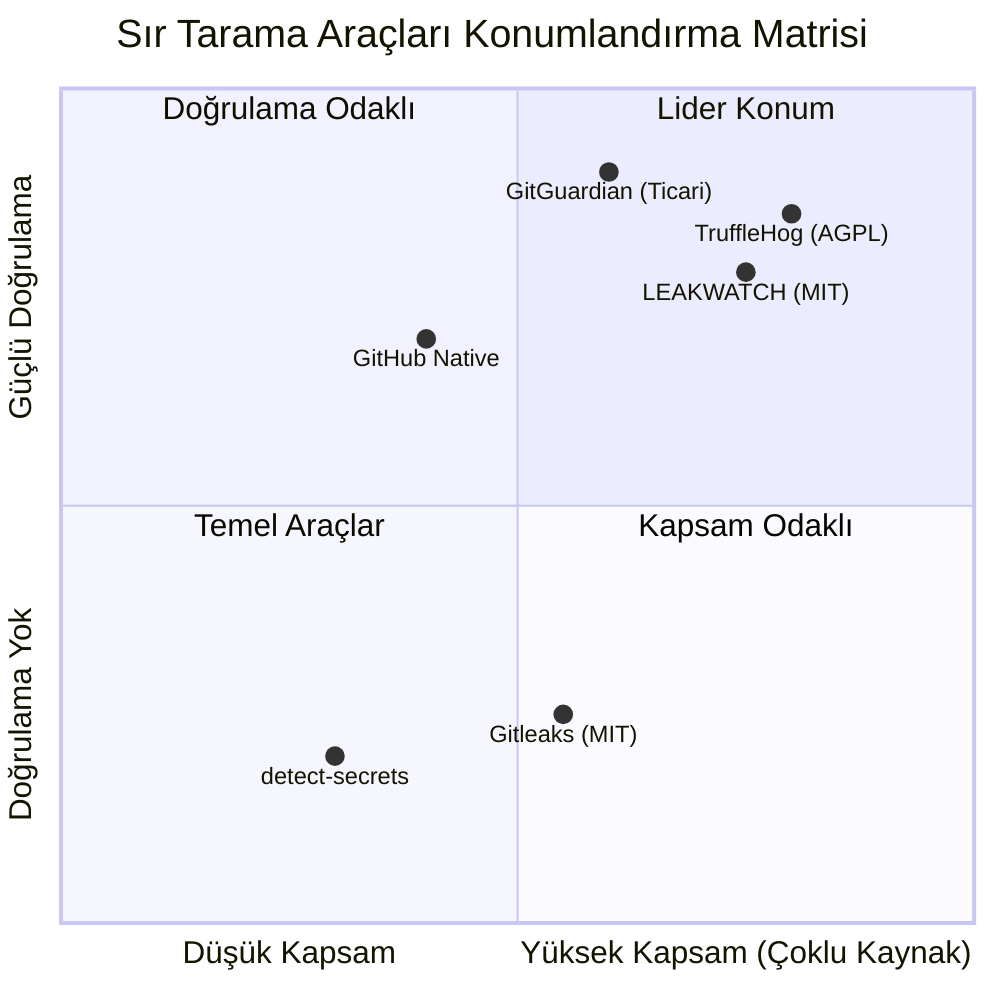

# Leakwatch - Rekabet Analizi ve Pazar Konumlandırma

> **Belge Versiyonu:** 1.0
> **Tarih:** 2026-03-24
> **Durum:** Taslak

---

## 1. Yönetici Özeti

Sır tarama (secret scanning) pazarı, yazılım tedarik zinciri güvenliğine artan odak, bulut-doğal (cloud-native) altyapının yaygınlaşması ve düzenleyici baskılar (SOC 2, PCI-DSS v4.0, GDPR) ile hızla büyümektedir. Uygulama güvenliği pazarı 2024 itibarıyla ~8-10 milyar USD değerindedir ve yıllık %15-20 büyüme göstermektedir. Sır tarama, bu pazarın ~500M-1B USD'lik bir alt segmentini oluşturmaktadır.

Mevcut açık kaynak araçları (TruffleHog, Gitleaks) belirli alanlarda güçlü olsa da, hiçbiri **doğrulama + çoklu kaynak tarama + düşük yanlış pozitif** üçlüsünü birlikte sunan, kolay genişletilebilir bir platform sağlayamamaktadır. Leakwatch, bu boşluğu doldurmayı hedeflemektedir.

---

## 2. Rakip Detay Analizi

### 2.1 TruffleHog (Truffle Security Co.)

| Özellik | Detay |
|---------|-------|
| **Dil/Teknoloji** | Go (Golang) |
| **Lisans** | AGPL-3.0 (açık kaynak); Enterprise sürüm ticari |
| **GitHub Stars** | ~17,000-18,000+ |
| **Katkıda Bulunan** | ~100-130+ |
| **Sürüm Sıklığı** | Her 1-2 haftada bir |

**Temel Özellikler:**
- 800+ sır dedektörü (regex tabanlı)
- **Canlı doğrulama (verification)** — ana farklılaştırıcı özellik. AWS STS, GitHub API, Stripe vb. üzerinden tespit edilen sırların aktif olup olmadığını kontrol eder
- Pipeline mimarisi: Source → Chunking → Detection → Verification
- Geniş kaynak desteği: Git, GitHub/GitLab/Bitbucket orgs, S3, GCS, Docker images, Slack, Jira, Confluence, Postman, Elasticsearch, Jenkins, CircleCI, Hugging Face
- JSON, SARIF çıktı formatları
- GitHub Actions entegrasyonu (tüm repolar için ücretsiz)

**Güçlü Yönler:**
- Sektördeki en kapsamlı doğrulama sistemi
- En geniş kaynak çeşitliliği
- `--only-verified` ile yanlış pozitifleri neredeyse sıfıra indirme
- Aktif geliştirme ve güçlü topluluk

**Zayıf Yönler:**
- AGPL-3.0 lisansı kurumsal benimsemeyi zorlaştırabilir
- Büyük repolarla yüksek bellek tüketimi
- Doğrulama API rate limit'lerine takılabilir
- Doğrulanmamış sonuçlar hâlâ gürültülü
- Özel dedektör ekleme Go kodu yazmayı ve yeniden derlemeyi gerektirir
- `.secretsignore` / allowlist mekanizması rakiplerine kıyasla daha az olgun

---

### 2.2 Gitleaks

| Özellik | Detay |
|---------|-------|
| **Dil/Teknoloji** | Go (Golang) |
| **Lisans** | MIT (CLI); GitHub Action v2 özel repolar için ticari |
| **GitHub Stars** | ~18,000-19,000+ |
| **Katkıda Bulunan** | ~150+ |
| **Ana Bakımcı** | Zachary Rice (@zricethezav) |

**Temel Özellikler:**
- ~150+ regex kuralı, anahtar kelime ön-filtreleme ile
- `gitleaks detect` (tam geçmiş), `gitleaks protect` (pre-commit), `gitleaks dir` (dosya sistemi)
- `.gitleaks.toml` ile esnek kural yapılandırması
- Entropi eşiği desteği (regex eşleşmeleri üzerine filtre)
- JSON, SARIF, CSV, JUnit XML çıktı formatları
- Baseline desteği (mevcut bulgulara karşı diff)

**Güçlü Yönler:**
- Hız — keyword ön-filtreleme ile 10-100x performans artışı (v8+)
- MIT lisansı — kurumsal entegrasyon için ideal
- En esnek kural yapılandırma sistemi (`.gitleaks.toml`)
- Pre-commit hook için en iyi seçenek
- Hafif ve basit — tek binary, minimum karmaşıklık

**Zayıf Yönler:**
- **Sır doğrulama yok** — tüm bulgular "potansiyel"
- Bulut/SaaS kaynakları tarayamaz (sadece yerel repo/dosya)
- GitHub Action'ın özel repolar için ücretli olması toplulukta tepki çekti
- Entropi tek başına bir tespit modu değil, yalnızca regex filtresi
- Düzeltme/remediation rehberliği yok

---

### 2.3 detect-secrets (Yelp)

| Özellik | Detay |
|---------|-------|
| **Dil/Teknoloji** | Python |
| **Lisans** | Apache 2.0 |
| **GitHub Stars** | ~3,500+ |

**Temel Özellikler:**
- Eklenti (plugin) tabanlı mimari
- `.secrets.baseline` dosyası — mevcut sırların JSON anlık görüntüsü
- Shannon entropi analizi (hex ve base64)
- ~20+ yerleşik eklenti (AWS, Slack, private key vb.)

**Güçlü Yönler:**
- Baseline modeli eski kod tabanlarına kademeli entegrasyon için mükemmel
- Hafif ve hızlı pre-commit kullanımı
- Kolay özelleştirilebilir eklenti sistemi

**Zayıf Yönler:**
- Python — performans sınırlamaları (CPU-bound görevlerde 10-100x yavaş)
- Git geçmişi taramıyor
- Sır doğrulama yok
- Sınırlı sır türü kapsamı
- Dashboard/raporlama yok

---

### 2.4 GitHub Secret Scanning (Yerel)

| Özellik | Detay |
|---------|-------|
| **Platform** | GitHub entegre |
| **Fiyatlandırma** | Public repolar: ücretsiz; Private: GHAS lisansı ($49/committer/ay) |

**Temel Özellikler:**
- 200+ sır türü (partner programı ile)
- Partner-side doğrulama ve otomatik iptal
- Push Protection — sırları push aşamasında engeller

**Güçlü Yönler:**
- Sıfır yapılandırma (public repolar)
- Çok düşük yanlış pozitif (desen tanımları token sağlayıcılarından)
- Otomatik remediation (partner revocation)
- Push Protection güçlü önleyici kontrol

**Zayıf Yönler:**
- Sadece GitHub — GitLab, Bitbucket, yerel repo desteği yok
- Private repolar için pahalı ($49/committer/ay)
- Sadece partner desenleri — özel/dahili sırlar sınırlı
- Entropi tabanlı tespit yok
- Git dışı kaynaklar taranamaz

---

### 2.5 GitGuardian

| Özellik | Detay |
|---------|-------|
| **Tür** | Ticari SaaS + ggshield CLI (açık kaynak) |
| **Fiyatlandırma** | Free: bireysel; Teams: ~$40-50/dev/ay; Enterprise: özel |
| **Kullanıcı** | 500K+ geliştirici |

**Temel Özellikler:**
- 400+ dedektör — pazardaki en geniş kapsam
- Sır doğrulama
- ML tabanlı bağlamsal analiz
- Public monitoring — kuruluşunuzun sırları herhangi bir public repoda göründüğünde algılama
- Honeytokens (tuzak kimlik bilgileri)
- Olay yönetimi dashboard'u

**Güçlü Yönler:**
- En geniş sır türü kapsamı
- Public monitoring benzersiz bir özellik
- Mükemmel geliştirici deneyimi
- Honeytokens

**Zayıf Yönler:**
- Ölçekte maliyet yüksek
- SaaS bağımlılığı — sır metadata'sı buluta gönderilir
- Free tier sınırlı

---

### 2.6 Diğer Araçlar

| Araç | Dil | Lisans | Öne Çıkan | Zayıf Yön |
|------|-----|--------|-----------|-----------|
| **SpectralOps** (Check Point) | Go | Ticari | 2000+ dedektör, IaC + PII tarama | Acquisition sonrası topluluk kaybı |
| **Whispers** (Skyscanner) | Python | Apache 2.0 | Yapısal dosya ayrıştırma (YAML/JSON/XML) | Küçük topluluk (~200 star), sadece config dosyaları |
| **Talisman** (ThoughtWorks) | Go | MIT | Dosya adı tespiti, pre-push odaklı | Sınırlı desen kütüphanesi, bypass edilebilir |

---

## 3. Karşılaştırmalı Özellik Matrisi

| Özellik | TruffleHog | Gitleaks | detect-secrets | GitHub Native | GitGuardian | **Leakwatch (Hedef)** |
|---------|------------|----------|----------------|---------------|-------------|----------------------|
| **Sır Doğrulama** | Evet (800+) | Hayır | Hayır | Evet (partner) | Evet | **Evet (modüler)** |
| **Git Geçmişi** | Evet | Evet | Hayır | Evet | Evet | **Evet** |
| **Dosya Sistemi** | Evet | Evet | Evet | Hayır | Evet | **Evet** |
| **Container İmajları** | Evet | Hayır | Hayır | Hayır | Evet | **Evet** |
| **Bulut Kaynakları** | Evet (S3, GCS) | Hayır | Hayır | Hayır | Hayır | **Evet (Faz 5)** |
| **SaaS Tarama** | Evet (Slack, Jira) | Hayır | Hayır | Hayır | Public monitoring | **Planlanıyor** |
| **Aho-Corasick** | Kısmen | Hayır | Hayır | Bilinmiyor | Bilinmiyor | **Evet** |
| **Entropi Analizi** | Evet | Filtre olarak | Evet | Hayır | ML ile | **Evet (hibrit)** |
| **SARIF Çıktı** | Evet | Evet | Hayır | Yerel | Evet | **Evet** |
| **Pre-commit** | Evet | Evet (birincil) | Evet | Push Protection | Evet | **Evet** |
| **Özel Kurallar** | Go kodu gerekir | TOML (kolay) | Plugin (Python) | Sınırlı | Enterprise | **YAML (kolay)** |
| **Allowlist/Ignore** | Temel | Gelişmiş | Baseline | Yok | Evet | **Gelişmiş** |
| **Lisans** | AGPL-3.0 | MIT* | Apache 2.0 | Ticari | Ticari | **MIT** |
| **Tek Binary** | Evet | Evet | Hayır (Python) | N/A | Hayır (Python) | **Evet** |
| **Remediation** | Hayır | Hayır | Hayır | Partner revoke | Dashboard | **Planlanıyor** |

---

## 4. Pazar Boşlukları ve Fırsatlar

### 4.1 Birincil Fırsatlar (Leakwatch'ın Farklılaşma Alanları)

#### Fırsat 1: Doğrulama-Öncelikli Açık Kaynak
**Durum:** TruffleHog doğrulama sunan tek büyük açık kaynak araç, ancak AGPL-3.0 lisansı kurumsal benimsemeyi engelliyor. Gitleaks MIT ama doğrulama yok.

**Leakwatch Fırsatı:** MIT lisanslı, modüler doğrulama sistemi ile açık kaynak pazarında benzersiz bir konum.

#### Fırsat 2: Kolay Genişletilebilirlik
**Durum:** TruffleHog'da özel dedektör eklemek Go kodu yazmayı ve yeniden derlemeyi gerektiriyor. Gitleaks'in TOML kuralları basit ama doğrulama mantığı eklemeye izin vermiyor.

**Leakwatch Fırsatı:** YAML tabanlı kural tanımlama + Go plugin arayüzü ile iki katmanlı genişletilebilirlik. Basit regex kuralları için YAML yeterli; gelişmiş doğrulama için Go arayüzü.

#### Fırsat 3: Akıllı Yanlış Pozitif Azaltma
**Durum:** Tüm açık kaynak araçlar yüksek yanlış pozitif oranlarından muzdarip. Test dosyaları, placeholder'lar, dokümantasyon örnekleri sürekli işaretleniyor.

**Leakwatch Fırsatı:**
- Bağlam-duyarlı analiz (test dosyası tespiti, placeholder pattern'leri)
- Aho-Corasick + entropi + regex hibrit yaklaşımı
- Akıllı filtreleme katmanı

#### Fırsat 4: Birleşik Çoklu Kaynak Tarama
**Durum:** Git + Dosya sistemi + Container imajları + Bulut depoları taramayı tek bir açık kaynak araçta sunan çözüm yok.

**Leakwatch Fırsatı:** Modüler `Source` arayüzü ile genişletilebilir kaynak desteği.

---

### 4.2 İkincil Fırsatlar

| Fırsat | Açıklama | Öncelik |
|--------|----------|---------|
| **Secrets Inventory** | Kuruluş genelinde tüm sırların merkezi envanteri | Yüksek |
| **Remediation Rehberliği** | Tespit edilen sırlar için rotasyon talimatları | Orta |
| **IDE Entegrasyonu** | VS Code, JetBrains eklentileri ile gerçek zamanlı tarama | Orta |
| **Honeytokens** | Tuzak kimlik bilgileri dağıtma ve kullanımlarını izleme | Düşük |
| **ML Tabanlı Tespit** | Bilinmeyen sır formatlarını makine öğrenmesi ile bulma | Gelecek |

---

## 5. Ürün Konumlandırma Stratejisi

### 5.1 Konumlandırma Bildirisi

> **Leakwatch**, modern geliştirme ekipleri için tasarlanmış, **açık kaynak**, **yüksek performanslı** ve **doğrulama-öncelikli** bir sır tarama platformudur. Git geçmişinden container imajlarına kadar birden fazla kaynağı tarayan, bulunan sırları otomatik olarak doğrulayan ve yanlış pozitifleri en aza indiren Leakwatch, güvenlik ekiplerinin ve geliştiricilerin güvenebileceği eyleme geçirilebilir sonuçlar sunar.

### 5.2 Hedef Kullanıcı Segmentleri

| Segment | İhtiyaç | Leakwatch Değer Önerisi |
|---------|---------|------------------------|
| **DevSecOps Mühendisleri** | CI/CD'ye entegre, güvenilir tarama | Pre-commit + CI pipeline entegrasyonu, SARIF çıktı |
| **Güvenlik Ekipleri** | Kuruluş genelinde denetim, düşük gürültü | Doğrulama ile eyleme geçirilebilir sonuçlar |
| **Açık Kaynak Geliştiriciler** | Ücretsiz, kolay kurulum, hızlı tarama | MIT lisansı, tek binary, sıfır bağımlılık |
| **Kurumsal DevOps** | Geniş ölçekte tarama, özel kurallar | Modüler mimari, YAML kural tanımlama |

### 5.3 Rekabet Karşısında Konumlandırma

### 5.4 Ana Mesajlar

1. **"Doğrulanmış güvenlik, açık kaynak özgürlüğüyle"** — MIT lisansı + doğrulama
2. **"Bir araç, her kaynak"** — Git, dosya sistemi, container, bulut
3. **"Gürültü değil, sinyal"** — Hibrit tespit ile düşük yanlış pozitif
4. **"Geliştirici dostu güvenlik"** — Hızlı, basit CLI, kolay entegrasyon

---

## 6. SWOT Analizi

### Güçlü Yönler (Strengths)
- MIT lisansı ile kurumsal benimseme engeli yok
- Doğrulama-öncelikli tasarım ile düşük yanlış pozitif
- Modern Go mimarisi ile yüksek performans
- Modüler eklenti sistemi ile kolay genişletilebilirlik
- Tek binary dağıtım, sıfır bağımlılık

### Zayıf Yönler (Weaknesses)
- Yeni proje — topluluk ve dedektör sayısı düşük başlayacak
- Mevcut araçların yerleşik kullanıcı tabanı ve marka bilinirliği
- Tek geliştirici/küçük ekip ile başlangıç

### Fırsatlar (Opportunities)
- AGPL'den kaçınan kurumsal kullanıcılar için MIT alternatifi
- Container güvenliği pazarının büyümesi
- Supply chain güvenliği düzenlemelerinin artması
- TruffleHog'un ticari yönelimi ile açık kaynak boşluk

### Tehditler (Threats)
- TruffleHog ve Gitleaks'in sürekli gelişimi
- GitHub'ın native secret scanning'i genişletmesi
- Büyük güvenlik firmalarının pazara girişi
- GitGuardian'ın free tier genişletmesi

---

## 7. Endüstri Standartları ve Uyumluluk

| Standart | Açıklama | Leakwatch Uyumu |
|----------|----------|-----------------|
| **OWASP Top 10 (A07:2021)** | Tanımlama ve Kimlik Doğrulama Hataları | Doğrudan hedef — hardcoded credential tespiti |
| **CWE-798** | Sabit Kodlanmış Kimlik Bilgileri | Birincil tespit hedefi |
| **CWE-540** | Kaynak Kodda Hassas Bilgi | Kapsam dahilinde |
| **SARIF (OASIS)** | Statik Analiz Sonuçları Değişim Formatı | Yerel destek planlanıyor |
| **NIST SP 800-53 (IA-5)** | Kimlik Doğrulayıcı Yönetimi | Tespit ve raporlama desteği |
| **SOC 2 Type II** | Kimlik bilgisi yönetimi kontrolleri | Denetim kanıtı olarak kullanılabilir |
| **PCI-DSS v4.0 (Req. 8)** | Kimlik doğrulama gereksinimleri | Uyumluluk raporlaması |

---

## 8. Sonuç

Sır tarama pazarı olgunlaşmakta ancak henüz **tek bir araç tüm ihtiyaçları karşılamamaktadır**:

- TruffleHog doğrulama konusunda lider ama AGPL lisansı ve bellek sorunları var
- Gitleaks hız ve basitlik konusunda lider ama doğrulama ve çoklu kaynak desteği yok
- GitGuardian en kapsamlı ama ticari ve pahalı
- detect-secrets baseline modeli ile benzersiz ama Python performans sınırlamaları var

**Leakwatch**, bu rakiplerin güçlü yönlerini birleştiren ve zayıf yönlerini gideren bir platform olarak konumlanmaktadır:
- TruffleHog'un doğrulama gücü + Gitleaks'in hızı ve MIT lisansı
- Modüler mimari ile GitGuardian'ın kapsamına ulaşma potansiyeli
- detect-secrets'in baseline konseptinden ilham alan akıllı filtreleme
