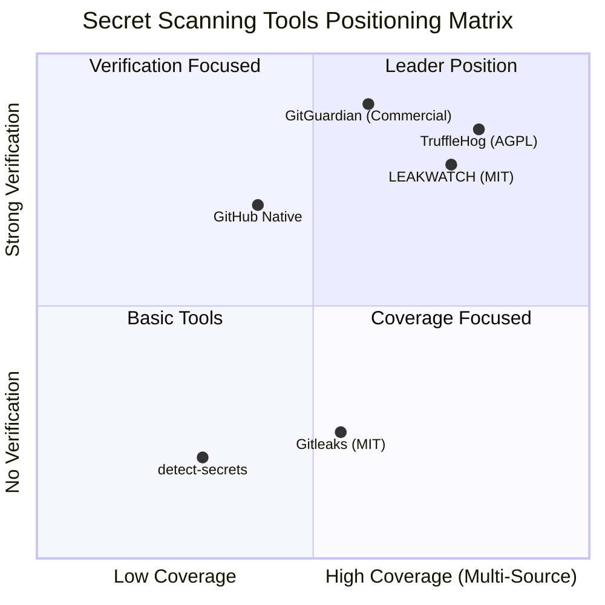

# Leakwatch - Competitive Analysis and Market Positioning

> **Document Version:** 1.0
> **Date:** 2026-03-24
> **Status:** Draft

---

## 1. Executive Summary

The secret scanning market is growing rapidly due to the increasing focus on software supply chain security, the proliferation of cloud-native infrastructure, and regulatory pressures (SOC 2, PCI-DSS v4.0, GDPR). The application security market is valued at ~8-10 billion USD as of 2024 and is growing at 15-20% annually. Secret scanning constitutes a ~500M-1B USD sub-segment of this market.

While existing open-source tools (TruffleHog, Gitleaks) are strong in certain areas, none of them provides an easily extensible platform that combines **verification + multi-source scanning + low false positives**. Leakwatch aims to fill this gap.

---

## 2. Detailed Competitor Analysis

### 2.1 TruffleHog (Truffle Security Co.)

| Feature | Details |
|---------|---------|
| **Language/Technology** | Go (Golang) |
| **License** | AGPL-3.0 (open source); Enterprise edition commercial |
| **GitHub Stars** | ~17,000-18,000+ |
| **Contributors** | ~100-130+ |
| **Release Frequency** | Every 1-2 weeks |

**Key Features:**
- 800+ secret detectors (regex-based)
- **Live verification** — the main differentiating feature. Checks whether detected secrets are active via AWS STS, GitHub API, Stripe, etc.
- Pipeline architecture: Source → Chunking → Detection → Verification
- Wide source support: Git, GitHub/GitLab/Bitbucket orgs, S3, GCS, Docker images, Slack, Jira, Confluence, Postman, Elasticsearch, Jenkins, CircleCI, Hugging Face
- JSON, SARIF output formats
- GitHub Actions integration (free for all repos)

**Strengths:**
- The most comprehensive verification system in the industry
- Widest source variety
- `--only-verified` reduces false positives to nearly zero
- Active development and strong community

**Weaknesses:**
- AGPL-3.0 license can hinder enterprise adoption
- High memory consumption with large repositories
- Verification can hit API rate limits
- Unverified results are still noisy
- Adding custom detectors requires writing Go code and recompiling
- `.secretsignore` / allowlist mechanism is less mature compared to competitors

---

### 2.2 Gitleaks

| Feature | Details |
|---------|---------|
| **Language/Technology** | Go (Golang) |
| **License** | MIT (CLI); GitHub Action v2 commercial for private repos |
| **GitHub Stars** | ~18,000-19,000+ |
| **Contributors** | ~150+ |
| **Lead Maintainer** | Zachary Rice (@zricethezav) |

**Key Features:**
- ~150+ regex rules with keyword pre-filtering
- `gitleaks detect` (full history), `gitleaks protect` (pre-commit), `gitleaks dir` (filesystem)
- Flexible rule configuration via `.gitleaks.toml`
- Entropy threshold support (filter on top of regex matches)
- JSON, SARIF, CSV, JUnit XML output formats
- Baseline support (diff against existing findings)

**Strengths:**
- Speed — 10-100x performance improvement with keyword pre-filtering (v8+)
- MIT license — ideal for enterprise integration
- The most flexible rule configuration system (`.gitleaks.toml`)
- Best option for pre-commit hooks
- Lightweight and simple — single binary, minimal complexity

**Weaknesses:**
- **No secret verification** — all findings are "potential"
- Cannot scan cloud/SaaS sources (local repo/file only)
- GitHub Action being paid for private repos has drawn community criticism
- Entropy is not a standalone detection mode, only a regex filter
- No remediation guidance

---

### 2.3 detect-secrets (Yelp)

| Feature | Details |
|---------|---------|
| **Language/Technology** | Python |
| **License** | Apache 2.0 |
| **GitHub Stars** | ~3,500+ |

**Key Features:**
- Plugin-based architecture
- `.secrets.baseline` file — JSON snapshot of existing secrets
- Shannon entropy analysis (hex and base64)
- ~20+ built-in plugins (AWS, Slack, private key, etc.)

**Strengths:**
- Baseline model is excellent for gradual integration into legacy codebases
- Lightweight and fast pre-commit usage
- Easily customizable plugin system

**Weaknesses:**
- Python — performance limitations (10-100x slower on CPU-bound tasks)
- Does not scan Git history
- No secret verification
- Limited secret type coverage
- No dashboard/reporting

---

### 2.4 GitHub Secret Scanning (Native)

| Feature | Details |
|---------|---------|
| **Platform** | GitHub integrated |
| **Pricing** | Public repos: free; Private: GHAS license ($49/committer/month) |

**Key Features:**
- 200+ secret types (via partner program)
- Partner-side verification and automatic revocation
- Push Protection — blocks secrets at the push stage

**Strengths:**
- Zero configuration (public repos)
- Very low false positives (pattern definitions from token providers)
- Automatic remediation (partner revocation)
- Push Protection is a strong preventive control

**Weaknesses:**
- GitHub only — no GitLab, Bitbucket, or local repo support
- Expensive for private repos ($49/committer/month)
- Partner patterns only — limited for custom/internal secrets
- No entropy-based detection
- Cannot scan non-Git sources

---

### 2.5 GitGuardian

| Feature | Details |
|---------|---------|
| **Type** | Commercial SaaS + ggshield CLI (open source) |
| **Pricing** | Free: individual; Teams: ~$40-50/dev/month; Enterprise: custom |
| **Users** | 500K+ developers |

**Key Features:**
- 400+ detectors — widest coverage in the market
- Secret verification
- ML-based contextual analysis
- Public monitoring — detects when your organization's secrets appear in any public repo
- Honeytokens (decoy credentials)
- Incident management dashboard

**Strengths:**
- Widest secret type coverage
- Public monitoring is a unique feature
- Excellent developer experience
- Honeytokens

**Weaknesses:**
- High cost at scale
- SaaS dependency — secret metadata is sent to the cloud
- Limited free tier

---

### 2.6 Other Tools

| Tool | Language | License | Highlight | Weakness |
|------|----------|---------|-----------|----------|
| **SpectralOps** (Check Point) | Go | Commercial | 2000+ detectors, IaC + PII scanning | Community loss after acquisition |
| **Whispers** (Skyscanner) | Python | Apache 2.0 | Structural file parsing (YAML/JSON/XML) | Small community (~200 stars), config files only |
| **Talisman** (ThoughtWorks) | Go | MIT | Filename detection, pre-push focused | Limited pattern library, can be bypassed |

---

## 3. Comparative Feature Matrix

| Feature | TruffleHog | Gitleaks | detect-secrets | GitHub Native | GitGuardian | **Leakwatch (Target)** |
|---------|------------|----------|----------------|---------------|-------------|----------------------|
| **Secret Verification** | Yes (800+) | No | No | Yes (partner) | Yes | **Yes (modular)** |
| **Git History** | Yes | Yes | No | Yes | Yes | **Yes** |
| **Filesystem** | Yes | Yes | Yes | No | Yes | **Yes** |
| **Container Images** | Yes | No | No | No | Yes | **Yes** |
| **Cloud Sources** | Yes (S3, GCS) | No | No | No | No | **Yes (Phase 5)** |
| **SaaS Scanning** | Yes (Slack, Jira) | No | No | No | Public monitoring | **Planned** |
| **Aho-Corasick** | Partial | No | No | Unknown | Unknown | **Yes** |
| **Entropy Analysis** | Yes | As filter | Yes | No | With ML | **Yes (hybrid)** |
| **SARIF Output** | Yes | Yes | No | Native | Yes | **Yes** |
| **Pre-commit** | Yes | Yes (primary) | Yes | Push Protection | Yes | **Yes** |
| **Custom Rules** | Requires Go code | TOML (easy) | Plugin (Python) | Limited | Enterprise | **YAML (easy)** |
| **Allowlist/Ignore** | Basic | Advanced | Baseline | None | Yes | **Advanced** |
| **License** | AGPL-3.0 | MIT* | Apache 2.0 | Commercial | Commercial | **MIT** |
| **Single Binary** | Yes | Yes | No (Python) | N/A | No (Python) | **Yes** |
| **Remediation** | No | No | No | Partner revoke | Dashboard | **Planned** |

---

## 4. Market Gaps and Opportunities

### 4.1 Primary Opportunities (Leakwatch's Differentiation Areas)

#### Opportunity 1: Verification-First Open Source
**Situation:** TruffleHog is the only major open-source tool offering verification, but its AGPL-3.0 license hinders enterprise adoption. Gitleaks is MIT but has no verification.

**Leakwatch Opportunity:** A unique position in the open-source market with an MIT-licensed, modular verification system.

#### Opportunity 2: Easy Extensibility
**Situation:** Adding custom detectors in TruffleHog requires writing Go code and recompiling. Gitleaks' TOML rules are simple but do not allow adding verification logic.

**Leakwatch Opportunity:** Two-tier extensibility with YAML-based rule definitions + Go plugin interface. YAML is sufficient for simple regex rules; Go interface for advanced verification.

#### Opportunity 3: Intelligent False Positive Reduction
**Situation:** All open-source tools suffer from high false positive rates. Test files, placeholders, and documentation examples are constantly flagged.

**Leakwatch Opportunity:**
- Context-aware analysis (test file detection, placeholder patterns)
- Aho-Corasick + entropy + regex hybrid approach
- Intelligent filtering layer

#### Opportunity 4: Unified Multi-Source Scanning
**Situation:** No single open-source tool offers Git + Filesystem + Container images + Cloud storage scanning.

**Leakwatch Opportunity:** Extensible source support via the modular `Source` interface.

---

### 4.2 Secondary Opportunities

| Opportunity | Description | Priority |
|-------------|-------------|----------|
| **Secrets Inventory** | Centralized inventory of all secrets across the organization | High |
| **Remediation Guidance** | Rotation instructions for detected secrets | Medium |
| **IDE Integration** | Real-time scanning with VS Code, JetBrains plugins | Medium |
| **Honeytokens** | Deploying decoy credentials and monitoring their usage | Low |
| **ML-Based Detection** | Finding unknown secret formats using machine learning | Future |

---

## 5. Product Positioning Strategy

### 5.1 Positioning Statement

> **Leakwatch** is an **open-source**, **high-performance**, and **verification-first** secret scanning platform designed for modern development teams. Scanning multiple sources from Git history to container images, automatically verifying discovered secrets, and minimizing false positives, Leakwatch delivers actionable results that security teams and developers can trust.

### 5.2 Target User Segments

| Segment | Need | Leakwatch Value Proposition |
|---------|------|---------------------------|
| **DevSecOps Engineers** | Reliable scanning integrated into CI/CD | Pre-commit + CI pipeline integration, SARIF output |
| **Security Teams** | Organization-wide auditing, low noise | Actionable results with verification |
| **Open Source Developers** | Free, easy setup, fast scanning | MIT license, single binary, zero dependencies |
| **Enterprise DevOps** | Scanning at scale, custom rules | Modular architecture, YAML rule definitions |

### 5.3 Competitive Positioning

### 5.4 Key Messages

1. **"Verified security with open-source freedom"** — MIT license + verification
2. **"One tool, every source"** — Git, filesystem, container, cloud
3. **"Signal, not noise"** — Low false positives with hybrid detection
4. **"Developer-friendly security"** — Fast, simple CLI, easy integration

---

## 6. SWOT Analysis

### Strengths
- No enterprise adoption barrier with MIT license
- Low false positives with verification-first design
- High performance with modern Go architecture
- Easy extensibility with modular plugin system
- Single binary distribution, zero dependencies

### Weaknesses
- New project — community and detector count will start low
- Established user base and brand recognition of existing tools
- Starting with a single developer/small team

### Opportunities
- MIT alternative for enterprise users avoiding AGPL
- Growth of the container security market
- Increasing supply chain security regulations
- Open-source gap due to TruffleHog's commercial direction

### Threats
- Continuous evolution of TruffleHog and Gitleaks
- GitHub expanding its native secret scanning
- Entry of major security firms into the market
- GitGuardian expanding its free tier

---

## 7. Industry Standards and Compliance

| Standard | Description | Leakwatch Alignment |
|----------|-------------|-------------------|
| **OWASP Top 10 (A07:2021)** | Identification and Authentication Failures | Direct target — hardcoded credential detection |
| **CWE-798** | Use of Hard-coded Credentials | Primary detection target |
| **CWE-540** | Inclusion of Sensitive Information in Source Code | Within scope |
| **SARIF (OASIS)** | Static Analysis Results Interchange Format | Native support planned |
| **NIST SP 800-53 (IA-5)** | Authenticator Management | Detection and reporting support |
| **SOC 2 Type II** | Credential management controls | Can be used as audit evidence |
| **PCI-DSS v4.0 (Req. 8)** | Authentication requirements | Compliance reporting |

---

## 8. Conclusion

The secret scanning market is maturing, but **no single tool addresses all needs** yet:

- TruffleHog leads in verification but has AGPL license and memory issues
- Gitleaks leads in speed and simplicity but lacks verification and multi-source support
- GitGuardian is the most comprehensive but commercial and expensive
- detect-secrets is unique with its baseline model but has Python performance limitations

**Leakwatch** is positioned as a platform that combines the strengths and addresses the weaknesses of these competitors:
- TruffleHog's verification power + Gitleaks' speed and MIT license
- Potential to reach GitGuardian's coverage with modular architecture
- Intelligent filtering inspired by detect-secrets' baseline concept
