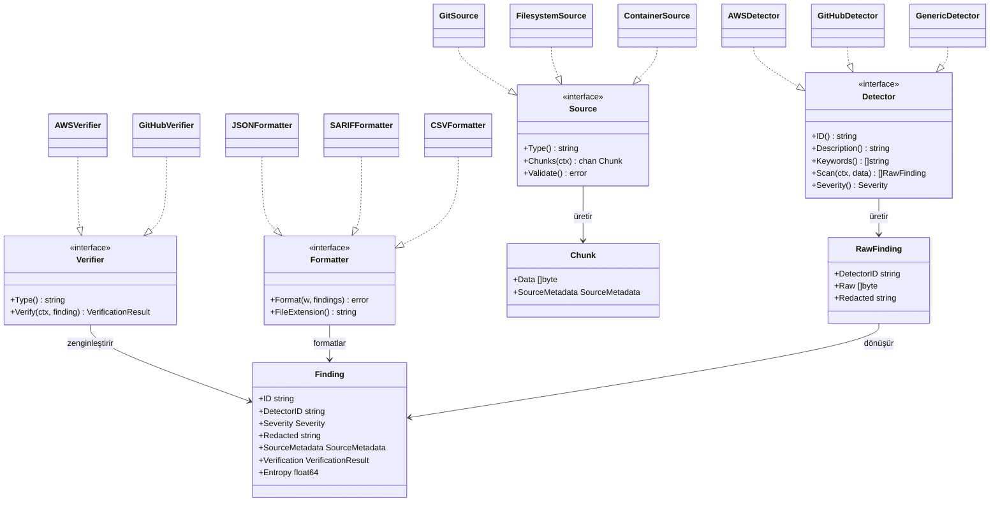
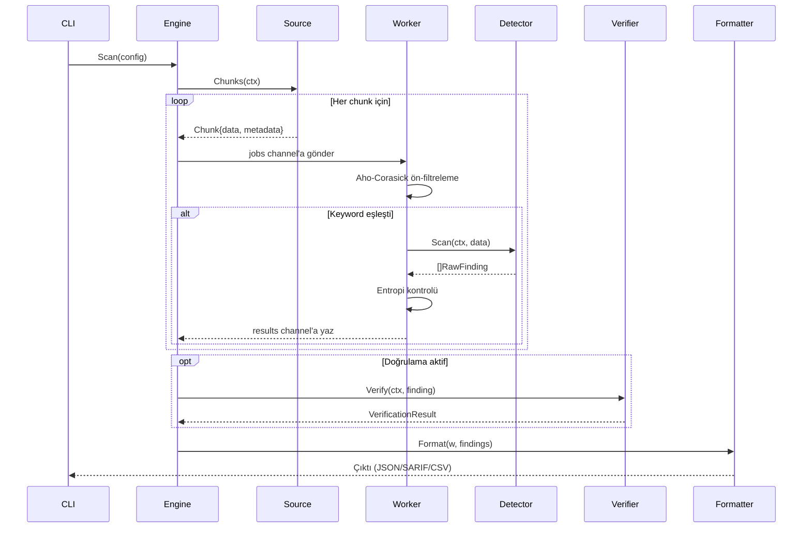
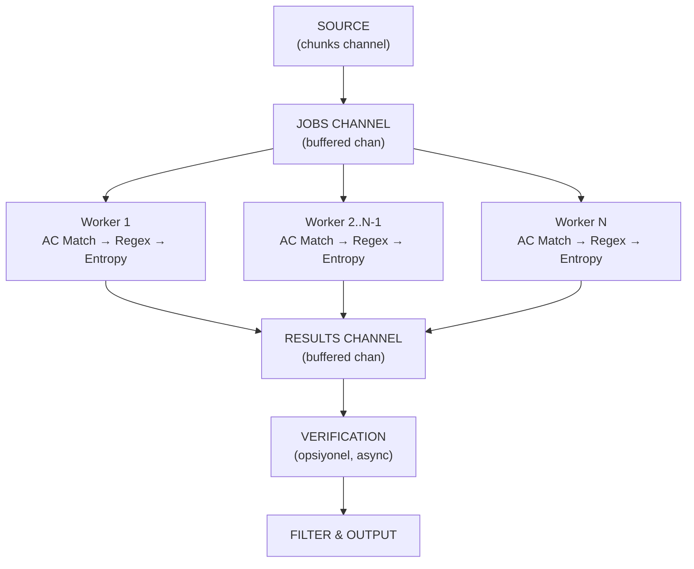
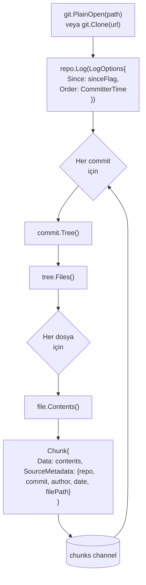
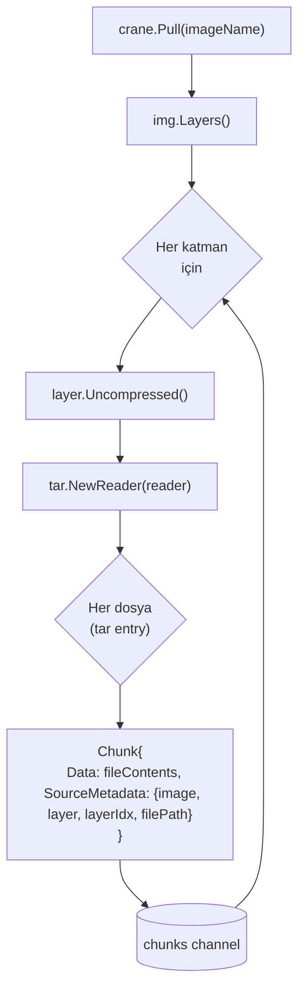
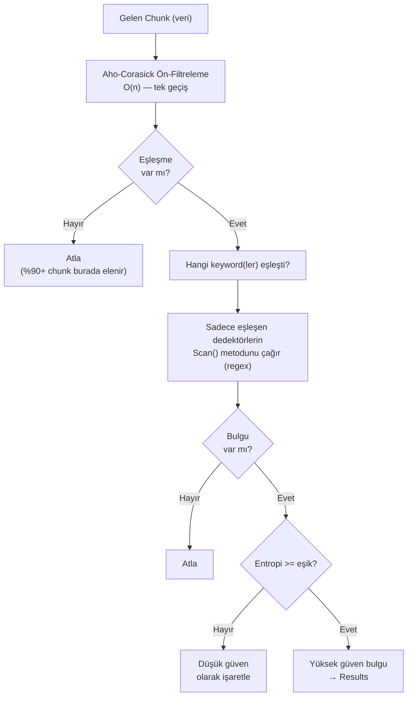

# Leakwatch - Detaylı Mimari Tasarım

> **Belge Versiyonu:** 1.0
> **Tarih:** 2026-03-24
> **Durum:** Taslak

---

## 1. Mimari Genel Bakış

Leakwatch, pipeline tabanlı bir mimari üzerine inşa edilmiştir. Veriler, kaynaktan (Source) çıktıya (Output) kadar bir dizi iyi tanımlanmış aşamadan geçer. Her aşama bağımsız olarak test edilebilir, ölçeklenebilir ve değiştirilebilir.

```mermaid
flowchart LR
    subgraph Sources["Kaynaklar"]
        S1[Git]
        S2[Dosya Sistemi]
        S3[Container]
        S4["S3 (v2)"]
    end

    subgraph Engine["Tespit Motoru"]
        E1[Aho-Corasick]
        E2[Regex Doğrulama]
        E3[Entropi Analizi]
        E4[Özel Kurallar]
    end

    subgraph Verifiers["Doğrulayıcılar"]
        V1[AWS STS]
        V2[GitHub API]
        V3[Slack API]
        V4[...]
    end

    subgraph Output["Çıktı"]
        O1[JSON]
        O2[SARIF]
        O3[CSV]
        O4[Table]
    end

    Sources -->|Chunks| Chunker[Chunker]
    Chunker --> Engine
    Engine --> Verifiers
    Verifiers --> Filter["Filtre & Çıktı"]
    Filter --> Output
```



---

## 2. Temel Arayüzler (Interfaces)

Leakwatch'ın genişletilebilirliği, iyi tanımlanmış Go arayüzleri üzerine kuruludur. Bu arayüzler, sistemin "sözleşmeleri"dir.



### 2.1 Source Arayüzü

```go
// Source, taranacak veri kaynağını temsil eder.
// Her kaynak türü (Git, dosya sistemi, container) bu arayüzü uygular.
type Source interface {
    // Type, kaynağın türünü döndürür (örn: "git", "filesystem", "container").
    Type() string

    // Chunks, taranacak veri parçalarını bir kanal üzerinden gönderir.
    // Context iptal edildiğinde kanal kapatılır.
    Chunks(ctx context.Context) <-chan Chunk

    // Validate, kaynağın erişilebilir ve geçerli olduğunu kontrol eder.
    Validate() error
}

// Chunk, taranacak en küçük veri birimini temsil eder.
type Chunk struct {
    // Data, taranacak ham içerik.
    Data []byte

    // SourceMetadata, bulgunun nereden geldiğini tanımlayan bağlam bilgisi.
    SourceMetadata SourceMetadata
}

// SourceMetadata, bir chunk'ın kökenini tanımlar.
type SourceMetadata struct {
    // Source türüne özgü alanlar
    SourceType string // "git", "filesystem", "container"

    // Git'e özgü
    Repository string
    Commit     string
    Author     string
    Email      string
    Date       time.Time
    Branch     string

    // Dosyaya özgü
    FilePath string
    Line     int

    // Container'a özgü
    Image    string
    Layer    string
    LayerIdx int
}
```

### 2.2 Detector Arayüzü

```go
// Detector, belirli bir sır türünü tespit eden bileşeni temsil eder.
type Detector interface {
    // ID, dedektörün benzersiz tanımlayıcısını döndürür (örn: "aws-access-key-id").
    ID() string

    // Description, dedektörün insan tarafından okunabilir açıklamasını döndürür.
    Description() string

    // Keywords, Aho-Corasick ön-filtreleme için anahtar kelimeleri döndürür.
    // Boş döndürürse, ön-filtreleme atlanır ve her chunk'a regex uygulanır.
    Keywords() []string

    // Scan, verilen veriyi tarar ve bulunan potansiyel sırları döndürür.
    Scan(ctx context.Context, data []byte) []RawFinding

    // Severity, bu dedektörün bulguları için varsayılan önem derecesini döndürür.
    Severity() Severity
}

// RawFinding, doğrulanmamış bir ham bulguyu temsil eder.
type RawFinding struct {
    DetectorID string
    Raw        []byte   // Bulunan sır verisi
    RawV2      []byte   // Opsiyonel: sırrın ikinci parçası (örn: secret key)
    Redacted   string   // Maskelenmiş versiyon (loglama için)
    ExtraData  map[string]string // Ek bağlam bilgisi
}
```

### 2.3 Verifier Arayüzü

```go
// Verifier, bir sırrın geçerliliğini doğrulayan bileşeni temsil eder.
type Verifier interface {
    // Type, doğrulayıcının hangi dedektör türüyle eşleştiğini döndürür.
    Type() string

    // Verify, bulunan sırrın geçerli/aktif olup olmadığını kontrol eder.
    // Ağ çağrıları yapabilir, bu nedenle context ile iptal edilebilir.
    Verify(ctx context.Context, finding RawFinding) VerificationResult
}

// VerificationResult, doğrulama sonucunu temsil eder.
type VerificationResult struct {
    Status    VerificationStatus
    Message   string           // İnsan tarafından okunabilir açıklama
    ExtraData map[string]string // Doğrulama sırasında elde edilen ek bilgi
}

// VerificationStatus, doğrulama durumu.
type VerificationStatus int

const (
    StatusUnverified      VerificationStatus = iota // Doğrulama yapılmadı
    StatusVerifiedActive                             // Doğrulandı: sır aktif
    StatusVerifiedInactive                           // Doğrulandı: sır devre dışı
    StatusVerifyError                                // Doğrulama sırasında hata
)
```

### 2.4 Formatter Arayüzü

```go
// Formatter, bulguları belirli bir formatta çıktılayan bileşeni temsil eder.
type Formatter interface {
    // Format, bulguları belirtilen writer'a yazar.
    Format(w io.Writer, findings []Finding) error

    // FileExtension, bu formatın dosya uzantısını döndürür.
    FileExtension() string
}
```

### 2.5 Birleştirilmiş Bulgu Modeli

```go
// Finding, tam olarak zenginleştirilmiş bir bulguyu temsil eder.
// Pipeline'ın son çıktısıdır.
type Finding struct {
    // Kimlik
    ID         string    `json:"id"`
    DetectorID string    `json:"detector_id"`
    Severity   Severity  `json:"severity"`

    // Sır verisi
    Raw      string `json:"raw,omitempty"`     // Sadece --show-raw ile
    Redacted string `json:"redacted"`           // Maskelenmiş

    // Konum
    SourceMetadata SourceMetadata `json:"source"`

    // Doğrulama
    Verification VerificationResult `json:"verification"`

    // Zaman
    DetectedAt time.Time `json:"detected_at"`

    // Entropi
    Entropy float64 `json:"entropy,omitempty"`

    // Ek bağlam
    ExtraData map[string]string `json:"extra_data,omitempty"`
}

// Severity, bulgu önem derecesi.
type Severity int

const (
    SeverityLow      Severity = iota
    SeverityMedium
    SeverityHigh
    SeverityCritical
)
```

---

### 2.6 Bileşen Etkileşim Sırası

Aşağıdaki sıra diyagramı, tek bir tarama işleminde bileşenlerin nasıl etkileştiğini gösterir:



---

## 3. Tarama Motoru (Engine) Detaylı Tasarım

### 3.1 İşçi Havuzu (Worker Pool) Modeli



### 3.2 Engine Yapılandırması

```go
type EngineConfig struct {
    // Eşzamanlılık
    Concurrency int // İşçi sayısı (varsayılan: runtime.NumCPU())
    ChunkSize   int // Chunk buffer boyutu (varsayılan: 1024)

    // Tespit
    Detectors      []Detector
    EnableEntropy  bool
    EntropyThreshold float64 // Varsayılan: 4.0

    // Doğrulama
    EnableVerification bool
    Verifiers         []Verifier
    VerifyTimeout     time.Duration // Varsayılan: 10s
    VerifyConcurrency int           // Doğrulama işçi sayısı

    // Filtreleme
    IncludePatterns []string // Glob desenleri
    ExcludePatterns []string // Glob desenleri
    MaxFileSize     int64    // Varsayılan: 10MB

    // Çıktı
    Formatter   Formatter
    ShowRaw     bool // Sır içeriğini göster
    OnlyVerified bool // Sadece doğrulanmış bulguları göster
}
```

### 3.3 Engine Yaşam Döngüsü

```mermaid
stateDiagram-v2
    [*] --> Başlatma

    state Başlatma {
        [*] --> DedektörleriYükle: Registry'den yükle
        DedektörleriYükle --> ACDerle: Aho-Corasick otomatonunu derle
        ACDerle --> HavuzOluştur: İşçi havuzunu oluştur
        HavuzOluştur --> KanallarOluştur: Kanalları oluştur
    }

    Başlatma --> Tarama

    state Tarama {
        [*] --> ChunkOku: Source.Chunks() kanalından oku
        ChunkOku --> JobsGönder: Jobs kanalına gönder
        JobsGönder --> ParalelTarama
        state ParalelTarama {
            [*] --> ACÖnFiltre: Aho-Corasick ön-filtreleme
            ACÖnFiltre --> DetectorScan: Eşleşen dedektörlerin Scan() çağır
            DetectorScan --> EntropiKontrol: Entropi kontrolü
            EntropiKontrol --> SonuçYaz: Results kanalına yaz
        }
    }

    Tarama --> Doğrulama: Opsiyonel

    state Doğrulama {
        [*] --> VerifierBul: Eşleşen Verifier'ı bul
        VerifierBul --> VerifyÇağır: Verify() çağır (rate-limited)
        VerifyÇağır --> Zenginleştir: Finding'i zenginleştir
    }

    Doğrulama --> Çıktı

    state Çıktı {
        [*] --> AllowlistFiltre: Allowlist/ignore uygula
        AllowlistFiltre --> VerifiedFiltre: --only-verified filtresi
        VerifiedFiltre --> SeverityFiltre: Severity filtresi
        SeverityFiltre --> Format: Formatter.Format() ile çıktıla
    }

    Çıktı --> [*]
```



---

## 4. Eklenti (Plugin) Kayıt Mekanizması

### 4.1 Derleme Zamanı Kayıt Deseni

```go
// internal/detector/registry.go

var (
    mu        sync.RWMutex
    detectors = make(map[string]Detector)
)

// Register, bir dedektörü merkezi kayıt defterine kaydeder.
// Her dedektör paketi, init() fonksiyonunda bu fonksiyonu çağırır.
func Register(d Detector) {
    mu.Lock()
    defer mu.Unlock()
    if _, exists := detectors[d.ID()]; exists {
        panic("duplicate detector ID: " + d.ID())
    }
    detectors[d.ID()] = d
}

// All, kayıtlı tüm dedektörleri döndürür.
func All() []Detector {
    mu.RLock()
    defer mu.RUnlock()
    result := make([]Detector, 0, len(detectors))
    for _, d := range detectors {
        result = append(result, d)
    }
    return result
}
```

### 4.2 Dedektör Kaydı Örneği

```go
// internal/detector/aws.go

func init() {
    Register(&AWSAccessKeyID{})
    Register(&AWSSecretAccessKey{})
}

type AWSAccessKeyID struct{}

func (d *AWSAccessKeyID) ID() string          { return "aws-access-key-id" }
func (d *AWSAccessKeyID) Description() string  { return "AWS Access Key ID" }
func (d *AWSAccessKeyID) Keywords() []string   { return []string{"AKIA", "ABIA", "ACCA", "ASIA"} }
func (d *AWSAccessKeyID) Severity() Severity   { return SeverityCritical }

func (d *AWSAccessKeyID) Scan(ctx context.Context, data []byte) []RawFinding {
    // AWS Access Key ID deseni: AKIA[0-9A-Z]{16}
    re := regexp.MustCompile(`(AKIA|ABIA|ACCA|ASIA)[0-9A-Z]{16}`)
    matches := re.FindAll(data, -1)

    findings := make([]RawFinding, 0, len(matches))
    for _, match := range matches {
        findings = append(findings, RawFinding{
            DetectorID: d.ID(),
            Raw:        match,
            Redacted:   string(match[:4]) + "****" + string(match[len(match)-4:]),
        })
    }
    return findings
}
```

### 4.3 Boş Import ile Aktivasyon

```go
// main.go veya cmd/root.go

import (
    // Dedektörleri kaydet
    _ "github.com/cemililik/leakwatch/internal/detector/aws"
    _ "github.com/cemililik/leakwatch/internal/detector/github"
    _ "github.com/cemililik/leakwatch/internal/detector/gcp"
    _ "github.com/cemililik/leakwatch/internal/detector/generic"
    _ "github.com/cemililik/leakwatch/internal/detector/privatekey"

    // Kaynakları kaydet
    _ "github.com/cemililik/leakwatch/internal/source/git"
    _ "github.com/cemililik/leakwatch/internal/source/filesystem"
    _ "github.com/cemililik/leakwatch/internal/source/container"

    // Doğrulayıcıları kaydet
    _ "github.com/cemililik/leakwatch/internal/verifier/aws"
    _ "github.com/cemililik/leakwatch/internal/verifier/github"
)
```

---

## 5. Kaynak (Source) İmplementasyonları

### 5.1 Git Kaynağı Akış Şeması



### 5.2 Dosya Sistemi Kaynağı

```go
// filepath.WalkDir ile io/fs tabanlı tarama
func (s *FilesystemSource) Chunks(ctx context.Context) <-chan Chunk {
    ch := make(chan Chunk, s.bufferSize)
    go func() {
        defer close(ch)
        filepath.WalkDir(s.root, func(path string, d fs.DirEntry, err error) error {
            select {
            case <-ctx.Done():
                return ctx.Err()
            default:
            }

            if err != nil || d.IsDir() {
                return nil
            }

            // Filtreleme: boyut, uzantı, .leakwatchignore
            if s.shouldSkip(path, d) {
                return nil
            }

            data, err := os.ReadFile(path)
            if err != nil {
                return nil
            }

            ch <- Chunk{
                Data: data,
                SourceMetadata: SourceMetadata{
                    SourceType: "filesystem",
                    FilePath:   path,
                },
            }
            return nil
        })
    }()
    return ch
}
```

### 5.3 Container İmaj Kaynağı



---

## 6. Tespit Motoru Detayı

### 6.1 Aho-Corasick + Regex Hibrit Stratejisi



### 6.2 Shannon Entropisi Hesaplama

```go
// entropy/shannon.go

// Calculate, verilen byte dizisinin Shannon entropisini hesaplar.
// Sonuç 0.0 (tamamen düzgün) ile ~8.0 (tamamen rastgele) arasındadır.
func Calculate(data []byte) float64 {
    if len(data) == 0 {
        return 0.0
    }

    // Karakter frekanslarını say
    freq := make(map[byte]float64)
    for _, b := range data {
        freq[b]++
    }

    // Shannon entropisi formülü: H = -Σ p(x) * log2(p(x))
    length := float64(len(data))
    entropy := 0.0
    for _, count := range freq {
        p := count / length
        if p > 0 {
            entropy -= p * math.Log2(p)
        }
    }
    return entropy
}

// Önerilen eşik değerleri:
// - Hex karakter seti:    > 3.0 (yüksek entropi)
// - Base64 karakter seti: > 4.5 (yüksek entropi)
// - Genel:                > 4.0 (yüksek entropi)
```

---

## 7. Doğrulama (Verification) Alt Sistemi

### 7.1 Rate Limiting ve Güvenlik

```go
type VerificationEngine struct {
    verifiers    map[string]Verifier
    rateLimiter  *rate.Limiter        // golang.org/x/time/rate
    timeout      time.Duration
    concurrency  int
    enabled      bool
}

// Güvenlik kuralları:
// 1. Doğrulanan kimlik bilgileri ASLA loglanmaz
// 2. Rate limiting zorunlu — API'leri aşırı yüklememek
// 3. Timeout zorunlu — yanıt vermeyen API'leri beklememe
// 4. Kullanıcı tarafından devre dışı bırakılabilir (--no-verify)
// 5. Doğrulama sonuçları önbelleğe alınabilir (aynı sır tekrar doğrulanmaz)
```

### 7.2 AWS Doğrulama Örneği

```go
// verifier/aws.go

func (v *AWSVerifier) Verify(ctx context.Context, finding RawFinding) VerificationResult {
    accessKeyID := string(finding.Raw)
    secretKey := string(finding.RawV2)

    if secretKey == "" {
        return VerificationResult{
            Status:  StatusUnverified,
            Message: "Secret Access Key bulunamadı, doğrulanamıyor",
        }
    }

    // AWS STS GetCallerIdentity — IAM izni gerektirmez
    cfg, err := config.LoadDefaultConfig(ctx,
        config.WithCredentialsProvider(
            credentials.NewStaticCredentialsProvider(accessKeyID, secretKey, ""),
        ),
    )
    if err != nil {
        return VerificationResult{Status: StatusVerifyError, Message: err.Error()}
    }

    client := sts.NewFromConfig(cfg)
    result, err := client.GetCallerIdentity(ctx, &sts.GetCallerIdentityInput{})
    if err != nil {
        return VerificationResult{
            Status:  StatusVerifiedInactive,
            Message: "Anahtar geçersiz veya devre dışı",
        }
    }

    return VerificationResult{
        Status:  StatusVerifiedActive,
        Message: fmt.Sprintf("Aktif anahtar: hesap=%s, ARN=%s", *result.Account, *result.Arn),
        ExtraData: map[string]string{
            "account": *result.Account,
            "arn":     *result.Arn,
        },
    }
}
```

---

## 8. Yapılandırma Hiyerarşisi

Viper ile yönetilen yapılandırma, aşağıdaki öncelik sırasına göre uygulanır (yukarıdan aşağıya azalan öncelik):

```
1. Komut satırı flag'leri        (en yüksek öncelik)
   --concurrency=8

2. Ortam değişkenleri
   LEAKWATCH_CONCURRENCY=8

3. Proje yapılandırma dosyası
   .leakwatch.yaml (çalışma dizininde)

4. Global yapılandırma dosyası
   ~/.leakwatch.yaml

5. Varsayılan değerler            (en düşük öncelik)
   concurrency: runtime.NumCPU()
```

### 8.1 Yapılandırma Dosyası Şeması (.leakwatch.yaml)

```yaml
# Tarama yapılandırması
scan:
  concurrency: 8              # İşçi sayısı
  max-file-size: 10485760     # 10MB
  chunk-size: 1024            # Chunk buffer boyutu

# Tespit yapılandırması
detection:
  entropy:
    enabled: true
    threshold: 4.0
  detectors:
    enabled: ["*"]             # Tümü aktif
    disabled: []               # Devre dışı bırakılanlar

# Doğrulama yapılandırması
verification:
  enabled: true
  timeout: 10s
  concurrency: 4

# Filtreleme
filter:
  exclude-paths:
    - "vendor/**"
    - "node_modules/**"
    - "**/*.lock"
    - "go.sum"
  exclude-detectors: []
  only-verified: false

# Çıktı yapılandırması
output:
  format: json                 # json, sarif, csv, table
  file: ""                     # Boşsa stdout'a yaz
  show-raw: false              # Sır içeriğini göster
  severity-threshold: low      # Minimum önem derecesi

# Özel kurallar
custom-rules:
  - id: "internal-api-key"
    description: "Dahili API Anahtarı"
    regex: 'INTERNAL_[A-Z0-9]{32}'
    keywords: ["INTERNAL_"]
    severity: high
    entropy: 3.5
```

---

## 9. Filtreleme Sistemi

### 9.1 .leakwatchignore

Git'in `.gitignore` formatıyla uyumlu, sır taramadan hariç tutulacak dosya ve yolları tanımlar:

```
# Test dosyaları
*_test.go
test/**
tests/**
__tests__/**

# Bağımlılıklar
vendor/
node_modules/
go.sum
package-lock.json
yarn.lock

# Dokümantasyon
docs/**
*.md

# Derleme çıktıları
dist/
build/
bin/

# Belirli dosyalar
.env.example
config.example.yaml
```

### 9.2 Satır İçi Yoksayma (Inline Ignore)

Belirli satırları tarama dışında bırakmak için:

```python
API_KEY = "AKIA1234EXAMPLE567890"  # leakwatch:ignore
PASSWORD = "test123"  # leakwatch:ignore:aws-access-key-id
```

---

## 10. Hata Yönetimi ve Dayanıklılık

### 10.1 Hata Stratejisi

| Hata Türü | Strateji |
|-----------|----------|
| Kaynak erişilemez (repo/dosya bulunamadı) | Fatal — hemen çık |
| Tek dosya okunamadı | Uyar, atla, devam et |
| Doğrulama hatası (ağ/timeout) | VerifyError olarak işaretle, devam et |
| Rate limit aşıldı | Exponential backoff ile yeniden dene |
| Bellek yetersiz | Chunk boyutunu küçült, uyar |

### 10.2 Yapılandırılmış Loglama (Structured Logging)

```go
// Go 1.21+ log/slog paketi
slog.Info("tarama başlatıldı",
    "source", "git",
    "repository", repoPath,
    "concurrency", config.Concurrency,
)

slog.Warn("dosya atlanıyor",
    "path", filePath,
    "reason", "boyut limiti aşıldı",
    "size", fileSize,
    "limit", config.MaxFileSize,
)
```

---

## 11. Güvenlik Tasarım İlkeleri

1. **Sırlar asla loglanmaz** — Bulunan sırlar sadece maskelenmiş (redacted) formda loglanır
2. **Minimum yetki** — Doğrulama için sadece salt-okunur API çağrıları kullanılır (örn: STS GetCallerIdentity)
3. **Sır önbelleğe alınmaz** — Doğrulanmış sırlar diske yazılmaz
4. **Güvenli çıkış kodları** — Sır bulunduğunda non-zero çıkış kodu (CI/CD entegrasyonu)
5. **Bağımlılık güvenliği** — `govulncheck` ile düzenli güvenlik açığı taraması
6. **Rate limiting** — Doğrulama API çağrılarında zorunlu hız sınırlama
