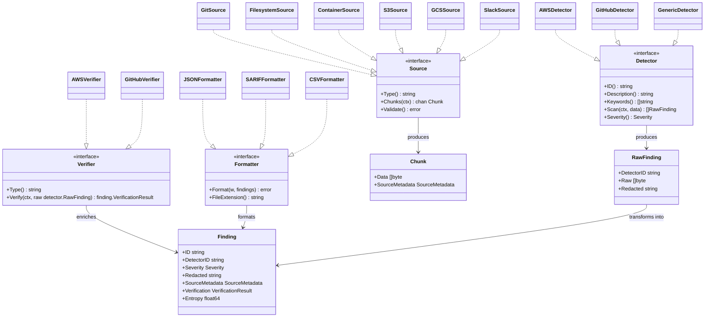
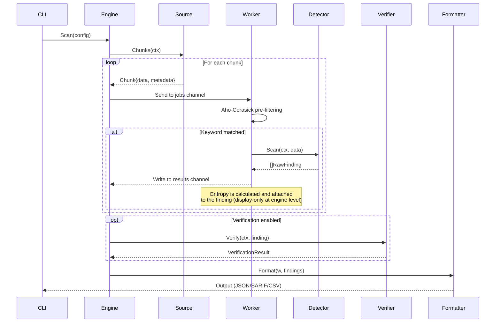
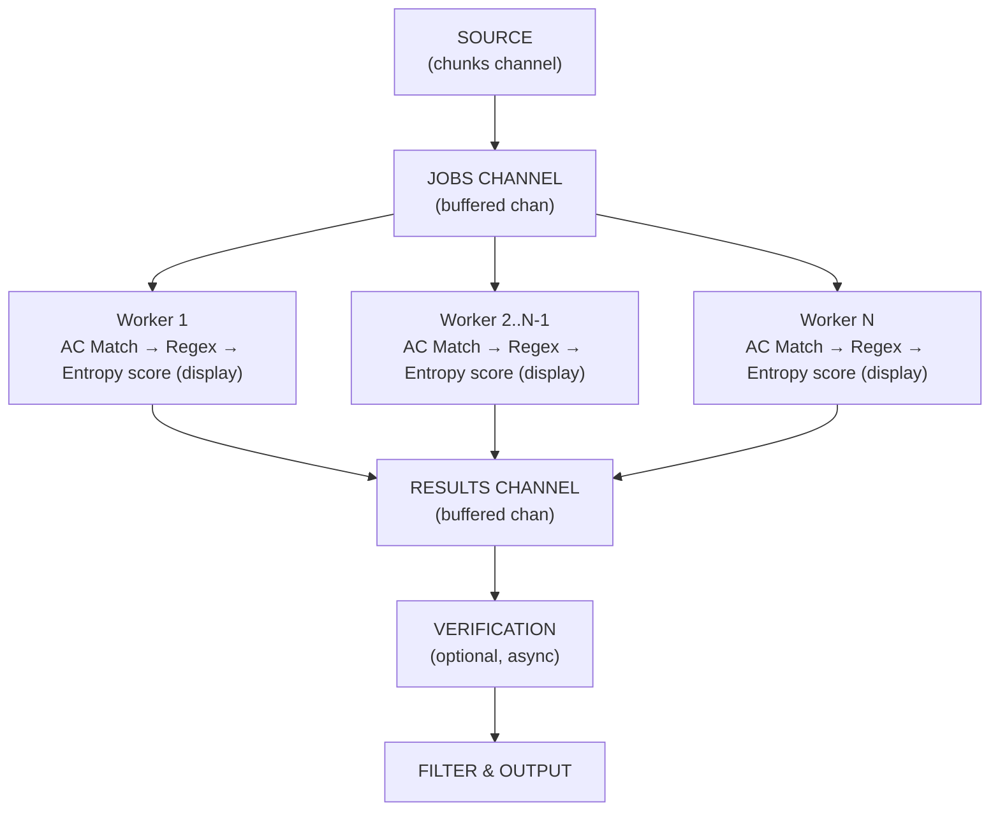
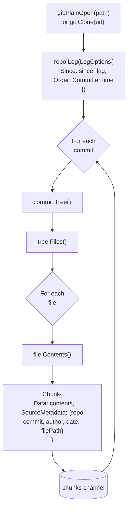
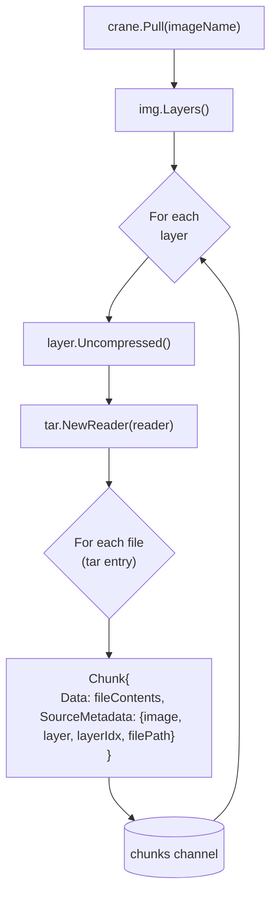
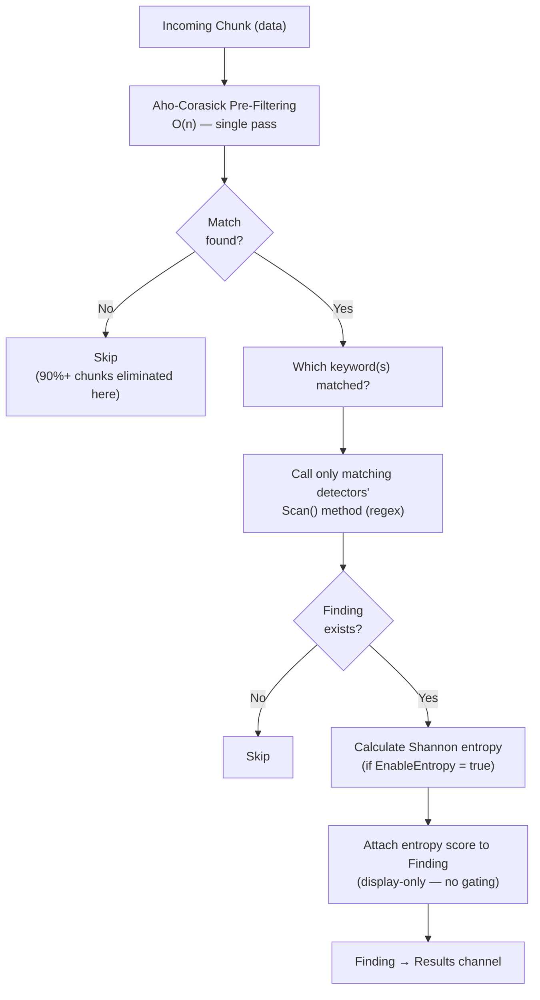

# Leakwatch - Detailed Architecture Design

> **Document Version:** 1.1
> **Date:** 2026-05-22
> **Status:** Approved

---

## 1. Architecture Overview

Leakwatch is built on a pipeline-based architecture. Data flows through a series of well-defined stages from source (Source) to output (Output). Each stage can be independently tested, scaled, and replaced.

```mermaid
flowchart LR
    subgraph Sources["Sources"]
        S1[Git]
        S2[Filesystem]
        S3[Container]
        S4["S3 (v2)"]
        S5[GCS]
        S6[Slack]
    end

    subgraph Engine["Detection Engine"]
        E1[Aho-Corasick]
        E2[Regex Validation]
        E3[Entropy Analysis]
        E4[Custom Rules]
    end

    subgraph Verifiers["Verifiers (54 verifiers, 51 packages, 85.7% coverage)"]
        V1[AWS STS]
        V2[GitHub API]
        V3[Slack API]
        V4[Stripe, JWT, ...]
    end

    subgraph Output["Output"]
        O1[JSON]
        O2[SARIF]
        O3[CSV]
        O4[Table]
    end

    Sources -->|Chunks| Chunker[Chunker]
    Chunker --> Engine
    Engine --> Verifiers
    Verifiers --> Filter["Filter & Output"]
    Filter --> Output
```



---

## 2. Core Interfaces

Leakwatch's extensibility is built on well-defined Go interfaces. These interfaces are the "contracts" of the system.



### 2.1 Source Interface

```go
// Source represents a data source to be scanned.
// Each source type (Git, filesystem, container) implements this interface.
type Source interface {
    // Type returns the source type (e.g., "git", "filesystem", "container").
    Type() string

    // Chunks sends data chunks to be scanned over a channel.
    // The channel is closed when the context is cancelled.
    Chunks(ctx context.Context) <-chan Chunk

    // Validate checks that the source is accessible and valid.
    Validate() error
}

// Chunk represents the smallest unit of data to be scanned.
type Chunk struct {
    // Data is the raw content to be scanned.
    Data []byte

    // SourceMetadata is the context information identifying where the finding came from.
    SourceMetadata SourceMetadata
}

// SourceMetadata describes the origin of a chunk.
type SourceMetadata struct {
    // Fields specific to the source type
    SourceType string // "git", "filesystem", "container"

    // Git-specific
    Repository string
    Commit     string
    Author     string
    Email      string
    Date       time.Time
    Branch     string

    // File-specific
    FilePath string
    Line     int

    // Container-specific
    Image    string
    Layer    string
    LayerIdx int
}
```

### 2.2 Detector Interface

```go
// Detector represents a component that detects a specific secret type.
type Detector interface {
    // ID returns the detector's unique identifier (e.g., "aws-access-key-id").
    ID() string

    // Description returns the detector's human-readable description.
    Description() string

    // Keywords returns keywords for Aho-Corasick pre-filtering.
    // If empty, pre-filtering is skipped and regex is applied to every chunk.
    Keywords() []string

    // Scan scans the given data and returns potential secrets found.
    Scan(ctx context.Context, data []byte) []RawFinding

    // Severity returns the default severity level for this detector's findings.
    Severity() Severity
}

// RawFinding represents an unverified raw finding.
type RawFinding struct {
    DetectorID string
    Raw        []byte   // The discovered secret data
    RawV2      []byte   // Optional: second part of the secret (e.g., secret key)
    Redacted   string   // Masked version (for logging)
    ExtraData  map[string]string // Additional context information
}
```

### 2.3 Verifier Interface

```go
// Verifier represents a component that validates a secret's authenticity.
// Defined in internal/verifier/verifier.go.
type Verifier interface {
    // Type returns which detector ID this verifier handles.
    // Must match the corresponding Detector.ID() value.
    Type() string

    // Verify checks whether the found secret is valid/active.
    // May make network calls, so it can be cancelled via context.
    Verify(ctx context.Context, raw detector.RawFinding) finding.VerificationResult
}

// VerificationResult represents the verification outcome.
type VerificationResult struct {
    Status    VerificationStatus
    Message   string           // Human-readable description
    ExtraData map[string]string // Additional information obtained during verification
}

// VerificationStatus represents the verification state.
type VerificationStatus int

const (
    StatusUnverified      VerificationStatus = iota // Verification not performed
    StatusVerifiedActive                             // Verified: secret is active
    StatusVerifiedInactive                           // Verified: secret is inactive
    StatusVerifyError                                // Error during verification
)
```

### 2.4 Formatter Interface

```go
// Formatter represents a component that outputs findings in a specific format.
type Formatter interface {
    // Format writes findings to the specified writer.
    Format(w io.Writer, findings []Finding) error

    // FileExtension returns the file extension for this format.
    FileExtension() string
}
```

### 2.5 Unified Finding Model

```go
// Finding represents a fully enriched finding.
// It is the final output of the pipeline.
type Finding struct {
    // Identity
    ID         string    `json:"id"`
    DetectorID string    `json:"detector_id"`
    Severity   Severity  `json:"severity"`

    // Secret data
    Raw      string `json:"raw,omitempty"`     // Only with --show-raw
    Redacted string `json:"redacted"`           // Masked

    // Location
    SourceMetadata SourceMetadata `json:"source"`

    // Verification
    Verification VerificationResult `json:"verification"`

    // Timestamp
    DetectedAt time.Time `json:"detected_at"`

    // Entropy
    Entropy float64 `json:"entropy,omitempty"`

    // Additional context
    ExtraData map[string]string `json:"extra_data,omitempty"`
}

// Severity represents the finding severity level.
type Severity int

const (
    SeverityLow      Severity = iota
    SeverityMedium
    SeverityHigh
    SeverityCritical
)
```

---

### 2.6 Component Interaction Sequence

The following sequence diagram shows how components interact during a single scan operation:



---

## 3. Scan Engine Detailed Design

### 3.1 Worker Pool Model



### 3.2 Engine Configuration

```go
// Config holds the scan engine configuration (internal/engine/engine.go).
type Config struct {
    // Concurrency controls the number of worker goroutines.
    // Channel buffers are sized as Concurrency × 2.
    Concurrency int

    // Detection
    Detectors        []detector.Detector
    EnableEntropy    bool
    // EntropyThreshold is validated and stored, but at the engine level
    // entropy is display-only. Threshold gating applies only to custom rules.
    EntropyThreshold float64 // Default: 4.0
    ShowRaw          bool    // Expose raw secret content on Finding.Raw

    // Optional clock override (for deterministic tests)
    Clock func() time.Time

    // Verification
    VerifierConfig verifier.Config
    Verifiers      []verifier.Verifier
    OnlyVerified   bool // If true, suppress unverified findings

    // Filtering
    MinSeverity finding.Severity // Minimum severity to include
}
```

### 3.3 Engine Lifecycle

```mermaid
stateDiagram-v2
    [*] --> Initialization

    state Initialization {
        [*] --> LoadDetectors: Load from registry
        LoadDetectors --> CompileAC: Compile Aho-Corasick automaton
        CompileAC --> CreatePool: Create worker pool
        CreatePool --> CreateChannels: Create channels
    }

    Initialization --> Scanning

    state Scanning {
        [*] --> ReadChunk: Read from Source.Chunks() channel
        ReadChunk --> SendToJobs: Send to jobs channel
        SendToJobs --> ParallelScan
        state ParallelScan {
            [*] --> ACPreFilter: Aho-Corasick pre-filtering
            ACPreFilter --> DetectorScan: Call matching detectors' Scan()
            DetectorScan --> EntropyCalc: Entropy score (display-only)
            EntropyCalc --> WriteResult: Write to results channel
        }
    }

    Scanning --> Verification: Optional

    state Verification {
        [*] --> FindVerifier: Find matching Verifier
        FindVerifier --> CallVerify: Call Verify() (rate-limited)
        CallVerify --> Enrich: Enrich Finding
    }

    Verification --> Output

    state Output {
        [*] --> AllowlistFilter: Apply allowlist/ignore
        AllowlistFilter --> VerifiedFilter: --only-verified filter
        VerifiedFilter --> SeverityFilter: Severity filter
        SeverityFilter --> Format: Output via Formatter.Format()
    }

    Output --> [*]
```



---

## 4. Plugin Registration Mechanism

### 4.1 Compile-Time Registration Pattern

```go
// internal/detector/registry.go

var (
    mu        sync.RWMutex
    detectors = make(map[string]Detector)
)

// Register registers a detector in the central registry.
// Each detector package calls this function in its init() function.
func Register(d Detector) {
    mu.Lock()
    defer mu.Unlock()
    if _, exists := detectors[d.ID()]; exists {
        panic("duplicate detector ID: " + d.ID())
    }
    detectors[d.ID()] = d
}

// All returns all registered detectors.
func All() []Detector {
    mu.RLock()
    defer mu.RUnlock()
    result := make([]Detector, 0, len(detectors))
    for _, d := range detectors {
        result = append(result, d)
    }
    return result
}
```

### 4.2 Detector Registration Example

```go
// internal/detector/aws.go

func init() {
    Register(&AWSAccessKeyID{})
    Register(&AWSSecretAccessKey{})
}

type AWSAccessKeyID struct{}

func (d *AWSAccessKeyID) ID() string          { return "aws-access-key-id" }
func (d *AWSAccessKeyID) Description() string  { return "AWS Access Key ID" }
func (d *AWSAccessKeyID) Keywords() []string   { return []string{"AKIA", "ABIA", "ACCA", "ASIA"} }
func (d *AWSAccessKeyID) Severity() Severity   { return SeverityCritical }

func (d *AWSAccessKeyID) Scan(ctx context.Context, data []byte) []RawFinding {
    // AWS Access Key ID pattern: AKIA[0-9A-Z]{16}
    re := regexp.MustCompile(`(AKIA|ABIA|ACCA|ASIA)[0-9A-Z]{16}`)
    matches := re.FindAll(data, -1)

    findings := make([]RawFinding, 0, len(matches))
    for _, match := range matches {
        findings = append(findings, RawFinding{
            DetectorID: d.ID(),
            Raw:        match,
            Redacted:   string(match[:4]) + "****" + string(match[len(match)-4:]),
        })
    }
    return findings
}
```

### 4.3 Activation via Blank Import

```go
// main.go or cmd/root.go

import (
    // Register detectors
    _ "github.com/HodeTech/leakwatch/internal/detector/aws"
    _ "github.com/HodeTech/leakwatch/internal/detector/generic"
    _ "github.com/HodeTech/leakwatch/internal/detector/privatekey"
    _ "github.com/HodeTech/leakwatch/internal/detector/github"
    _ "github.com/HodeTech/leakwatch/internal/detector/slack"
    _ "github.com/HodeTech/leakwatch/internal/detector/stripe"
    _ "github.com/HodeTech/leakwatch/internal/detector/jwt"
    _ "github.com/HodeTech/leakwatch/internal/detector/dbconn"
    _ "github.com/HodeTech/leakwatch/internal/detector/custom"

    // Register sources
    _ "github.com/HodeTech/leakwatch/internal/source/git"
    _ "github.com/HodeTech/leakwatch/internal/source/filesystem"
    _ "github.com/HodeTech/leakwatch/internal/source/container"
    _ "github.com/HodeTech/leakwatch/internal/source/s3"
    _ "github.com/HodeTech/leakwatch/internal/source/gcs"
    _ "github.com/HodeTech/leakwatch/internal/source/slack"

    // Register verifiers
    _ "github.com/HodeTech/leakwatch/internal/verifier/aws"
    _ "github.com/HodeTech/leakwatch/internal/verifier/github"
)
```

---

## 5. Source Implementations

### 5.1 Git Source Flow Diagram



### 5.2 Filesystem Source

```go
// filepath.WalkDir based scanning with io/fs
func (s *FilesystemSource) Chunks(ctx context.Context) <-chan Chunk {
    ch := make(chan Chunk, s.bufferSize)
    go func() {
        defer close(ch)
        filepath.WalkDir(s.root, func(path string, d fs.DirEntry, err error) error {
            select {
            case <-ctx.Done():
                return ctx.Err()
            default:
            }

            if err != nil || d.IsDir() {
                return nil
            }

            // Filtering: size, extension, .leakwatchignore
            if s.shouldSkip(path, d) {
                return nil
            }

            data, err := os.ReadFile(path)
            if err != nil {
                return nil
            }

            ch <- Chunk{
                Data: data,
                SourceMetadata: SourceMetadata{
                    SourceType: "filesystem",
                    FilePath:   path,
                },
            }
            return nil
        })
    }()
    return ch
}
```

### 5.3 Container Image Source



---

## 6. Detection Engine Detail

### 6.1 Aho-Corasick + Regex Hybrid Strategy



> **Note on entropy gating:** At the engine level, entropy is **display-only**. The computed value is attached to the `Finding.Entropy` field for human review; the engine never suppresses or demotes a finding based on entropy score. The exception is **custom rules**: a YAML rule with an `entropy:` field does gate matches — only candidates whose entropy meets or exceeds the rule's threshold are emitted. A global entropy gate for built-in detectors is planned but not yet implemented (see [ROADMAP — Known Gaps](../../docs/05-ROADMAP.md)).

### 6.2 Shannon Entropy Calculation

```go
// entropy/shannon.go

// Calculate computes the Shannon entropy of the given byte slice.
// The result ranges from 0.0 (perfectly uniform) to ~8.0 (perfectly random).
func Calculate(data []byte) float64 {
    if len(data) == 0 {
        return 0.0
    }

    // Count character frequencies
    freq := make(map[byte]float64)
    for _, b := range data {
        freq[b]++
    }

    // Shannon entropy formula: H = -Σ p(x) * log2(p(x))
    length := float64(len(data))
    entropy := 0.0
    for _, count := range freq {
        p := count / length
        if p > 0 {
            entropy -= p * math.Log2(p)
        }
    }
    return entropy
}

// Recommended threshold values:
// - Hex character set:    > 3.0 (high entropy)
// - Base64 character set: > 4.5 (high entropy)
// - General:              > 4.0 (high entropy)
```

---

## 7. Verification Subsystem

### 7.1 Rate Limiting and Security

```go
type VerificationEngine struct {
    verifiers    map[string]Verifier
    rateLimiter  *rate.Limiter        // golang.org/x/time/rate
    timeout      time.Duration
    concurrency  int
    enabled      bool
}

// Security rules:
// 1. Verified credentials are NEVER logged
// 2. Rate limiting is mandatory — to avoid overloading APIs
// 3. Timeout is mandatory — to avoid waiting on unresponsive APIs
// 4. Can be disabled by the user (--no-verify)
// 5. Verification results can be cached (same secret is not re-verified)
```

### 7.2 AWS Verification Example

```go
// verifier/aws.go

func (v *AWSVerifier) Verify(ctx context.Context, finding RawFinding) VerificationResult {
    accessKeyID := string(finding.Raw)
    secretKey := string(finding.RawV2)

    if secretKey == "" {
        return VerificationResult{
            Status:  StatusUnverified,
            Message: "Secret Access Key not found, cannot verify",
        }
    }

    // AWS STS GetCallerIdentity — does not require IAM permissions
    cfg, err := config.LoadDefaultConfig(ctx,
        config.WithCredentialsProvider(
            credentials.NewStaticCredentialsProvider(accessKeyID, secretKey, ""),
        ),
    )
    if err != nil {
        return VerificationResult{Status: StatusVerifyError, Message: err.Error()}
    }

    client := sts.NewFromConfig(cfg)
    result, err := client.GetCallerIdentity(ctx, &sts.GetCallerIdentityInput{})
    if err != nil {
        return VerificationResult{
            Status:  StatusVerifiedInactive,
            Message: "Key is invalid or disabled",
        }
    }

    return VerificationResult{
        Status:  StatusVerifiedActive,
        Message: fmt.Sprintf("Active key: account=%s, ARN=%s", *result.Account, *result.Arn),
        ExtraData: map[string]string{
            "account": *result.Account,
            "arn":     *result.Arn,
        },
    }
}
```

---

## 8. Configuration Hierarchy

Configuration managed by Viper is applied according to the following priority order (descending priority from top to bottom):

```
1. Command-line flags               (highest priority)
   --concurrency=8

2. Environment variables
   LEAKWATCH_CONCURRENCY=8

3. Project configuration file
   .leakwatch.yaml (in working directory)

4. Global configuration file
   ~/.leakwatch.yaml

5. Default values                    (lowest priority)
   concurrency: runtime.NumCPU()
```

### 8.1 Configuration File Schema (.leakwatch.yaml)

```yaml
# Scan configuration
scan:
  concurrency: 8              # Number of workers
  max-file-size: 10485760     # 10MB
  chunk-size: 1024            # Chunk buffer size

# Detection configuration
detection:
  entropy:
    enabled: true
    threshold: 4.0
  detectors:
    enabled: ["*"]             # All active
    disabled: []               # Disabled ones

# Verification configuration
verification:
  enabled: true
  timeout: 10s
  concurrency: 4

# Filtering
filter:
  exclude-paths:
    - "vendor/**"
    - "node_modules/**"
    - "**/*.lock"
    - "go.sum"
  exclude-detectors: []
  only-verified: false

# Output configuration
output:
  format: json                 # json, sarif, csv, table
  file: ""                     # If empty, write to stdout
  show-raw: false              # Show secret content
  severity-threshold: low      # Minimum severity level

# Custom rules
custom-rules:
  - id: "internal-api-key"
    description: "Internal API Key"
    regex: 'INTERNAL_[A-Z0-9]{32}'
    keywords: ["INTERNAL_"]
    severity: high
    entropy: 3.5
```

---

## 9. Filtering System

### 9.1 .leakwatchignore

Compatible with Git's `.gitignore` format, defines files and paths to exclude from secret scanning:

```
# Test files
*_test.go
test/**
tests/**
__tests__/**

# Dependencies
vendor/
node_modules/
go.sum
package-lock.json
yarn.lock

# Documentation
docs/**
*.md

# Build outputs
dist/
build/
bin/

# Specific files
.env.example
config.example.yaml
```

### 9.2 Inline Ignore

To exclude specific lines from scanning:

```python
API_KEY = "AKIA1234EXAMPLE567890"  # leakwatch:ignore
PASSWORD = "test123"  # leakwatch:ignore:aws-access-key-id
```

---

## 10. Error Handling and Resilience

### 10.1 Error Strategy

| Error Type | Strategy |
|-----------|----------|
| Source inaccessible (repo/file not found) | Fatal — exit immediately |
| Single file unreadable | Warn, skip, continue |
| Verification error (network/timeout) | Mark as VerifyError, continue |
| Rate limit exceeded | Retry with exponential backoff |
| Insufficient memory | Reduce chunk size, warn |

### 10.2 Structured Logging

```go
// Go 1.21+ log/slog package
slog.Info("scan started",
    "source", "git",
    "repository", repoPath,
    "concurrency", config.Concurrency,
)

slog.Warn("skipping file",
    "path", filePath,
    "reason", "size limit exceeded",
    "size", fileSize,
    "limit", config.MaxFileSize,
)
```

---

## 11. Security Design Principles

1. **Secrets are never logged** — Discovered secrets are only logged in redacted form
2. **Least privilege** — Only read-only API calls are used for verification (e.g., STS GetCallerIdentity)
3. **Secrets are not cached** — Verified secrets are not written to disk
4. **Secure exit codes** — Non-zero exit code when secrets are found (CI/CD integration)
5. **Dependency security** — Regular vulnerability scanning with `govulncheck`
6. **Rate limiting** — Mandatory rate limiting on verification API calls
