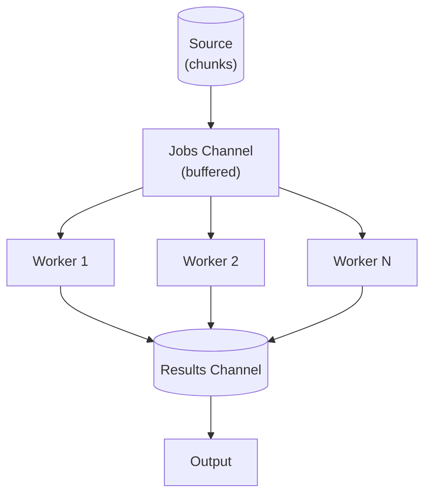

# ADR-0008: Concurrency Model — Worker Pool

- **Status:** Accepted
- **Date:** 2026-03-24
- **Decision Makers:** Project team

## Context

Secret scanning is inherently a largely I/O-bound operation (file reading, network requests). Spawning uncontrolled goroutines for every file/commit/layer to be scanned can exhaust system resources. The concurrency level must be kept under control.

## Decision

**Worker Pool** design pattern has been selected.

### Rationale

- Fixed number of worker goroutines (default: `runtime.NumCPU()`)
- Jobs (chunks) -> buffered jobs channel -> workers -> buffered results channel
- Concurrency level is controlled, resource usage is predictable
- Configurable by the user via the `--concurrency` flag
- Completely separates scanning logic from data source logic (Separation of Concerns)

### Channel structure

| Channel | Buffer | Producer | Consumer |
|---------|--------|----------|----------|
| `jobs` | `Concurrency × 2` (constant `channelBufferMultiplier = 2`) | Source goroutine | Worker goroutines |
| `results` | `Concurrency × 2` (constant `channelBufferMultiplier = 2`) | Worker goroutines | Result collection goroutine |

The buffer formula `Concurrency × channelBufferMultiplier` ensures enough headroom for all workers to have a pending item without blocking the producer, while keeping memory usage proportional to the configured concurrency level (rather than a fixed 1 024-slot allocation regardless of parallelism).

## Alternatives Considered

### Uncontrolled goroutines (new goroutine per chunk)

- **Pros:** Simple implementation
- **Cons:** Uncontrolled resource consumption, file descriptor limits can be exceeded, GC pressure
- **Decision:** Rejected.

### errgroup / semaphore

- **Pros:** Simple concurrency limiting with `golang.org/x/sync/errgroup`
- **Cons:** Not as flexible as a worker pool, result collection must be managed separately
- **Decision:** Partially applicable — errgroup can be used for error management within the worker pool.

### Pipeline (channel chaining)

- **Pros:** Each stage can scale independently
- **Cons:** Data transformation between stages is simple in this project, pipeline overhead is unnecessary
- **Decision:** Rejected. Worker pool is more suitable for this use case.

## Consequences

### Positive

- Resource usage is predictable and bounded
- Users can tune via `--concurrency` according to their hardware
- Graceful shutdown supported via context cancellation
- Source-agnostic: Git, file system, container — all use the same worker pool

### Negative

- Buffered channel size must be properly tuned (too small: bottleneck, too large: memory waste)
- The verification stage requires separate concurrency control (network I/O + rate limiting)
