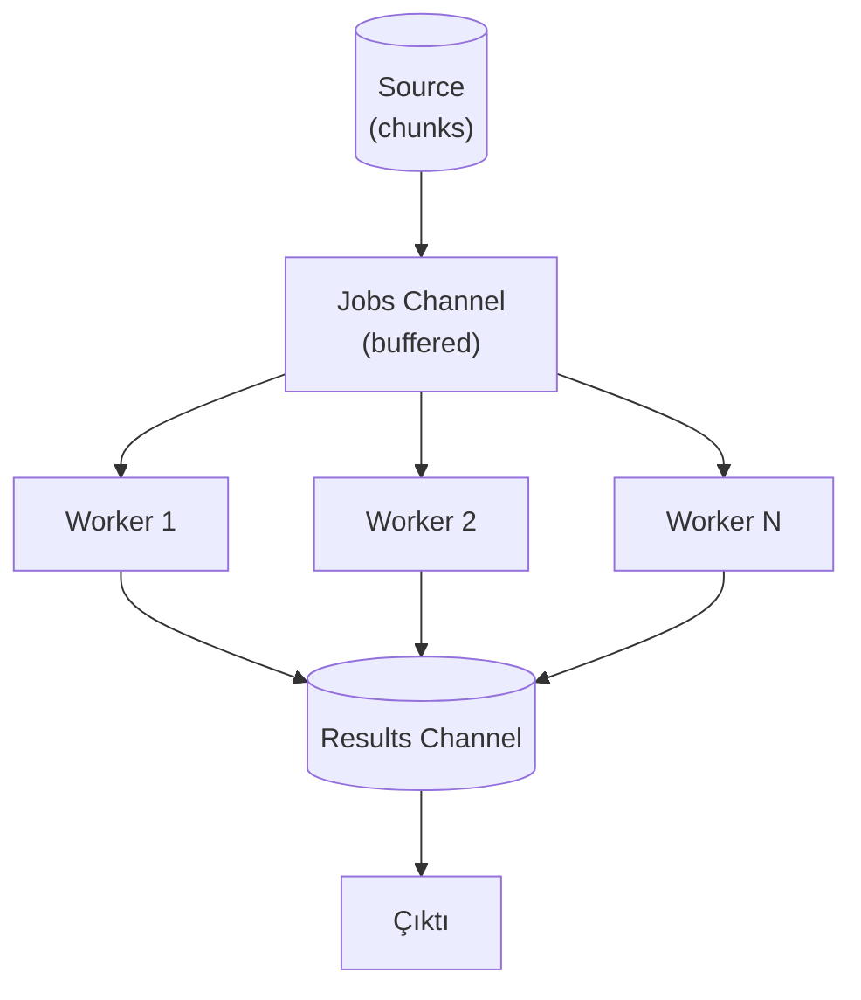

# ADR-0008: Eşzamanlılık Modeli — Worker Pool

- **Durum:** Kabul Edildi
- **Tarih:** 2026-03-24
- **Karar Verenler:** Proje ekibi

## Bağlam

Sır tarama, doğası gereği büyük ölçüde I/O'ya bağlı (dosya okuma, ağ istekleri) bir işlemdir. Taranacak her dosya/commit/katman için kontrolsüz goroutine başlatmak sistem kaynaklarını tüketebilir. Eşzamanlılık seviyesi kontrol altında tutulmalıdır.

## Karar

**İşçi Havuzu (Worker Pool)** tasarım deseni seçilmiştir.

### Gerekçe

- Sabit sayıda işçi goroutine'i (varsayılan: `runtime.NumCPU()`)
- İşler (chunks) → buffered jobs channel → işçiler → buffered results channel
- Eşzamanlılık seviyesi kontrol altında, kaynak kullanımı öngörülebilir
- `--concurrency` flag'i ile kullanıcı tarafından ayarlanabilir
- Tarama mantığını veri kaynağı mantığından tamamen ayırır (Separation of Concerns)

### Kanal yapısı

| Kanal | Tampon | Üretici | Tüketici |
|-------|--------|---------|----------|
| `jobs` | `ChunkSize` (1024) | Source goroutine'i | Worker goroutine'leri |
| `results` | `ChunkSize` (1024) | Worker goroutine'leri | Sonuç toplama goroutine'i |

## Değerlendirilen Alternatifler

### Kontrolsüz goroutine (her chunk için yeni goroutine)

- **Artılar:** Basit implementasyon
- **Eksiler:** Kaynak tüketimi kontrolsüz, dosya tanıtıcı limitleri aşılabilir, GC baskısı
- **Karar:** Reddedildi.

### errgroup / semaphore

- **Artılar:** `golang.org/x/sync/errgroup` ile basit eşzamanlılık sınırlama
- **Eksiler:** Worker pool kadar esnek değil, sonuç toplama ayrı yönetilmeli
- **Karar:** Kısmen uygulanabilir — worker pool içinde hata yönetimi için errgroup kullanılabilir.

### Pipeline (channel chaining)

- **Artılar:** Her aşama bağımsız ölçeklenebilir
- **Eksiler:** Bu projede aşamalar arası veri dönüşümü basit, pipeline overhead gereksiz
- **Karar:** Reddedildi. Worker pool, bu kullanım için daha uygun.

## Sonuçlar

### Olumlu

- Kaynak kullanımı öngörülebilir ve sınırlı
- Kullanıcı, `--concurrency` ile donanımına göre ayarlayabilir
- Context iptali ile graceful shutdown desteklenir
- Kaynaktan bağımsız: Git, dosya sistemi, container — hepsi aynı worker pool'u kullanır

### Olumsuz

- Buffered channel boyutu doğru ayarlanmalı (çok küçük: darboğaz, çok büyük: bellek israfı)
- Doğrulama (verification) aşaması ayrı bir eşzamanlılık kontrolü gerektirir (ağ I/O + rate limiting)
