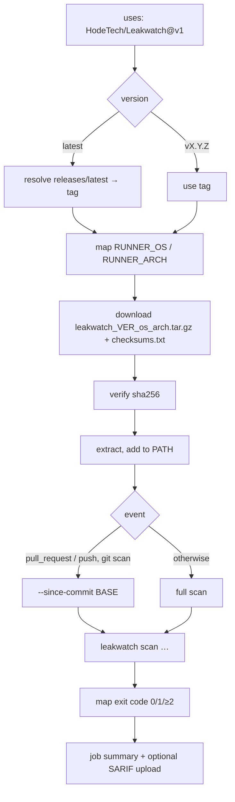

# ADR-0009: GitHub Marketplace Action — Location & Runtime

- **Status:** Accepted
- **Date:** 2026-05-24
- **Decision Makers:** Project team

## Context

Leakwatch should be usable in GitHub workflows with a single line, discoverable
through the GitHub Marketplace — the same low-friction adoption path TruffleHog
OSS offers (`uses: trufflesecurity/trufflehog@main`).

Two constraints shaped the design:

1. **Marketplace requires the action metadata at the repository root.** GitHub
   only publishes an action whose `action.yml`/`action.yaml` lives at the root of
   a public repository, one published action per repository.
2. **Prebuilt artifacts already exist.** The release pipeline (`.goreleaser.yml`)
   already produces cross-platform binaries
   (`leakwatch_<version>_<os>_<arch>.tar.gz` + `checksums.txt`) and multi-arch
   GHCR images on every `v*` tag.

The previous action lived at `action/action.yml` (a subdirectory, not
publishable) and installed Leakwatch with `go install …@latest`, recompiling from
source on every run (slow, requires a Go toolchain).

## Decision

### 1. Publish from the main repository root

The action metadata lives at the repository root `action.yml` and is consumed as
`uses: HodeTech/Leakwatch@v1`. No separate `leakwatch-action` repository is
created.

A floating major tag (`v1`) is moved to each new stable release by the release
workflow, so consumers can pin `@v1` and receive the latest `v1.x`.

### 2. Install a prebuilt binary (composite action)

The action is a **composite** action that downloads the prebuilt release archive
matching the runner OS/arch, verifies its SHA-256 checksum against
`checksums.txt`, extracts it, and puts the binary on `PATH`. It does **not**
compile from source.

### Rationale

- **TruffleHog model.** Publishing from the main repo keeps the action versioned
  in lock-step with the tool, leverages the repo's existing visibility, and
  avoids the synchronization burden of a second repository.
- **Prebuilt over `go install`.** Reuses artifacts the release already ships;
  scans start in seconds with no Go toolchain, and the checksum step adds
  supply-chain integrity.

## Alternatives Considered

### Separate `HodeTech/leakwatch-action` repository

- **Pros:** main repo stays free of action metadata; independent versioning.
- **Cons:** two repositories to keep in sync; the action and tool versions
  decouple; a new repo starts with no visibility.
- **Decision:** Rejected.

### Docker container action (`image: docker://ghcr.io/hodetech/leakwatch`)

- **Pros:** simplest, fastest pull; uses the GHCR image already built.
- **Cons:** Linux-only; the image tag is static per action tag.
- **Decision:** Rejected as the primary mechanism; the GHCR image remains a
  documented manual alternative (and the only option on Windows runners).

### Keep `go install`

- **Cons:** recompiles every run, requires a Go toolchain, slow.
- **Decision:** Rejected.

## Consequences

### Positive

- Single-line, Marketplace-discoverable usage: `uses: HodeTech/Leakwatch@v1`.
- Fast, reproducible, checksum-verified install.
- New inputs (`output`, `remediation`, `config`, `scan-diff`, `extra-args`,
  `working-directory`) and a job summary improve the CI experience.
- PR-diff scanning (`--since-commit`) and the `github` output format (inline
  annotations) bring parity with comparable tools.

### Negative

- **Linux and macOS only.** The composite install script relies on
  `$GITHUB_PATH` and POSIX tooling, which are reliable on Linux/macOS. Windows
  runners are not supported by the action; users run on Linux/macOS or invoke the
  GHCR image directly. (Future enhancement.)
- The `v1` tag must be maintained automatically (handled in the release
  workflow) and consumers who want strict reproducibility should pin a full
  release tag or commit SHA.

## Publishing to the Marketplace (maintainer runbook)

Publishing is a **manual, one-time** step that cannot be automated:

1. Ensure the repository is **public** and `action.yml` is at the root.
2. Confirm the action `name:` ("Leakwatch Secret Scanner") is **unique** across
   the Marketplace and does not collide with an existing GitHub user/org name.
3. On the maintainer account: enable **2FA** and accept the **GitHub Marketplace
   Developer Agreement**.
4. Draft a GitHub **Release** for a version tag (e.g. `v1.5.0`). On the release
   form, tick **"Publish this Action to the GitHub Marketplace"**, choose the
   primary category **Security** (and a secondary such as *Continuous
   integration*), then publish.
5. Verify the listing resolves at
   `https://github.com/marketplace/actions/leakwatch-secret-scanner` and that
   `uses: HodeTech/Leakwatch@v1` works from an external repository.

The release workflow moves the `v1` tag automatically on each stable release; no
manual tag bookkeeping is required after the first publish.
