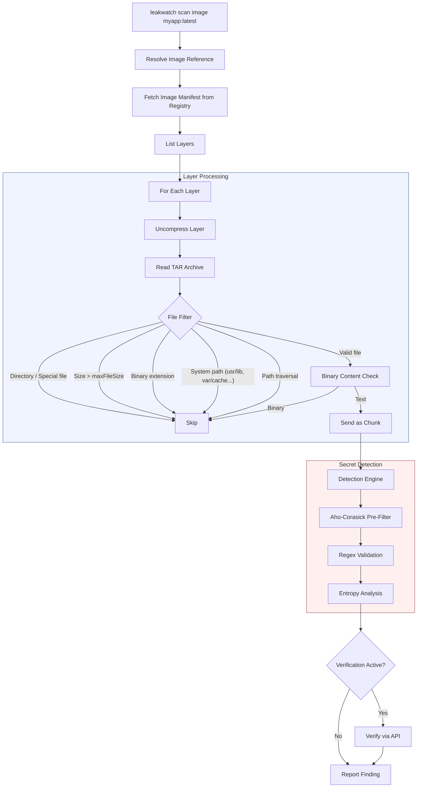
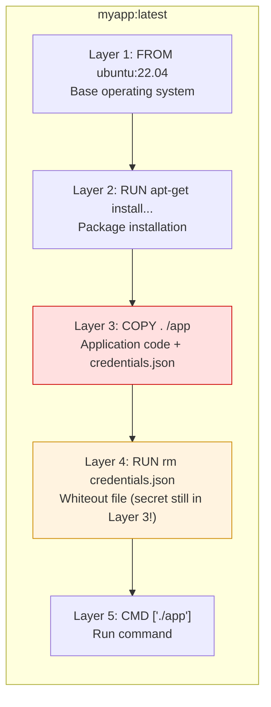
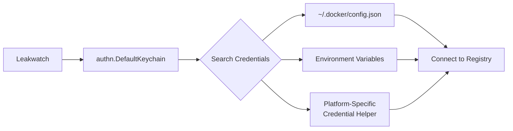
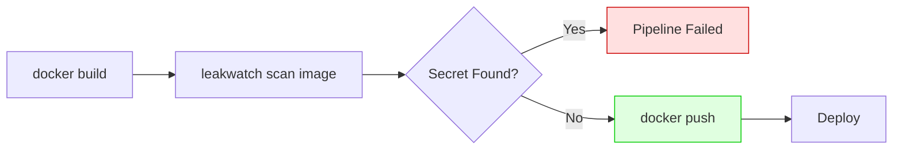

# Leakwatch - Container Image Scanning Guide

> **Document Version:** 1.0
> **Date:** 2026-03-24
> **Status:** Approved

---

## Table of Contents

1. [Why Scan Container Images?](#1-why-scan-container-images)
2. [Supported Registries](#2-supported-registries)
3. [Basic Usage](#3-basic-usage)
4. [How Does It Work?](#4-how-does-it-work)
5. [Layer-Based Analysis](#5-layer-based-analysis)
6. [Registry Authentication](#6-registry-authentication)
7. [Container Scanning in CI/CD](#7-container-scanning-in-cicd)
8. [Performance Tips](#8-performance-tips)
9. [Security Best Practices](#9-security-best-practices)

---

## 1. Why Scan Container Images?

Container images package application code and dependencies in layers. While this layered structure provides a powerful distribution mechanism, it also harbors a significant security risk: **deleted files are not actually deleted**.

### The Layer Reality

Docker images consist of read-only layers stacked on top of each other. When you create a file in a `Dockerfile` and delete it in the next line, the file is masked by a "whiteout" file in the upper layer but still exists in the lower layer.

```dockerfile
# DANGEROUS: Secret remains in the lower layer!
COPY credentials.json /app/credentials.json
RUN ./setup.sh && rm /app/credentials.json
```

In this example, the `credentials.json` file is not visible in the final image's filesystem; however, it is fully accessible in the first layer. Leakwatch scans each layer independently to uncover these "hidden" secrets.

### Common Secret Leakage Scenarios

| Scenario | Description |
|----------|-------------|
| **Deleted credentials** | API keys and certificates added during build and then deleted |
| **Multi-stage build remnants** | Secrets remaining in pre-stages of multi-stage builds |
| **Env values written to files** | An `ENV`/`ARG` value persisted into a file during build (note: Leakwatch scans layer file contents, not the image config blob where `ENV` itself lives -- see §5.3) |
| **Configuration files** | Database connection details, cloud credentials |
| **SSH keys** | Private keys used during build that remain in layers |

---

## 2. Supported Registries

Leakwatch supports all OCI-compliant container registries. Thanks to the `go-containerregistry` library, it **does not require a running Docker daemon**.

| Registry | Example Reference | Authentication |
|----------|-------------------|----------------|
| **Docker Hub** | `nginx:latest`, `myorg/myapp:v1.2` | Docker config.json |
| **GitHub Container Registry (GHCR)** | `ghcr.io/owner/image:tag` | `GITHUB_TOKEN` |
| **AWS ECR** | `123456789.dkr.ecr.eu-west-1.amazonaws.com/app:latest` | `aws ecr get-login-password` |
| **Google Container Registry (GCR)** | `gcr.io/project-id/image:tag` | `gcloud auth configure-docker` |
| **Google Artifact Registry** | `europe-docker.pkg.dev/project/repo/image:tag` | `gcloud auth configure-docker` |
| **Azure Container Registry** | `myregistry.azurecr.io/app:latest` | `az acr login` |
| **Private Registry** | `registry.example.com/app:v1` | Docker config.json |

---

## 3. Basic Usage

### 3.1 Local and Remote Image Scanning

Leakwatch takes the image reference directly with the `scan image` command. The image is pulled from the remote registry and scanned layer by layer.

```bash
# Simple image scan
leakwatch scan image nginx:latest

# Scan with a specific tag
leakwatch scan image myorg/myapp:v2.1.0

# Scan with digest (immutability guarantee)
leakwatch scan image myorg/myapp@sha256:abc123...
```

### 3.2 Output Format Selection

```bash
# JSON format output (default)
leakwatch scan image myapp:latest --format json

# SARIF format output (compatible with GitHub Security tab)
leakwatch scan image myapp:latest --format sarif --output results.sarif

# Table format output (human-readable)
leakwatch scan image myapp:latest --format table

# CSV format output
leakwatch scan image myapp:latest --format csv --output results.csv
```

### 3.3 Additional Options

```bash
# Set file size limit (default: 10MB)
leakwatch scan image myapp:latest --max-file-size 5242880

# Concurrent scanning (number of workers)
leakwatch scan image myapp:latest --concurrency 4

# Show only verified secrets
leakwatch scan image myapp:latest --only-verified

# Disable verification
leakwatch scan image myapp:latest --no-verify

# Show raw secret content (use with caution)
leakwatch scan image myapp:latest --show-raw
```

### 3.4 Authentication with Private Registry

Leakwatch uses Docker's standard authentication chain (`authn.DefaultKeychain`). No additional configuration is needed after logging in to the registry.

```bash
# Log in to private registry
docker login registry.example.com

# Then scan normally
leakwatch scan image registry.example.com/myapp:latest
```

---

## 4. How Does It Work?

Leakwatch scans container images in a daemonless manner using the `go-containerregistry` library. The following diagram illustrates the scanning process:



### Processing Steps

1. **Reference resolution:** The image reference (e.g., `nginx:latest`) is parsed into an OCI-compliant reference.
2. **Manifest retrieval:** The image manifest is pulled from the registry. This operation does not require a Docker daemon.
3. **Layer iteration:** Each layer is processed sequentially. The layer's `digest` value is used as its identifier.
4. **Uncompress:** Each layer is stored in compressed (gzip) format; Leakwatch decompresses them to obtain the raw TAR archive.
5. **TAR reading:** Each file entry in the archive is read and filtered.
6. **Chunk sending:** Files that pass the filter are sent to the detection engine along with metadata (image, layer ID, layer index, file path).
7. **Secret detection:** Secrets are detected using Aho-Corasick pre-filtering, regex validation, and entropy analysis.
8. **Verification (optional):** Detected secrets are verified against the relevant APIs.

---

## 5. Layer-Based Analysis

### 5.1 Why Does Each Layer Matter?

A container image creates a separate layer for each command in the Dockerfile. These layers are immutable and are stacked on top of each other.



**Critical point:** Although `credentials.json` appears to be deleted in Layer 4, it still exists in Layer 3. When you run a container with `docker run`, the file is not visible, but it can be accessed using `docker save` or layer inspection tools.

### 5.2 Detection of Deleted Files

Since Leakwatch scans each layer independently, files deleted in upper layers are detected in the lower layers. Layer information is reported for each finding in the scan results:

```json
{
  "id": "a1b2c3d4e5f67890abcdef1234567890",
  "detector_id": "generic-api-key",
  "severity": "high",
  "redacted": "ABCD****wxyz",
  "source": {
    "source_type": "container",
    "image": "myapp:latest",
    "layer": "sha256:a1b2c3d4...",
    "layer_idx": 2,
    "file_path": "app/credentials.json"
  },
  "verification": {
    "status": "unverified"
  },
  "detected_at": "2026-04-08T14:22:00Z"
}
```

The `layer_idx` field indicates which layer the secret was found in. This information is used to determine which Dockerfile command added the secret.

### 5.3 Layer Analysis with Examples

**Scenario 1: SSH key added and deleted during build**

```dockerfile
FROM golang:1.25-alpine AS builder
COPY id_rsa /root/.ssh/id_rsa
RUN go mod download
RUN rm /root/.ssh/id_rsa
```

Leakwatch output:

```
[HIGH] Private Key (RSA) detected
  Image:    myorg/builder:latest
  Layer:    sha256:e5f6g7h8... (layer 1)
  File:     root/.ssh/id_rsa
  Status:   Not verified
```

**Scenario 2: API key written to a file during build**

```dockerfile
ENV API_KEY=sk-proj-abc123def456
RUN ./configure.sh   # persists $API_KEY into /app/config.yaml
```

Leakwatch reads the file contents inside each layer's TAR archive -- it does
**not** read the image config blob where `ENV` and `ARG` values are stored. A
secret that lives *only* in an environment variable is therefore **not detected**.
It is caught only when a build step persists that value into a file inside a layer
(here, `/app/config.yaml` written by `configure.sh`).

---

## 6. Registry Authentication

Leakwatch uses the `authn.DefaultKeychain` mechanism from the `go-containerregistry` library. This mechanism automatically searches for credentials from the following sources:



### 6.1 Docker config.json

The most common method is to log in using the `docker login` command. Credentials are saved to the `~/.docker/config.json` file.

```bash
# Docker Hub
docker login

# Private registry
docker login registry.example.com
```

### 6.2 GitHub Container Registry (GHCR)

```bash
# Login with GITHUB_TOKEN
echo $GITHUB_TOKEN | docker login ghcr.io -u USERNAME --password-stdin

# Then scan
leakwatch scan image ghcr.io/myorg/myapp:latest
```

In CI/CD environments, `GITHUB_TOKEN` is automatically provided:

```yaml
# GitHub Actions
- name: Login to GHCR
  run: echo "${{ secrets.GITHUB_TOKEN }}" | docker login ghcr.io -u ${{ github.actor }} --password-stdin

- name: Scan image
  run: leakwatch scan image ghcr.io/${{ github.repository }}:${{ github.sha }}
```

### 6.3 AWS Elastic Container Registry (ECR)

```bash
# Get temporary token with AWS CLI
aws ecr get-login-password --region eu-west-1 | \
  docker login --username AWS --password-stdin 123456789.dkr.ecr.eu-west-1.amazonaws.com

# Scan
leakwatch scan image 123456789.dkr.ecr.eu-west-1.amazonaws.com/myapp:latest
```

ECR tokens are valid for 12 hours. In CI/CD, they must be refreshed at the start of each pipeline.

### 6.4 Google Container Registry (GCR) and Artifact Registry

```bash
# Authentication for GCR
gcloud auth configure-docker

# Authentication for Artifact Registry
gcloud auth configure-docker europe-docker.pkg.dev

# Scan
leakwatch scan image gcr.io/my-project/myapp:latest
leakwatch scan image europe-docker.pkg.dev/my-project/my-repo/myapp:latest
```

Usage with a service account:

```bash
# With service account key
gcloud auth activate-service-account --key-file=sa-key.json
gcloud auth configure-docker
```

---

## 7. Container Scanning in CI/CD

### 7.1 Post-Build Scanning Workflow

The most effective approach is to scan the container image immediately after building it and before pushing it:



### 7.2 GitHub Actions Example

```yaml
name: Container Security Scan

on:
  push:
    branches: [main]
  pull_request:
    branches: [main]

jobs:
  build-and-scan:
    runs-on: ubuntu-latest
    permissions:
      contents: read
      security-events: write  # For SARIF upload

    steps:
      - name: Checkout
        uses: actions/checkout@v4

      - name: Set up Docker Buildx
        uses: docker/setup-buildx-action@v3

      - name: Build image
        uses: docker/build-push-action@v5
        with:
          context: .
          load: true
          tags: myapp:${{ github.sha }}

      - name: Set up Go
        uses: actions/setup-go@v5
        with:
          go-version: '1.25'

      - name: Install Leakwatch
        run: go install github.com/HodeTech/leakwatch@latest

      - name: Scan container image
        run: |
          leakwatch scan image myapp:${{ github.sha }} \
            --format sarif \
            --output results.sarif \
            --only-verified

      - name: Upload SARIF results
        if: always()
        uses: github/codeql-action/upload-sarif@v3
        with:
          sarif_file: results.sarif

      - name: Login to GHCR
        if: github.event_name == 'push'
        run: echo "${{ secrets.GITHUB_TOKEN }}" | docker login ghcr.io -u ${{ github.actor }} --password-stdin

      - name: Push image
        if: github.event_name == 'push'
        run: |
          docker tag myapp:${{ github.sha }} ghcr.io/${{ github.repository }}:latest
          docker push ghcr.io/${{ github.repository }}:latest
```

### 7.3 GitLab CI Example

```yaml
container-scan:
  stage: test
  image: docker:24
  services:
    - docker:24-dind
  variables:
    DOCKER_TLS_CERTDIR: "/certs"
  script:
    - docker build -t $CI_REGISTRY_IMAGE:$CI_COMMIT_SHA .
    - go install github.com/HodeTech/leakwatch@latest
    - leakwatch scan image $CI_REGISTRY_IMAGE:$CI_COMMIT_SHA --format json --output results.json
  artifacts:
    reports:
      security: results.json
    when: always
```

---

## 8. Performance Tips

### 8.1 File Size Limit

The default maximum file size is 10 MB. For images that may contain large log files or data files, you can speed up scanning by lowering this limit:

```bash
# Limit maximum file size to 1 MB
leakwatch scan image myapp:latest --max-file-size 1048576
```

### 8.2 Automatically Skipped Paths

Leakwatch automatically skips system paths that are unlikely to contain secrets. These paths are not scanned:

| Path Prefix | Description |
|-------------|-------------|
| `usr/share/doc/` | Package documentation |
| `usr/share/man/` | Man pages |
| `usr/share/locale/` | Localized translations |
| `usr/lib/` | System libraries |
| `var/cache/` | Package manager cache |

### 8.3 Binary File Filtering

Leakwatch applies two-stage binary filtering:

1. **Extension-based:** Known binary extensions such as `.jpg`, `.png`, `.gz`, `.zip` are skipped.
2. **Content-based:** Files whose extensions look like text but whose content is binary are detected through content analysis and skipped.

### 8.4 Concurrency

You can speed up scanning by increasing the number of workers:

```bash
# Scan with 8 workers
leakwatch scan image myapp:latest --concurrency 8
```

The default value is the number of CPU cores on the system (`runtime.NumCPU()`).

---

## 9. Security Best Practices

### 9.1 Image Creation

| Practice | Description |
|----------|-------------|
| **Use multi-stage builds** | Use secrets only in the build stage; do not transfer them to the final image |
| **Do not pass secrets via build arguments** | `ARG` and `ENV` are visible in layers; use build-time secret mounts instead |
| **Use Docker BuildKit secret mounts** | With `--mount=type=secret`, secrets are not written to layers |
| **Use `.dockerignore`** | Exclude files like `.env`, `credentials.json`, `*.pem` |
| **Prefer small base images** | `alpine` or `distroless` images offer a smaller attack surface |

### 9.2 Multi-Stage Build Example

```dockerfile
# Build stage — secrets may remain here but do not pass to the final image
FROM golang:1.25-alpine AS builder
RUN --mount=type=secret,id=github_token \
    GITHUB_TOKEN=$(cat /run/secrets/github_token) go mod download
RUN CGO_ENABLED=0 go build -o /app

# Final image — clean, secret-free
FROM gcr.io/distroless/static:nonroot
COPY --from=builder /app /app
ENTRYPOINT ["/app"]
```

Build command:

```bash
docker build --secret id=github_token,env=GITHUB_TOKEN -t myapp:latest .
```

### 9.3 CI/CD Security Recommendations

- **Pre-push scanning:** Always scan images before pushing them to the registry.
- **Focus on verified secrets:** Reduce false positives with the `--only-verified` flag.
- **Stop the pipeline:** Ensure the pipeline fails when a secret is detected.
- **SARIF integration:** Upload results to GitHub Security tab or a similar platform.
- **Periodic scanning:** Periodically re-scan images in existing registries; old secrets may surface as new rules are added.

### 9.4 What to Do When a Secret Is Found?

1. **Revoke the secret immediately:** Invalidate the API key, token, or certificate from the respective provider.
2. **Rebuild the image:** Build the image from scratch to remove the layer containing the secret. Simply deleting from the upper layer is not sufficient.
3. **Clean old images from the registry:** Delete tags or digests containing the secret from the registry.
4. **Investigate the root cause:** Determine how the secret got into the image and improve the process.

---

## Related Documents

- [Architecture Design](../architecture/03-ARCHITECTURE.md)
- [Cloud Storage Scanning Guide](cloud-scanning.md)
- [ADR-0006: Container Library](../decisions/ADR-0006-container-library.md)
- [Development Standards](../standards/04-DEVELOPMENT-STANDARDS.md)
