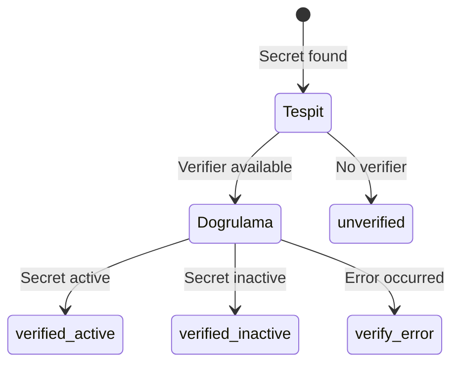
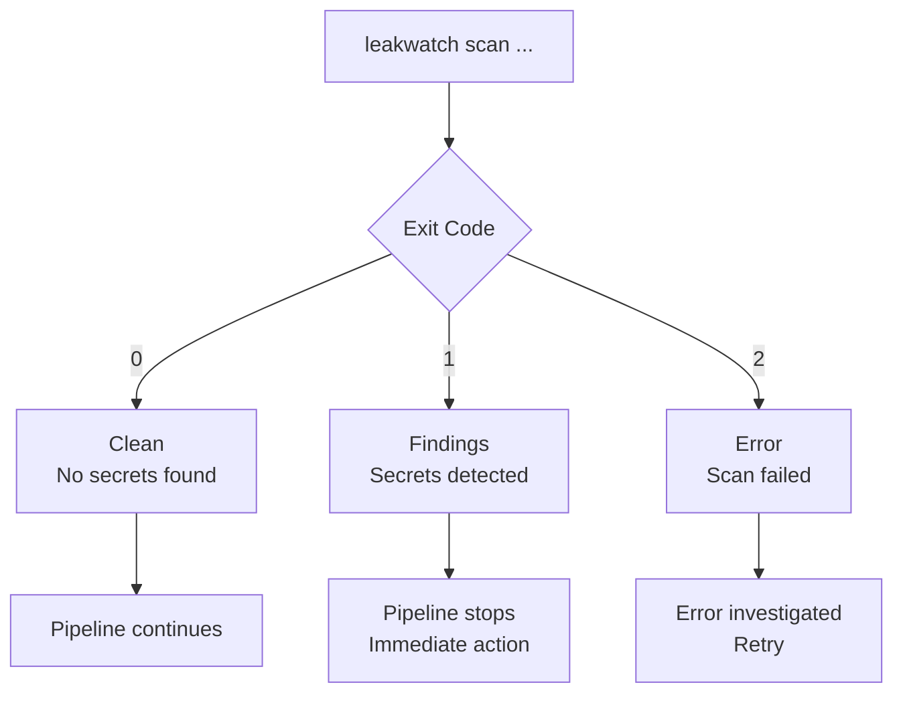
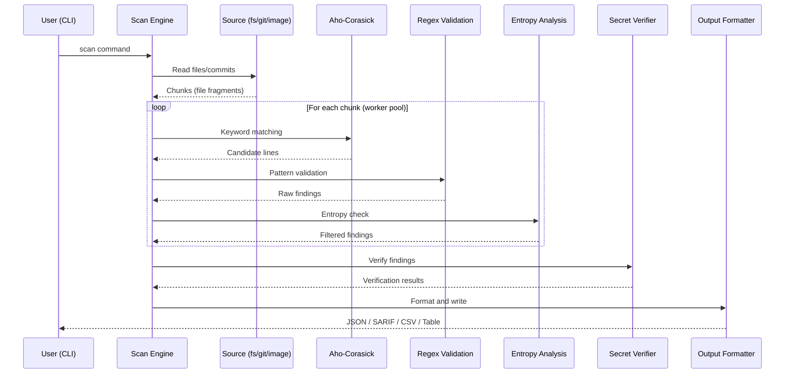

# Leakwatch - Getting Started Guide

> **Document Version:** 1.0
> **Date:** 2026-03-24
> **Status:** Approved

---

## 1. What is Leakwatch?

Leakwatch is a high-performance, open source (MIT) security tool that detects, verifies, and reports leaked secrets (API keys, passwords, certificates) in codebases, Git histories, and container images.

**Key features:**

- **63 built-in detectors + unlimited YAML custom rules** -- Covers major cloud providers, AI platforms, CI/CD tools, databases, and SaaS services out of the box, with YAML custom rules for anything else
- **Hybrid detection engine** -- Aho-Corasick pre-filter, regex validation, and Shannon entropy analysis for a low false positive rate
- **Secret verification** -- 53 built-in verifiers with 84% verification coverage confirm whether discovered secrets are still active via API calls (AWS, GitHub, Slack, Stripe, and more)
- **Multi-source support** -- Filesystem, Git repository, container images, S3, GCS, parallel multi-repo, and Slack
- **Flexible output** -- JSON, SARIF, CSV, and table formats
- **Single binary, zero dependencies** -- Runs on every platform, no Docker daemon required

```mermaid
flowchart LR
    subgraph Kaynaklar["Scan Sources"]
        S1["Filesystem"]
        S2["Git Repository"]
        S3["Container Image"]
        S4["S3 / GCS"]
        S5["Multi-Repo"]
        S6["Slack"]
    end

    subgraph Motor["Detection Engine"]
        E1["Aho-Corasick\nPre-Filter"]
        E2["Regex\nValidation"]
        E3["Entropy\nAnalysis"]
    end

    subgraph Dogrulama["Secret Verification\n(53 verifiers, 84% coverage)"]
        V1["AWS STS"]
        V2["GitHub API"]
        V3["Slack API"]
        V4["Stripe, JWT, ..."]
    end

    Kaynaklar -->|Chunks| E1
    E1 --> E2
    E2 --> E3
    E3 -->|Findings| Dogrulama
    Dogrulama --> Cikti["JSON / SARIF / CSV / Table"]
```



---

## 2. Installation

You can use one of the following methods to install Leakwatch on your system.

### 2.1 Go Install

If Go 1.22 or higher is installed:

```bash
go install github.com/cemililik/leakwatch@latest
```

The binary is installed to the `$GOPATH/bin` (or `$HOME/go/bin`) directory. Make sure this directory is defined in your `PATH` environment variable.

### 2.2 Homebrew (macOS / Linux)

```bash
brew install cemililik/tap/leakwatch
```

### 2.3 Binary Download

You can download the binary suitable for your platform from the GitHub Releases page:

```bash
# Download with automatic platform detection
curl -sSfL https://github.com/cemililik/Leakwatch/releases/latest/download/leakwatch_$(uname -s)_$(uname -m).tar.gz | tar xz

# Move binary to PATH
sudo mv leakwatch /usr/local/bin/
```

### 2.4 Docker

```bash
# Latest version
docker pull ghcr.io/cemililik/leakwatch:latest

# Scan current directory
docker run --rm -v "$(pwd):/scan" ghcr.io/cemililik/leakwatch:latest scan fs /scan
```

### 2.5 Installation Verification

To make sure the installation was successful:

```bash
leakwatch version
```

Expected output:

```
leakwatch version v0.x.x (commit: abc1234, built: 2026-03-24)
```

---

## 3. First Scan

Leakwatch supports seven scan commands for different source types. Below are basic usage examples for each.

### 3.1 Filesystem Scan (`scan fs`)

Scans all files in a directory. Does not examine Git history, only checks current file contents.

```bash
# Scan current directory
leakwatch scan fs .

# Scan a specific project directory
leakwatch scan fs /path/to/project

# Save results to a file
leakwatch scan fs /path/to/project --output results.json
```

**When to use:**
- When a quick scan is needed
- When scanning files that are not in a Git repository
- When checking build artifacts in CI/CD pipelines

### 3.2 Git Repository Scan (`scan git`)

Scans the entire commit history of a Git repository. Also finds secrets in deleted or modified files.

```bash
# Scan local repository (full history)
leakwatch scan git /path/to/repo

# Scan remote repository (by cloning)
leakwatch scan git https://github.com/org/repo.git

# Scan repository in current directory
leakwatch scan git .

# Scan commits after a specific date
leakwatch scan git . --since 2026-01-01

# Scan changes since the last commit (ideal for CI/CD)
leakwatch scan git . --since-commit HEAD~1

# Scan a specific branch
leakwatch scan git . --branch feature/payment

# Scan remote repository with partial history (faster)
leakwatch scan git https://github.com/org/repo.git --depth 50
```

**When to use:**
- When searching for secrets hidden in repository history
- During PR reviews
- During regular security audits

### 3.3 Container Image Scan (`scan image`)

Scans container images layer by layer. Does not require a Docker daemon; reads directly from the registry or local cache.

```bash
# Scan Docker Hub image
leakwatch scan image nginx:latest

# Scan GHCR image
leakwatch scan image ghcr.io/org/app:v1.2.3

# Scan ECR image
leakwatch scan image 123456789.dkr.ecr.eu-west-1.amazonaws.com/my-app:latest

# Scan private registry image
leakwatch scan image registry.example.com/team/service:main
```

**When to use:**
- When checking images before deploying to production
- During security audits of third-party images
- For post-build checks in CI/CD pipelines

### 3.4 S3 Bucket Scan (`scan s3`)

Scans objects in an AWS S3 bucket. Uses your default AWS credentials or the credentials configured in your environment.

```bash
# Scan an entire S3 bucket
leakwatch scan s3 my-bucket

# Scan only objects under a specific prefix
leakwatch scan s3 my-bucket --prefix config/
```

**When to use:**
- When auditing cloud storage for accidentally uploaded secrets
- During security reviews of shared S3 buckets

### 3.5 GCS Bucket Scan (`scan gcs`)

Scans objects in a Google Cloud Storage bucket.

```bash
# Scan a GCS bucket
leakwatch scan gcs my-bucket --project my-project
```

**When to use:**
- When auditing GCP storage for leaked secrets
- During cloud infrastructure security reviews

### 3.6 Parallel Multi-Repo Scan (`scan repos`)

Scans multiple Git repositories in parallel, useful for auditing an entire organization.

```bash
# Scan multiple repos in parallel
leakwatch scan repos https://github.com/org/repo1 https://github.com/org/repo2 --parallel 3
```

**When to use:**
- When auditing all repositories in an organization
- During large-scale security assessments across multiple projects

### 3.7 Slack Workspace Scan (`scan slack`)

Scans messages and files in a Slack workspace for leaked secrets.

```bash
# Scan a Slack workspace
leakwatch scan slack --token xoxb-... --channels general,engineering
```

**When to use:**
- When checking whether secrets have been shared in Slack channels
- During incident response to assess secret exposure in messaging

---

## 4. Understanding the Output

By default, Leakwatch writes results to standard output (stdout) in JSON format. Below is an example finding and field descriptions.

### 4.1 Example JSON Output

```json
[
  {
    "id": "a1b2c3d4-e5f6-7890-abcd-ef1234567890",
    "detector_id": "aws-access-key-id",
    "severity": "critical",
    "redacted": "AKIA************XMPL",
    "source": {
      "source_type": "git",
      "repository": "/path/to/repo",
      "commit": "abc1234def5678",
      "author": "developer",
      "email": "dev@example.com",
      "date": "2026-03-20T10:30:00Z",
      "file_path": "config/settings.py",
      "line": 42
    },
    "verification": {
      "status": "verified_active",
      "message": "AWS credentials are valid and active"
    },
    "detected_at": "2026-03-24T14:22:00Z",
    "entropy": 4.82
  }
]
```

### 4.2 Field Descriptions

| Field | Type | Description |
|-------|------|-------------|
| `id` | string | Unique identifier for the finding (UUID) |
| `detector_id` | string | ID of the detector that found the secret |
| `severity` | string | Severity level (see below) |
| `raw` | string | Raw content of the secret (shown with `--show-raw`) |
| `redacted` | string | Masked secret content (shown by default) |
| `source` | object | Source information for the finding |
| `source.source_type` | string | Source type: `filesystem`, `git`, or `container` |
| `source.file_path` | string | File path where the secret was found |
| `source.line` | int | Line number where the secret was found |
| `source.commit` | string | Git commit hash (git scan only) |
| `source.image` | string | Container image name (image scan only) |
| `source.layer` | string | Container layer hash (image scan only) |
| `verification` | object | Verification result |
| `verification.status` | string | Verification status (see below) |
| `detected_at` | string | Time when the finding was detected (ISO 8601) |
| `entropy` | float | Shannon entropy value (range 0-8) |

### 4.3 Severity Levels

| Level | Value | Description | Example |
|-------|-------|-------------|---------|
| **critical** | 3 | Secrets that can lead to direct access | AWS Secret Key, Private Key |
| **high** | 2 | Secrets providing sensitive access | GitHub PAT, Slack Bot Token |
| **medium** | 1 | Secrets providing limited access | API Key (read-only) |
| **low** | 0 | Low-risk or potential secrets | Generic API Key, test token |

### 4.4 Verification Statuses

| Status | Description |
|--------|-------------|
| `verified_active` | Secret verified and **active** -- requires immediate action |
| `verified_inactive` | Secret verified but **inactive** -- revoked or expired |
| `unverified` | Verification not performed (verifier not available or `--no-verify` used) |
| `verify_error` | Error occurred during verification (network error, timeout, etc.) |



---

## 5. Common Flags

The following flags are shared across all scan commands (`scan fs`, `scan git`, `scan image`, `scan s3`, `scan gcs`, `scan repos`, `scan slack`).

### 5.1 Output Flags

| Flag | Short | Default | Description |
|------|-------|---------|-------------|
| `--format` | `-f` | `json` | Output format: `json`, `sarif`, `csv`, `table` |
| `--output` | `-o` | stdout | File path to write results to |
| `--show-raw` | -- | `false` | Show unmasked secret content |

```bash
# Save in SARIF format to a file
leakwatch scan fs . --format sarif --output results.sarif

# Print in table format to the terminal
leakwatch scan git . --format table

# Pipe CSV format output to another tool
leakwatch scan fs . --format csv | grep "critical"
```

> **Security warning:** The `--show-raw` flag shows the full content of secrets. Only use this flag in secure environments. DO NOT use it in CI/CD logs or shared terminals.

### 5.2 Performance Flags

| Flag | Short | Default | Description |
|------|-------|---------|-------------|
| `--concurrency` | `-c` | CPU count | Number of parallel worker threads |
| `--max-file-size` | -- | `10485760` (10 MB) | Maximum file size to scan (bytes) |

```bash
# Scan with 4 workers (lower resource consumption)
leakwatch scan fs . --concurrency 4

# Also scan large files (up to 50 MB)
leakwatch scan fs . --max-file-size 52428800
```

### 5.3 Verification and Remediation Flags

| Flag | Default | Description |
|------|---------|-------------|
| `--no-verify` | `false` | Disable secret verification |
| `--only-verified` | `false` | Show only verified active findings |
| `--min-severity` | `low` | Minimum severity level to report |
| `--remediation` | `false` | Include remediation guidance (rotation steps, doc links) |

```bash
# Quick scan without verification
leakwatch scan fs . --no-verify

# Show only verified and active secrets (fewest false positives)
leakwatch scan git . --only-verified

# Show only high and critical findings
leakwatch scan git . --min-severity high

# Combination: only verified critical findings
leakwatch scan git . --only-verified --min-severity critical

# Include remediation guidance with rotation steps
leakwatch scan fs . --remediation
```

### 5.4 Git-Specific Flags

These flags can only be used with the `scan git` command:

| Flag | Default | Description |
|------|---------|-------------|
| `--since` | -- | Scan commits after the specified date (YYYY-MM-DD) |
| `--since-commit` | -- | Scan from the specified commit to HEAD |
| `--branch` | -- | Branch to scan |
| `--depth` | `0` (all) | Clone depth (remote repositories only) |

```bash
# Scan commits from the last 30 days
leakwatch scan git . --since 2026-02-22

# Since the last commit (for CI/CD)
leakwatch scan git . --since-commit HEAD~1

# Specific branch and depth
leakwatch scan git https://github.com/org/repo.git --branch main --depth 100
```

### 5.5 General Flags

These flags apply to all commands:

| Flag | Default | Description |
|------|---------|-------------|
| `--config` | -- | Configuration file path (default: `.leakwatch.yaml`) |
| `--log-level` | `warn` | Log level: `debug`, `info`, `warn`, `error` |

```bash
# Scan with a custom configuration file
leakwatch scan fs . --config /etc/leakwatch/production.yaml

# Run in debug mode
leakwatch scan git . --log-level debug
```

---

## 6. Exit Codes

Leakwatch returns meaningful exit codes for easy use in CI/CD pipelines:

| Code | Meaning | Description |
|------|---------|-------------|
| `0` | Clean | No secrets found |
| `1` | Findings | One or more secrets detected |
| `2` | Error | An error occurred during scanning |

### CI/CD Usage Example

```bash
# GitHub Actions / CI pipeline
leakwatch scan git . --only-verified --min-severity high
EXIT_CODE=$?

if [ $EXIT_CODE -eq 0 ]; then
    echo "Scan clean, no secrets found."
elif [ $EXIT_CODE -eq 1 ]; then
    echo "WARNING: Active secrets detected! Pipeline failed."
    exit 1
elif [ $EXIT_CODE -eq 2 ]; then
    echo "ERROR: A problem occurred during scanning."
    exit 2
fi
```



---

## 7. Scan Pipeline

An overview of how Leakwatch executes a scan:



---

## 8. Quick Reference Table

| Task | Command |
|------|---------|
| Scan current directory | `leakwatch scan fs .` |
| Scan Git history | `leakwatch scan git .` |
| Scan remote repository | `leakwatch scan git https://github.com/org/repo.git` |
| Scan container image | `leakwatch scan image nginx:latest` |
| Scan S3 bucket | `leakwatch scan s3 my-bucket --prefix config/` |
| Scan GCS bucket | `leakwatch scan gcs my-bucket --project my-project` |
| Scan multiple repos | `leakwatch scan repos repo1-url repo2-url --parallel 3` |
| Scan Slack workspace | `leakwatch scan slack --token xoxb-... --channels general` |
| Show only active secrets | `leakwatch scan git . --only-verified` |
| Generate SARIF output | `leakwatch scan fs . --format sarif --output results.sarif` |
| Scan last commit | `leakwatch scan git . --since-commit HEAD~1` |
| Show critical findings | `leakwatch scan git . --min-severity critical` |
| Debug mode | `leakwatch scan git . --log-level debug` |

---

## 9. Next Steps

Check out the following resources to use Leakwatch more effectively:

| Topic | Document |
|-------|----------|
| Configuration file and options | [Configuration Guide](./configuration.md) |
| CI/CD integration (GitHub Actions, pre-commit) | [README - CI/CD Integration](../../README.md#cicd-entegrasyonu) |
| Supported secret types | [README - Supported Secret Types](../../README.md#desteklenen-s%C4%B1r-t%C3%BCrleri) |
| Architecture design | [Architecture Document](../architecture/03-ARCHITECTURE.md) |
| Roadmap | [Roadmap](../05-ROADMAP.md) |
| Contribution guide | [CONTRIBUTING.md](../../CONTRIBUTING.md) |
