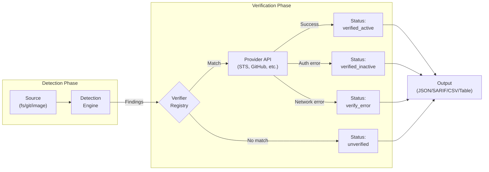
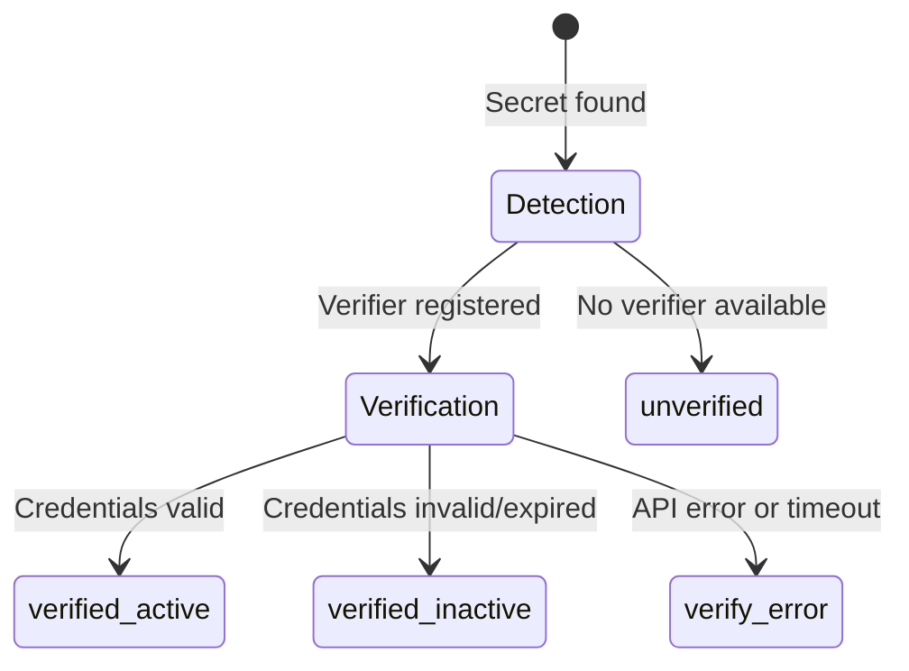
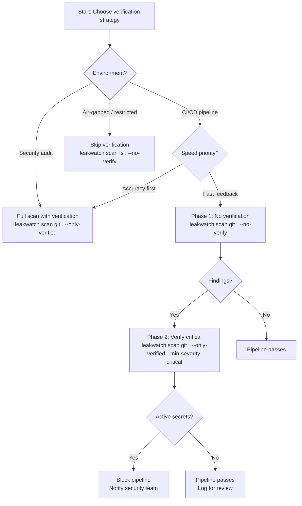

# Leakwatch - Secret Verification Guide

> **Document Version:** 2.0
> **Date:** 2026-03-25
> **Status:** Active

---

## 1. What is Secret Verification?

Secret verification is the process of checking whether a detected secret is actually active and valid. Leakwatch ships with **53 verifiers** covering **84% of its 63 built-in detectors**, making it one of the most comprehensive verification systems available under an MIT license.

Verification is performed through two methods:
- **Live API verification** (48 detectors) -- controlled, read-only API calls to the service that issued the credential
- **Format validation** (5 detectors) -- structural checks (decode, parse, expiry) without network calls

**Why it matters:**

- **Reduces false positives** -- A regex match alone cannot tell you whether a string is a real, active secret. Verification eliminates noise by confirming status with the provider.
- **Prioritizes remediation** -- Teams can focus on verified active secrets first instead of triaging hundreds of unconfirmed findings.
- **Provides context** -- Verification results include extra metadata (e.g., AWS account ID, GitHub username) that helps identify the owner of the leaked credential.



---

## 2. Verification Statuses

Every finding in Leakwatch carries a verification status. Understanding these statuses is essential for effective triage.

| Status | Description | Action Required |
|--------|-------------|-----------------|
| `verified_active` | Secret is **valid and active** -- the provider confirmed it works | **Immediate rotation required** |
| `verified_inactive` | Secret is **invalid or revoked** -- the provider rejected it | Low priority; may still warrant cleanup |
| `unverified` | Verification was not performed (no verifier available, or `--no-verify` was used) | Manual review recommended |
| `verify_error` | An error occurred during verification (network timeout, rate limit, etc.) | Retry or verify manually |



---

## 3. Verified Detectors

Leakwatch provides 53 verifiers across three verification types. The following table shows all verified detectors grouped by verification method.

### Live API Verification (48 detectors)

These verifiers make a read-only API call to the provider to confirm whether the secret is active or inactive.

| Category | Detector | Detector ID | API Endpoint |
|----------|----------|-------------|-------------|
| **Cloud** | AWS Access Key | `aws-access-key-id` | STS `GetCallerIdentity` |
| **Cloud** | DigitalOcean Token | `digitalocean-token` | `api.digitalocean.com/v2/account` |
| **Cloud** | Cloudflare API Token | `cloudflare-api-token` | `api.cloudflare.com/client/v4/user/tokens/verify` |
| **Cloud** | Heroku API Key | `heroku-api-key` | `api.heroku.com/account` |
| **Cloud** | Vercel Token | `vercel-token` | `api.vercel.com/v2/user` |
| **AI/ML** | OpenAI API Key | `openai-api-key` | `api.openai.com/v1/models` |
| **AI/ML** | Anthropic API Key | `anthropic-api-key` | `api.anthropic.com/v1/models` |
| **AI/ML** | Hugging Face Token | `huggingface-token` | `huggingface.co/api/whoami-v2` |
| **AI/ML** | DeepSeek API Key | `deepseek-api-key` | `api.deepseek.com/models` |
| **DevTools** | GitHub PAT | `github-token` | `api.github.com/user` |
| **DevTools** | GitHub OAuth Token | `github-oauth-token` | `api.github.com/user` |
| **DevTools** | GitLab PAT | `gitlab-pat` | `gitlab.com/api/v4/user` |
| **DevTools** | Bitbucket App Password | `bitbucket-app-password` | `api.bitbucket.org/2.0/user` |
| **DevTools** | NPM Token | `npm-token` | `registry.npmjs.org/-/npm/v1/user` |
| **DevTools** | PyPI Token | `pypi-api-token` | `upload.pypi.org/legacy/` |
| **DevTools** | RubyGems Key | `rubygems-api-key` | `rubygems.org/api/v1/api_key.json` |
| **DevTools** | Docker Hub PAT | `dockerhub-pat` | `hub.docker.com/v2/user/login` |
| **CI/CD** | CircleCI Token | `circleci-token` | `circleci.com/api/v2/me` |
| **CI/CD** | Terraform Cloud Token | `terraform-cloud-token` | `app.terraform.io/api/v2/account/details` |
| **Communication** | Slack Bot Token | `slack-token` | `slack.com/api/auth.test` |
| **Communication** | Discord Bot Token | `discord-bot-token` | `discord.com/api/v10/users/@me` |
| **Communication** | Telegram Bot Token | `telegram-bot-token` | `api.telegram.org/bot{token}/getMe` |
| **Email** | SendGrid API Key | `sendgrid-api-key` | `api.sendgrid.com/v3/user/profile` |
| **Email** | Mailgun API Key | `mailgun-api-key` | `api.mailgun.net/v3/domains` |
| **Email** | Postmark Server Token | `postmark-server-token` | `api.postmarkapp.com/server` |
| **Payment** | Stripe Live Key | `stripe-api-key-live` | `api.stripe.com/v1/charges?limit=1` |
| **Payment** | Stripe Test Key | `stripe-api-key-test` | `api.stripe.com/v1/charges?limit=1` |
| **Payment** | Coinbase API Key | `coinbase-api-key` | `api.coinbase.com/v2/user` |
| **Database** | Supabase Service Key | `supabase-service-key` | `{project-ref}.supabase.co/rest/v1/` |
| **Infrastructure** | Databricks PAT | `databricks-token` | `{workspace}.cloud.databricks.com/api/2.0/clusters/list` |
| **Identity** | Okta API Token | `okta-api-token` | `{domain}/api/v1/users/me` |
| **Identity** | Auth0 Management Token | `auth0-management-token` | `{domain}/api/v2/users?per_page=1` |
| **Identity** | HashiCorp Vault Token | `hashicorp-vault-token` | `{vault-addr}/v1/auth/token/lookup-self` |
| **Monitoring** | Datadog API Key | `datadog-api-key` | `api.datadoghq.com/api/v1/validate` |
| **Monitoring** | Grafana API Key | `grafana-api-key` | `grafana.com/api/user` |
| **Monitoring** | PagerDuty API Key | `pagerduty-api-key` | `api.pagerduty.com/users/me` |
| **Monitoring** | New Relic API Key | `newrelic-api-key` | `api.newrelic.com/v2/users.json` |
| **Monitoring** | Sentry Auth Token | `sentry-token` | `sentry.io/api/0/` |
| **Security** | Snyk API Key | `snyk-api-key` | `api.snyk.io/rest/self` |
| **Security** | Twilio API Key | `twilio-api-key` | `api.twilio.com/2010-04-01/Accounts.json` |
| **Secrets Mgmt** | Doppler Service Token | `doppler-token` | `api.doppler.com/v3/me` |
| **Feature Flags** | LaunchDarkly SDK Key | `launchdarkly-sdk-key` | `app.launchdarkly.com/api/v2/caller-identity` |
| **Code Quality** | SonarCloud Token | `sonarcloud-token` | `sonarcloud.io/api/authentication/validate` |
| **SaaS** | Shopify Access Token | `shopify-access-token` | `{shop}.myshopify.com/admin/api/2024-01/shop.json` |
| **SaaS** | Notion Token | `notion-token` | `api.notion.com/v1/users/me` |
| **SaaS** | Linear API Key | `linear-api-key` | `api.linear.app/graphql` |
| **SaaS** | Figma PAT | `figma-pat` | `api.figma.com/v1/me` |
| **SaaS** | Airtable PAT | `airtable-pat` | `api.airtable.com/v0/meta/whoami` |

### Format Validation (5 detectors)

These verifiers perform structural validation without making network calls. They check format, decode tokens, and validate expiry claims.

| Detector | Detector ID | Validation Method |
|----------|-------------|-------------------|
| JWT | `jwt` | Decode and check `exp` claim; validate structural integrity |
| Azure Storage Key | `azure-storage-key` | HMAC-SHA256 signature format validation |
| Azure Entra Secret | `azure-entra-secret` | OAuth2 client credential format check |
| GCP Service Account | `gcp-service-account` | JSON key file structure and private key parsing |
| Snowflake Credentials | `snowflake-credentials` | Connection string format and credential structure validation |

### Not Verifiable (10 detectors)

These detectors identify secrets that cannot be verified through automated means.

| Detector | Detector ID | Reason |
|----------|-------------|--------|
| Private Key | `private-key` | No remote verification endpoint; validity depends on deployment target |
| Generic API Key | `generic-api-key` | Unknown provider; no way to determine which API to call |
| Database Connection String | `database-connection-string` | Requires direct database connection; intrusive and unsafe |
| Redis Connection | `redis-connection-string` | Requires direct network connection to typically internal Redis instance |
| RabbitMQ Connection | `rabbitmq-connection-string` | Requires direct network connection to broker |
| FTP/SFTP Credentials | `ftp-credentials` | Requires direct connection to potentially internal FTP servers |
| LDAP Credentials | `ldap-credentials` | Requires direct connection to LDAP directory server |
| Slack Webhook | `slack-webhook` | Verification would send a message (side effect) |
| MS Teams Webhook | `teams-webhook` | Verification would send a message (side effect) |
| Infura API Key | `infura-api-key` | Uses API quota; high false-positive overlap with generic hex strings |

---

## 4. AWS Verification

### How It Works

The AWS verifier calls [STS GetCallerIdentity](https://docs.aws.amazon.com/STS/latest/APIReference/API_GetCallerIdentity.html) using the discovered Access Key ID and Secret Access Key. This is a read-only API call that returns identity information without performing any actions on the AWS account.

- **Detector ID:** `aws-access-key-id`
- **Required data:** Both the Access Key ID (`AKIA...`) and the corresponding Secret Access Key must be found in the same context.
- **API endpoint:** `sts.amazonaws.com` (us-east-1)

### What It Reveals

When credentials are active, the verifier returns:

| Field | Description |
|-------|-------------|
| `account` | AWS account ID |
| `arn` | Full ARN of the authenticated entity |
| `user_id` | IAM user or role ID |

### IAM Permissions

The `GetCallerIdentity` API requires **no specific IAM permissions**. It works with any valid AWS credentials regardless of attached policies. This makes it ideal for verification: even a key with zero permissions will return a successful response if the credentials are active.

### Example Output

```json
{
  "verification": {
    "status": "verified_active",
    "message": "AWS credentials are active",
    "extra_data": {
      "account": "123456789012",
      "arn": "arn:aws:iam::123456789012:user/deploy-bot",
      "user_id": "AIDAEXAMPLEUSERID"
    }
  }
}
```

If the credentials are invalid or expired:

```json
{
  "verification": {
    "status": "verified_inactive",
    "message": "AWS credentials are invalid or inactive"
  }
}
```

### Conditions for Skipping

If the Secret Access Key is not found alongside the Access Key ID, verification is skipped and the finding is marked as `unverified` with the message "secret access key not found."

---

## 5. GitHub Verification

### How It Works

The GitHub verifier sends a `GET /user` request to the GitHub API using the discovered token as a Bearer token. This is a read-only call that returns information about the authenticated user.

- **Detector ID:** `github-token`
- **API endpoint:** `https://api.github.com/user`
- **Headers:** `Authorization: Bearer <token>`, `User-Agent: leakwatch-verifier`

### What It Reveals

When the token is active, the verifier returns:

| Field | Description |
|-------|-------------|
| `login` | GitHub username associated with the token |

### Response Handling

| HTTP Status | Verification Result |
|-------------|-------------------|
| `200 OK` | `verified_active` -- token is valid |
| `401 Unauthorized` | `verified_inactive` -- token is invalid or revoked |
| Other | `verify_error` -- unexpected response |

### Example Output

```json
{
  "verification": {
    "status": "verified_active",
    "message": "GitHub token is active",
    "extra_data": {
      "login": "octocat"
    }
  }
}
```

---

## 6. CLI Flags

Leakwatch provides flags to control verification behavior on all scan commands (`scan fs`, `scan git`, `scan image`).

| Flag | Default | Description |
|------|---------|-------------|
| `--no-verify` | `false` | Skip all secret verification |
| `--only-verified` | `false` | Only include findings with `verified_active` status in the output |
| `--min-severity` | `low` | Minimum severity level to report |

### Examples

```bash
# Fast scan without any verification API calls
leakwatch scan fs /path/to/project --no-verify

# Show only confirmed active secrets (highest confidence)
leakwatch scan git . --only-verified

# Combine: only verified critical findings
leakwatch scan git . --only-verified --min-severity critical
```

---

## 7. Rate Limiting and Concurrency

The verification engine manages API calls carefully to avoid overwhelming provider APIs and to stay within rate limits.

### Default Settings

| Parameter | Default | Description |
|-----------|---------|-------------|
| Concurrency | 4 workers | Number of parallel verification goroutines |
| Rate limit | 10 req/sec | Maximum verification requests per second (token bucket) |
| Timeout | 10 seconds | Per-request timeout for each verification API call |

### How It Works

The verification engine uses a worker pool pattern with a shared rate limiter:

1. **Worker pool** -- A fixed number of goroutines (default 4) process verification jobs concurrently.
2. **Token bucket rate limiter** -- Before each API call, the worker acquires a token from a `golang.org/x/time/rate` limiter. If the bucket is empty, the worker waits until a token becomes available.
3. **Per-request timeout** -- Each verification call has its own context timeout (default 10s). If the provider does not respond in time, the finding is marked `verify_error`.
4. **Context cancellation** -- If the parent context is cancelled (e.g., the user presses Ctrl+C), all pending verifications are abandoned gracefully.

### Configuration

These settings can be adjusted in the `.leakwatch.yaml` configuration file:

```yaml
verification:
  enabled: true
  timeout: 10s
  concurrency: 4
  rate_limit: 10.0
```

---

## 8. Security Considerations

Verification involves sending discovered credentials to provider APIs. Keep the following in mind:

- **Credentials are transmitted over the network** -- The raw secret value is sent to the provider's API endpoint (e.g., `sts.amazonaws.com`, `api.github.com`) over HTTPS. Ensure your network allows outbound HTTPS traffic to these endpoints.
- **Leakwatch never logs raw secrets** -- Verifiers are designed to never log, persist, or cache the raw credential values. Only redacted values appear in logs.
- **Read-only operations only** -- All verification calls are read-only. They check validity without performing any destructive or state-changing actions.
- **Network requirements** -- Verification requires outbound HTTPS access. In air-gapped or restricted environments, use `--no-verify` to skip verification entirely.
- **Provider rate limits** -- While Leakwatch applies its own rate limiting, provider-side rate limits may still apply. If you are verifying a large number of findings, consider the provider's documented rate limits.

---

## 9. Use Cases and Strategies

### CI/CD Pipeline: Two-Phase Approach

In CI/CD pipelines, speed matters. A two-phase approach balances speed with accuracy:

```bash
# Phase 1: Fast scan without verification (fail fast on regex matches)
leakwatch scan git . --since-commit HEAD~1 --no-verify --min-severity high
if [ $? -eq 1 ]; then
    echo "Potential secrets found, running verification..."

    # Phase 2: Verify only critical findings
    leakwatch scan git . --since-commit HEAD~1 --only-verified --min-severity critical
    if [ $? -eq 1 ]; then
        echo "CONFIRMED active secrets found! Blocking merge."
        exit 1
    fi
fi
```

### Triage Workflow

For security teams reviewing scan results:

1. Run a full scan with verification enabled (the default).
2. Address `verified_active` findings immediately -- these are confirmed live credentials.
3. Review `unverified` findings manually -- these may still be real secrets without an available verifier.
4. Deprioritize `verified_inactive` findings -- these are expired or revoked, but consider removing them from the codebase for hygiene.
5. Retry `verify_error` findings -- these may have failed due to transient network issues.

### Decision Tree



---

## 10. Next Steps

| Topic | Document |
|-------|----------|
| Getting started with Leakwatch | [Getting Started Guide](./getting-started.md) |
| Configuration file and options | [Configuration Guide](./configuration.md) |
| Running Leakwatch with Docker | [Docker Usage Guide](./docker-usage.md) |
| Architecture overview | [Architecture Document](../architecture/03-ARCHITECTURE.md) |
