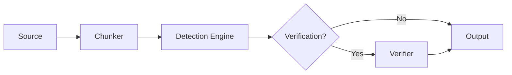
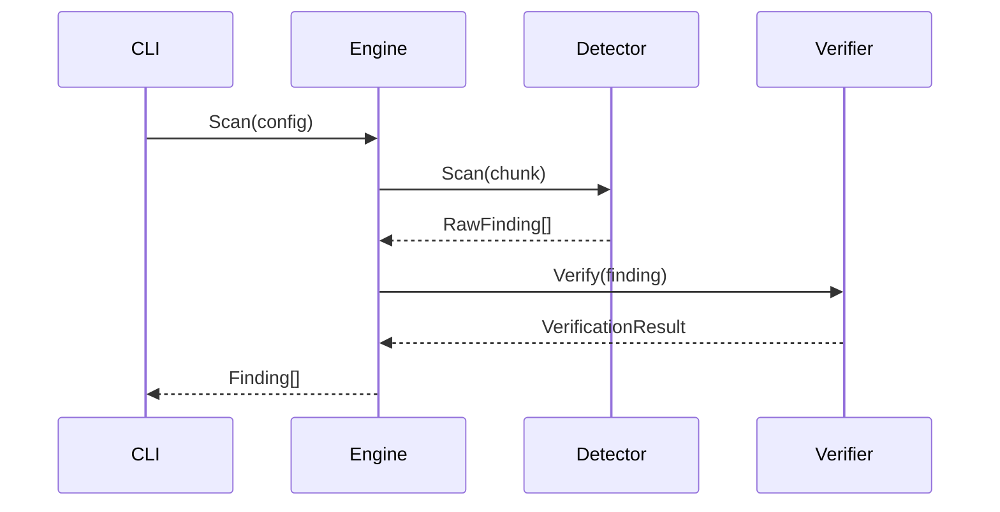
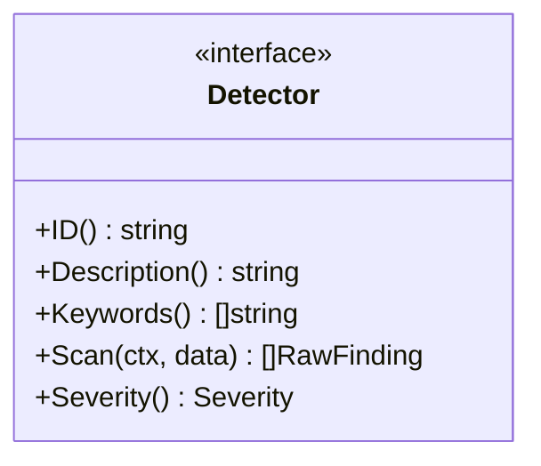

# Leakwatch - Documentation Standards

> **Document Version:** 1.0
> **Date:** 2026-03-24
> **Status:** Approved

---

## 1. General Principles

1. **Language:** All documents must be written in English. Technical terms (interface, pipeline, chunk, etc.) remain in English.
2. **Format:** All documents are written in GitHub-Flavored Markdown (GFM) format.
3. **Encoding:** UTF-8, line endings LF (`\n`).
4. **Line length:** No mandatory line length limit in Markdown files; use natural paragraph flow.

---

## 2. Directory Structure

```
docs/
├── architecture/       # Architecture and technical design documents
│   ├── 01-COMPETITIVE-ANALYSIS.md
│   ├── 02-TECHNOLOGY-DECISIONS.md
│   └── 03-ARCHITECTURE.md
├── decisions/          # Architecture Decision Records (ADR)
│   ├── README.md       # ADR index and description
│   ├── ADR-0001-programlama-dili.md
│   ├── ADR-0002-cli-cercevesi.md
│   └── ...
├── standards/          # Standards and rules
│   ├── 00-DOCUMENTATION-STANDARDS.md   (this document)
│   ├── 01-CODE-REVIEW-STANDARDS.md
│   ├── 02-RELEASE-STANDARDS.md
│   └── 04-DEVELOPMENT-STANDARDS.md
├── 05-ROADMAP.md       # Roadmap (under root docs/)
└── guides/             # Usage guides (future)
    ├── getting-started.md
    ├── custom-rules.md
    └── ci-cd-integration.md
```

### 2.1 Directory Responsibilities

| Directory | Content | Target Audience |
|-----------|---------|-----------------|
| `architecture/` | Architecture decisions, technical design, competitive analysis | Developer, architect |
| `decisions/` | ADR — context and rationale of architecture decisions | Developer, architect |
| `standards/` | Coding, testing, documentation, CI/CD standards | Developer, contributor |
| `guides/` | Installation, usage, integration guides | End user |
| Root `docs/` | Roadmap, general documents | Everyone |

---

## 3. Document Template

Every document should begin with the following header block:

```markdown
# Leakwatch - <Document Title>

> **Document Version:** X.Y
> **Date:** YYYY-MM-DD
> **Status:** Draft | In Review | Approved | Archived

---
```

### 3.1 Document Statuses

| Status | Description |
|--------|-------------|
| **Draft** | In initial writing phase, open to changes |
| **In Review** | Under review, awaiting feedback |
| **Approved** | Approved, can be used as a reference |
| **Archived** | Outdated, kept as historical reference |

### 3.2 ADR (Architecture Decision Record) Template

Architecture decisions are documented under `docs/decisions/` in the following format:

```markdown
# ADR-NNNN: <Decision Title>

- **Status:** Proposed | Accepted | Superseded | Rejected | Deprecated
- **Date:** YYYY-MM-DD
- **Decision Makers:** <Names or team>

## Context
The situation, problem, or need that led to the decision.

## Decision
The decision made and its rationale.

## Evaluated Alternatives
Options considered and reasons for rejection.

## Consequences
Positive and negative impacts of the decision.

## Related Decisions
Related ADRs (if any).
```

**ADR Rules:**

- File name: `ADR-NNNN-short-title.md` (lowercase, hyphen-separated)
- Sequence number is 4 digits, zero-padded: `0001`, `0002`, ...
- Each ADR is added to the `docs/decisions/README.md` index
- Accepted ADRs are not modified — to override, write a new ADR and mark the old one as "Deprecated"
- ADRs are also added to the `CLAUDE.md` reference table

---

## 4. Diagram and Visualization Standards

### 4.1 Mermaid Usage (Mandatory)

All diagrams must be drawn using **Mermaid** syntax. ASCII art or external image files must not be used.

**Rationale:**
- GitHub, GitLab, VS Code, and many Markdown viewers render Mermaid natively
- Compatible with version control (text-based, diffable)
- Consistent appearance
- Easy to maintain

### 4.2 Supported Diagram Types

| Type | Use Case | Mermaid Syntax |
|------|----------|----------------|
| **Flowchart** | Pipeline, data flow, decision tree | `flowchart TD` or `flowchart LR` |
| **Sequence Diagram** | Component interactions, API calls | `sequenceDiagram` |
| **Class Diagram** | Interfaces, type relationships | `classDiagram` |
| **State Diagram** | Lifecycles, state transitions | `stateDiagram-v2` |
| **Gantt Chart** | Timelines, roadmap | `gantt` |
| **Pie/Bar Chart** | Statistics, comparisons | `pie` / `xychart-beta` |
| **Block Diagram** | Architecture block diagrams | `block-beta` |
| **Git Graph** | Branching strategy | `gitgraph` |
| **Quadrant Chart** | Positioning matrices | `quadrantChart` |

### 4.3 Mermaid Style Rules

1. **Direction:** Top-down (`TD`) by default. Use `LR` when horizontal flow is needed.
2. **Color:** Use Mermaid's default theme; custom colors only when semantic distinction is needed.
3. **Labels:** Short and descriptive. Use text outside the diagram for longer explanations.
4. **Complexity:** A single diagram should not exceed 15-20 nodes. More complex structures should be split into sub-diagrams.
5. **Subgraphs:** Use to group related components.

### 4.4 Mermaid Examples

**Flowchart:**

````markdown

````

**Sequence diagram:**

````markdown

````

**Class diagram:**

````markdown

````

---

## 5. Code Example Standards

### 5.1 Code Blocks

- Every code block must specify the language: ` ```go `, ` ```yaml `, ` ```bash `
- Code examples should be compilable and runnable (whenever possible)
- Long code blocks (>50 lines) should be split into sections with explanations in between

### 5.2 Command Line Examples

```markdown
# CORRECT: Each command has an explanation before it
# Scan filesystem
leakwatch scan fs /path/to/project

# INCORRECT: Command sequence without explanations
leakwatch scan fs /path
leakwatch scan git /path
leakwatch verify aws
```

---

## 6. Table Standards

- Tables are written using GFM table syntax
- Column headers may be **bold** (`| **Header** |`) or use GFM default bold
- Tables should not exceed 5-6 columns; for wider data use multiple tables
- Prefer short phrases and links over long text in cells

---

## 7. Link Standards

### 7.1 Internal Links

- Internal document links use **relative paths**:
  ```markdown
  For details, see the [Architecture Design](../architecture/03-ARCHITECTURE.md) document.
  ```
- Same-document links use anchors:
  ```markdown
  See [Diagram Standards](#4-diagram-and-visualization-standards)
  ```

### 7.2 External Links

- External links use full URLs
- Link text should be descriptive:
  ```markdown
  # CORRECT
  [Go Effective Go guide](https://go.dev/doc/effective_go)

  # INCORRECT
  [click here](https://go.dev/doc/effective_go)
  ```

---

## 8. Change Management

1. Document updates are made via PR
2. Document version is incremented semantically (X.Y)
   - **X** — Structural or major content change
   - **Y** — Minor corrections, additions
3. Each update uses the `docs(<scope>):` prefix in the commit message
4. Outdated documents are moved to "Archived" status, not deleted

---

## 9. Review Checklist

The following checklist must be completed before opening a document PR:

- [ ] Header block (version, date, status) is present
- [ ] All diagrams are in Mermaid format
- [ ] Code blocks include a language tag
- [ ] Internal links use relative paths
- [ ] Tables do not exceed 6 columns
- [ ] Spelling has been checked
- [ ] Mermaid diagrams render correctly on GitHub (preview)
