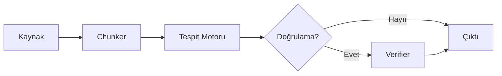
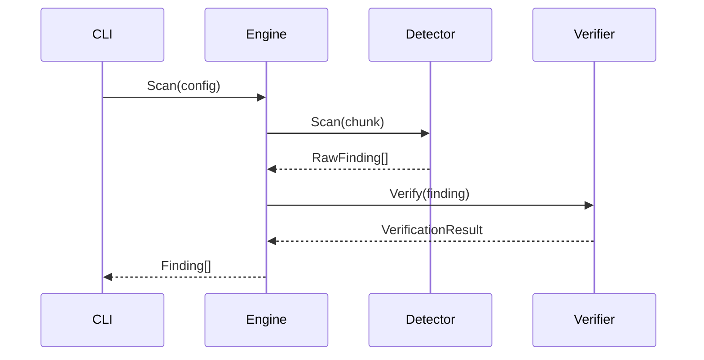
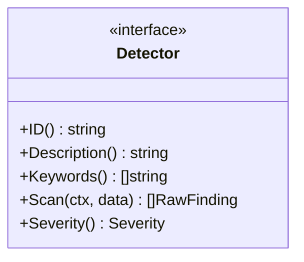

# Leakwatch - Dokümantasyon Standartları

> **Belge Versiyonu:** 1.0
> **Tarih:** 2026-03-24
> **Durum:** Onaylandı

---

## 1. Genel İlkeler

1. **Dil:** Tüm belgeler Türkçe yazılır. Teknik terimler (interface, pipeline, chunk vb.) İngilizce bırakılabilir.
2. **Format:** Tüm belgeler GitHub-Flavored Markdown (GFM) formatında yazılır.
3. **Kodlama:** UTF-8, satır sonu LF (`\n`).
4. **Satır uzunluğu:** Markdown dosyalarında zorunlu satır sonu sınırı yoktur; doğal paragraf akışı kullanılır.

---

## 2. Dizin Yapısı

```
docs/
├── architecture/       # Mimari ve teknik tasarım belgeleri
│   ├── 01-COMPETITIVE-ANALYSIS.md
│   ├── 02-TECHNOLOGY-DECISIONS.md
│   └── 03-ARCHITECTURE.md
├── decisions/          # Architecture Decision Records (ADR)
│   ├── README.md       # ADR dizini ve açıklama
│   ├── ADR-0001-programlama-dili.md
│   ├── ADR-0002-cli-cercevesi.md
│   └── ...
├── standards/          # Standartlar ve kurallar
│   ├── 00-DOCUMENTATION-STANDARDS.md   (bu belge)
│   ├── 01-CODE-REVIEW-STANDARDS.md
│   ├── 02-RELEASE-STANDARDS.md
│   └── 04-DEVELOPMENT-STANDARDS.md
├── 05-ROADMAP.md       # Yol haritası (kök docs/ altında)
└── guides/             # Kullanım rehberleri (gelecekte)
    ├── getting-started.md
    ├── custom-rules.md
    └── ci-cd-integration.md
```

### 2.1 Dizin Sorumlulukları

| Dizin | İçerik | Hedef Kitle |
|-------|--------|-------------|
| `architecture/` | Mimari kararlar, teknik tasarım, rakip analizi | Geliştirici, mimar |
| `decisions/` | ADR — mimari kararların bağlamı ve gerekçesi | Geliştirici, mimar |
| `standards/` | Kodlama, test, dokümantasyon, CI/CD standartları | Geliştirici, katkıda bulunan |
| `guides/` | Kurulum, kullanım, entegrasyon rehberleri | Son kullanıcı |
| Kök `docs/` | Yol haritası, genel belgeler | Herkes |

---

## 3. Belge Şablonu

Her belge aşağıdaki başlık bloğu ile başlamalıdır:

```markdown
# Leakwatch - <Belge Başlığı>

> **Belge Versiyonu:** X.Y
> **Tarih:** YYYY-MM-DD
> **Durum:** Taslak | İncelemede | Onaylandı | Arşivlenmiş

---
```

### 3.1 Belge Durumları

| Durum | Açıklama |
|-------|----------|
| **Taslak** | İlk yazım aşamasında, değişikliğe açık |
| **İncelemede** | İnceleme sürecinde, geri bildirim bekleniyor |
| **Onaylandı** | Onaylanmış, referans olarak kullanılabilir |
| **Arşivlenmiş** | Güncelliğini yitirmiş, tarihsel referans |

### 3.2 ADR (Architecture Decision Record) Şablonu

Mimari kararlar `docs/decisions/` altında aşağıdaki formatta belgelenir:

```markdown
# ADR-NNNN: <Karar Başlığı>

- **Durum:** Önerilen | Kabul Edildi | Değiştirildi | Reddedildi | Kullanımdan Kaldırıldı
- **Tarih:** YYYY-MM-DD
- **Karar Verenler:** <İsimler veya ekip>

## Bağlam
Kararın alınmasına yol açan durum, sorun veya ihtiyaç.

## Karar
Alınan karar ve gerekçesi.

## Değerlendirilen Alternatifler
İncelenen seçenekler ve reddedilme gerekçeleri.

## Sonuçlar
Kararın olumlu ve olumsuz etkileri.

## İlişkili Kararlar
Bağlantılı diğer ADR'lar (varsa).
```

**ADR Kuralları:**

- Dosya adı: `ADR-NNNN-kisa-baslik.md` (küçük harf, tire ile ayrılmış)
- Sıra numarası 4 hane, sıfır dolgulu: `0001`, `0002`, ...
- Her ADR `docs/decisions/README.md` dizinine eklenir
- Kabul edilen ADR'lar değiştirilmez — geçersiz kılmak için yeni ADR yazılır ve eski "Kullanımdan Kaldırıldı" yapılır
- ADR'lar `CLAUDE.md` referans tablosuna da eklenir

---

## 4. Diyagram ve Görselleştirme Standartları

### 4.1 Mermaid Kullanımı (Zorunlu)

Tüm diyagramlar **Mermaid** sözdizimi ile çizilmelidir. ASCII art veya harici imaj dosyaları kullanılmamalıdır.

**Gerekçe:**
- GitHub, GitLab, VS Code ve birçok Markdown görüntüleyici Mermaid'i yerel olarak render eder
- Versiyon kontrolü ile uyumlu (metin tabanlı, diff alınabilir)
- Tutarlı görünüm
- Bakımı kolay

### 4.2 Desteklenen Diyagram Türleri

| Tür | Kullanım Alanı | Mermaid Sözdizimi |
|-----|----------------|-------------------|
| **Akış Diyagramı (Flowchart)** | Pipeline, veri akışı, karar ağacı | `flowchart TD` veya `flowchart LR` |
| **Sıra Diyagramı (Sequence)** | Bileşen etkileşimleri, API çağrıları | `sequenceDiagram` |
| **Sınıf Diyagramı (Class)** | Arayüzler, tip ilişkileri | `classDiagram` |
| **Durum Diyagramı (State)** | Yaşam döngüleri, durum geçişleri | `stateDiagram-v2` |
| **Gantt Şeması** | Zaman çizelgeleri, yol haritası | `gantt` |
| **Pasta/Çubuk Grafik** | İstatistikler, karşılaştırmalar | `pie` / `xychart-beta` |
| **Blok Diyagramı** | Mimari blok şemaları | `block-beta` |
| **Git Grafiği** | Branching stratejisi | `gitgraph` |
| **Quadrant Chart** | Konumlandırma matrisleri | `quadrantChart` |

### 4.3 Mermaid Stil Kuralları

1. **Yön:** Varsayılan olarak yukarıdan aşağıya (`TD`). Yatay akış gerekiyorsa `LR` kullanılır.
2. **Renk:** Mermaid'in varsayılan teması kullanılır; özel renkler yalnızca anlamsal farklılık gerektiğinde eklenir.
3. **Etiketler:** Kısa ve açıklayıcı. Uzun açıklamalar için diyagram dışında metin kullanılır.
4. **Karmaşıklık:** Tek bir diyagram 15-20 düğümü aşmamalıdır. Daha karmaşık yapılar alt diyagramlara bölünmelidir.
5. **Alt graflar (subgraph):** İlişkili bileşenleri gruplamak için kullanılır.

### 4.4 Mermaid Örnekleri

**Akış diyagramı:**

````markdown

````

**Sıra diyagramı:**

````markdown

````

**Sınıf diyagramı:**

````markdown

````

---

## 5. Kod Örnekleri Standartları

### 5.1 Kod Blokları

- Her kod bloğunda dil belirtilmelidir: ` ```go `, ` ```yaml `, ` ```bash `
- Kod örnekleri derlenebilir ve çalışabilir olmalıdır (mümkün olduğunca)
- Uzun kod blokları (>50 satır) parçalara bölünüp arada açıklama eklenmeli

### 5.2 Komut Satırı Örnekleri

```markdown
# ✅ DOĞRU: Her komutun önünde açıklama
# Dosya sistemi tara
leakwatch scan fs /path/to/project

# ❌ YANLIŞ: Açıklamasız komut dizisi
leakwatch scan fs /path
leakwatch scan git /path
leakwatch verify aws
```

---

## 6. Tablo Standartları

- Tablolar GFM tablo sözdizimi ile yazılır
- Sütun başlıkları **kalın** (`| **Başlık** |`) veya GFM varsayılan kalın
- Tablolar 5-6 sütunu aşmamalı; daha geniş veriler için birden fazla tablo kullanılmalı
- Hücrelerde uzun metin yerine kısa ifadeler ve linkler tercih edilmeli

---

## 7. Bağlantı (Link) Standartları

### 7.1 Dahili Bağlantılar

- Belge içi bağlantılar **göreceli yol** kullanır:
  ```markdown
  Detaylar için [Mimari Tasarım](../architecture/03-ARCHITECTURE.md) belgesine bakın.
  ```
- Aynı belge içi bağlantılar anchor kullanır:
  ```markdown
  Bkz. [Diyagram Standartları](#4-diyagram-ve-görselleştirme-standartları)
  ```

### 7.2 Harici Bağlantılar

- Harici bağlantılar tam URL ile yazılır
- Bağlantı metni açıklayıcı olmalıdır:
  ```markdown
  # ✅ DOĞRU
  [Go Effective Go rehberi](https://go.dev/doc/effective_go)

  # ❌ YANLIŞ
  [buraya tıklayın](https://go.dev/doc/effective_go)
  ```

---

## 8. Değişiklik Yönetimi

1. Belge güncellemeleri PR ile yapılır
2. Belge versiyonu semantik olarak artırılır (X.Y)
   - **X** — Yapısal veya kapsamlı içerik değişikliği
   - **Y** — Küçük düzeltmeler, eklemeler
3. Her güncelleme commit mesajında `docs(<kapsam>):` ön eki kullanır
4. Eskiyen belgeler "Arşivlenmiş" durumuna alınır, silinmez

---

## 9. Gözden Geçirme Kontrol Listesi

Bir belge PR'ı açılmadan önce aşağıdaki kontrol listesi tamamlanmalıdır:

- [ ] Başlık bloğu (versiyon, tarih, durum) mevcut
- [ ] Tüm diyagramlar Mermaid formatında
- [ ] Kod blokları dil etiketi içeriyor
- [ ] Dahili bağlantılar göreceli yol kullanıyor
- [ ] Tablolar 6 sütunu aşmıyor
- [ ] Yazım hataları kontrol edildi
- [ ] Mermaid diyagramları GitHub'da doğru render ediliyor (preview)
