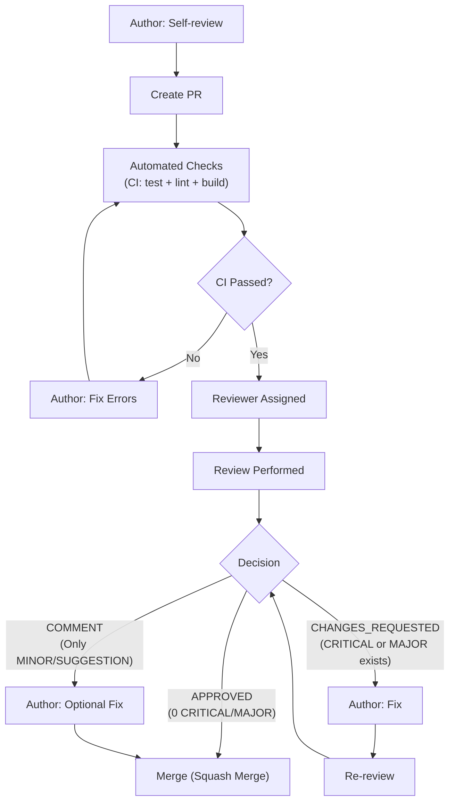

# Leakwatch - Code Review Standards

> **Document Version:** 1.0
> **Date:** 2026-03-24
> **Status:** Draft

---

## 1. Purpose and Scope

Code reviews are the quality gate for code entering the `main` branch. Every pull request must be reviewed by at least one developer before merging. This document defines the review process, checklists, finding classification, and review output format.

Since Leakwatch is a **security tool**, code reviews include additional checks focused on security, performance, and concurrency beyond standard software quality.

---

## 2. Review Principles

| Principle | Description |
|-----------|-------------|
| **Standards-Focused** | Every finding should reference a documented standard, not personal preference |
| **Severity Accuracy** | Findings are classified by impact, not by effort to fix |
| **Actionable** | Every finding includes a concrete fix suggestion or direction |
| **No False Positives** | Every finding must be verified against the actual code |
| **Regression Awareness** | Fix commits should be evaluated as potential sources of new bugs |
| **Completeness** | All changed files must be reviewed |

---

## 3. Finding Classification

### 3.1 Severity Levels

| Level | Label | Merge | Description |
|-------|-------|-------|-------------|
| **CRITICAL** | `🔴 CRITICAL` | Blocks | Security vulnerability, data loss risk, secret leakage |
| **MAJOR** | `🟠 MAJOR` | Blocks | Architecture violation, bug, missing tests |
| **MINOR** | `🟡 MINOR` | Does not block | Style, naming, minor improvements |
| **SUGGESTION** | `🔵 SUGGESTION` | Does not block | Alternative approach, future improvement |

### 3.2 Zero Tolerance Rules (Always CRITICAL)

When the following conditions are detected, the finding is **always classified as CRITICAL**:

| # | Rule | Reference |
|---|------|-----------|
| ZT-01 | Logging, printing to console, or saving discovered secret content to disk | CLAUDE.md, Security Principles |
| ZT-02 | Using real secret content in test fixtures | CLAUDE.md |
| ZT-03 | Adding a dependency that requires CGO | ADR-0001 |
| ZT-04 | Business logic inside the `cmd/` package | CLAUDE.md, Package Rules |
| ZT-05 | Making architectural decisions that contradict ADRs | CLAUDE.md |
| ZT-06 | Using `fmt.Println` or `log.Printf` (instead of `log/slog`) | 04-DEVELOPMENT-STANDARDS §2.5 |
| ZT-07 | Race condition: unsynchronized access to shared state | Go Concurrency |
| ZT-08 | Goroutine leak: unclosed channel or uncancelled context | ADR-0008 |
| ZT-09 | Error swallowing: silently continuing in `if err != nil` block | 04-DEVELOPMENT-STANDARDS §2.4 |
| ZT-10 | Manually editing `go.sum` or `vendor/` directory | CLAUDE.md |
| ZT-11 | Skipping git hooks with `--no-verify` | CLAUDE.md |
| ZT-12 | Using ASCII art diagrams (instead of Mermaid) | 00-DOCUMENTATION-STANDARDS |

---

## 4. Review Checklist

### 4.1 Security (SEC)

Since Leakwatch is a security tool, this section has the **highest priority**.

| # | Check | Severity |
|---|-------|----------|
| SEC-01 | Is discovered secret data masked via the `Redacted` field? Is `Raw` content never logged? | CRITICAL |
| SEC-02 | Do verification API calls use only read-only endpoints? (e.g., STS GetCallerIdentity) | CRITICAL |
| SEC-03 | Are user inputs (file paths, URLs, regex patterns) validated? | MAJOR |
| SEC-04 | Is path traversal protection in place? (`filepath.Clean`, `filepath.Rel`) | MAJOR |
| SEC-05 | Are regex patterns safe against ReDoS? (Go's RE2 engine guarantee is sufficient, but performance should be checked for complex patterns) | MAJOR |
| SEC-06 | Is the newly added dependency trustworthy? Is its license MIT/Apache/BSD compatible? | MAJOR |
| SEC-07 | Is secret content hidden from output without the `--show-raw` flag? | CRITICAL |
| SEC-08 | Are verification results not being written to disk or cache? | MAJOR |

### 4.2 Concurrency and Performance (CONC)

| # | Check | Severity |
|---|-------|----------|
| CONC-01 | Are shared variables accessed with `sync.Mutex` or `sync.RWMutex`? | CRITICAL |
| CONC-02 | Are channels properly closed? Is close responsibility on the sender side? | CRITICAL |
| CONC-03 | Is `context.Context` cancellation checked in every goroutine? (`select` with `ctx.Done()`) | MAJOR |
| CONC-04 | Is `sync.WaitGroup` used correctly? (`Add` before goroutine start, `Done` with `defer`) | MAJOR |
| CONC-05 | Is there a goroutine leak risk? Could channel writes block? | CRITICAL |
| CONC-06 | Are buffered channel sizes reasonable? Has memory consumption been checked? | MINOR |
| CONC-07 | Does the worker pool support graceful shutdown? | MAJOR |
| CONC-08 | Are tests run with the `-race` flag? | MAJOR |

### 4.3 Architecture (ARCH)

| # | Check | Severity |
|---|-------|----------|
| ARCH-01 | Is business logic in `internal/` packages? Is `cmd/` only a thin layer? | CRITICAL |
| ARCH-02 | Are public types under `pkg/`? | MAJOR |
| ARCH-03 | Are new detectors/formatters registered using the `init()` + blank import pattern? (ADR-0004) | MAJOR |
| ARCH-04 | Does the code depend on interfaces, not concrete types? | MAJOR |
| ARCH-05 | Is the package dependency direction correct? (`internal/` → `pkg/`, never the reverse) | CRITICAL |
| ARCH-06 | Are there circular dependencies? | CRITICAL |
| ARCH-07 | If a new architectural decision is being made, has an ADR been written? | MAJOR |
| ARCH-08 | Has the standard library been preferred? Have unnecessary dependencies been avoided? | MINOR |

### 4.4 Error Handling (ERR)

| # | Check | Severity |
|---|-------|----------|
| ERR-01 | Are errors wrapped with `fmt.Errorf("context: %w", err)`? | MAJOR |
| ERR-02 | Are sentinel errors defined with `errors.New`? | MINOR |
| ERR-03 | Are error checks not skipped? (every `err` should be checked) | MAJOR |
| ERR-04 | Are fatal errors (resource unreachable) properly distinguished from transient errors (file unreadable)? | MAJOR |
| ERR-05 | If panic is used, is there justification? (only for programming errors or init) | MAJOR |

### 4.5 Testing (TEST)

| # | Check | Severity |
|---|-------|----------|
| TEST-01 | Have tests been written for new code? | MAJOR |
| TEST-02 | Is the table-driven test pattern used? | MINOR |
| TEST-03 | Does test naming follow the `Test<Function>_<Scenario>_<ExpectedResult>` format? | MINOR |
| TEST-04 | Are edge cases tested? (empty input, nil, large data, context cancellation) | MAJOR |
| TEST-05 | Are mocks written against interfaces? | MINOR |
| TEST-06 | Do detector tests use format patterns, not real secret content? | CRITICAL |
| TEST-07 | Is `fstest.MapFS` preferred for in-memory filesystem tests? | SUGGESTION |
| TEST-08 | Are test coverage targets met? (detectors 95%, engine 85%, overall 80%) | MAJOR |
| TEST-09 | Are tests deterministic? Are there dependencies on time, filesystem, or network? | MAJOR |
| TEST-10 | Do tests pass with the race detector (`-race`)? | MAJOR |

### 4.6 Code Quality (CQ)

| # | Check | Severity |
|---|-------|----------|
| CQ-01 | Are naming conventions followed? (PascalCase exported, camelCase internal, snake_case files) | MINOR |
| CQ-02 | Is there dead code? Unused variables, functions, or imports? | MINOR |
| CQ-03 | Is there code duplication (DRY violation)? | MINOR |
| CQ-04 | Do functions follow the single responsibility principle? | MINOR |
| CQ-05 | Do exported functions and types have godoc comments? | MINOR |
| CQ-06 | Are there magic numbers/strings? Should they be defined as constants? | MINOR |
| CQ-07 | Has `gofumpt` formatting been applied? | MINOR |
| CQ-08 | Are there `golangci-lint` warnings? | MAJOR |

### 4.7 Logging and Observability (OBS)

| # | Check | Severity |
|---|-------|----------|
| OBS-01 | Is `log/slog` structured logging being used? | MAJOR |
| OBS-02 | Are log messages in English? Are structured parameters (key-value) used? | MINOR |
| OBS-03 | Are log levels correct? (Debug: development detail, Info: business events, Warn: recoverable issues, Error: errors) | MINOR |
| OBS-04 | Does secret content never appear in log messages? | CRITICAL |
| OBS-05 | Is there unnecessary logging in performance-critical paths? | MINOR |

### 4.8 Detector-Specific Checks (DET)

| # | Check | Severity |
|---|-------|----------|
| DET-01 | Is the regex compiled once at package level with `regexp.MustCompile`? (not inside `Scan()`) | MAJOR |
| DET-02 | Does `Keywords()` return the correct keywords? (for Aho-Corasick pre-filtering) | MAJOR |
| DET-03 | Does the `Redacted` field sufficiently mask secret content? | CRITICAL |
| DET-04 | Is the false positive rate acceptable? Do test scenarios cover this? | MAJOR |
| DET-05 | Is the detector ID unique and in a consistent format? (`kebab-case`) | MINOR |
| DET-06 | Is severity assigned correctly? (real secret=Critical, possible secret=Medium, informational=Low) | MAJOR |

---

## 5. Review Process

### 5.1 Workflow



### 5.2 Author Responsibilities

- Perform a **self-review** before creating the PR
- Changes should not exceed **400 lines** (split if they do)
- PR description must include:
  - What was done and why
  - Test plan
  - Breaking changes must be noted if applicable
- Ensure CI passes

### 5.3 Reviewer Responsibilities

- Read the PR description
- Review **all changed files**
- Classify findings by severity level
- Suggest a **concrete fix** for each finding
- For non-trivial changes, run the code locally

### 5.4 Security-Sensitive Changes

The following changes require **2 reviewers**:

- Verification (verifier) code — interaction with API keys
- Scan engine changes — concurrency and data flow
- Output formatters — risk of secret content leakage
- Configuration system — security parameters
- Adding new dependencies

---

## 6. Author Self-Review Gate

Before creating a PR, the author should check this list:

### Go Code

- [ ] `go test -race ./...` passes
- [ ] `golangci-lint run ./...` has no warnings
- [ ] Secret content is not logged or written to disk
- [ ] Errors are wrapped with `fmt.Errorf("context: %w", err)`
- [ ] New exported functions/types have godoc comments
- [ ] Context cancellation is checked in goroutines

### Testing

- [ ] Tests are written for new code
- [ ] Edge cases are covered
- [ ] Test coverage has not dropped below target

### General

- [ ] Commit messages follow Conventional Commits format
- [ ] PR description states what was done and why
- [ ] Breaking changes are explicitly noted if applicable

---

## 7. Review Finding Format

### 7.1 Inline Comment Template

```
🔴 **CRITICAL** | SEC-01

**Issue:** Discovered secret content is being logged with `slog.Info`.

**Fix:**
Use only the `Redacted` field:
​```go
slog.Info("secret found", "redacted", finding.Redacted)
​```

**Reference:** CLAUDE.md — Security Principles
```

### 7.2 Review Summary Template

```markdown
## Review Summary

| Level | Count |
|-------|-------|
| 🔴 CRITICAL | 0 |
| 🟠 MAJOR | 1 |
| 🟡 MINOR | 2 |
| 🔵 SUGGESTION | 1 |

**Decision:** CHANGES_REQUESTED

### Findings

1. 🟠 **MAJOR** | CONC-03 — `worker.go:45` — Context cancellation not checked
2. 🟡 **MINOR** | CQ-01 — `detector.go:12` — Function name should be camelCase
3. 🟡 **MINOR** | OBS-02 — `engine.go:78` — Log message should be in English
4. 🔵 **SUGGESTION** | TEST-07 — `filesystem_test.go` — Consider using `fstest.MapFS`
```

---

## 8. Review Priority Order

Follow this priority order during review:

```
1. Security (SEC)           ← Highest priority
2. Zero Tolerance (ZT)
3. Concurrency (CONC)
4. Architecture (ARCH)
5. Error Handling (ERR)
6. Testing (TEST)
7. Detector-Specific (DET)
8. Logging (OBS)
9. Code Quality (CQ)        ← Lowest priority
```

> **Rule:** If 3 or more CRITICAL findings are detected, stop the review and issue `CHANGES_REQUESTED`. The remaining issues will be caught after the fix commit.

---

## 9. Common Anti-Patterns

### 9.1 Go Anti-Patterns

| Anti-Pattern | Correct Approach |
|--------------|------------------|
| `go func() { ... }()` without context | `go func(ctx context.Context) { ... }(ctx)` |
| `select {}` for infinite wait | `select { case <-ctx.Done(): return }` |
| `sync.Mutex` where `sync.RWMutex` is needed | Use `RWMutex` for read-heavy access |
| Blocking risk on channel send | Buffered channel or `select` with timeout |
| `regexp.Compile` on every call | Package-level `regexp.MustCompile` |
| Error swallowing in `err != nil` check | Always `return fmt.Errorf("context: %w", err)` |
| `log.Fatal` in production code | `slog.Error` + appropriate exit code |
| Unnecessary use of `interface{}` or `any` | Concrete type or generic |

### 9.2 Detector Anti-Patterns

| Anti-Pattern | Correct Approach |
|--------------|------------------|
| Compiling regex inside `Scan()` | Package-level `var re = regexp.MustCompile(...)` |
| Returning `Raw` field without masking | Always populate the `Redacted` field |
| Overly broad regex (false positives) | More specific pattern + entropy check |
| Detector without keywords (regex on every chunk) | Proper `Keywords()` for Aho-Corasick filtering |
| Using real API keys in tests | Format pattern + random characters |

---

## 10. Review Metrics

| Metric | Target |
|--------|--------|
| Time to first review | < 24 hours |
| Review cycles | ≤ 2 rounds |
| PR size | < 400 lines changed |
| CRITICAL findings / PR | 0 (target) |
