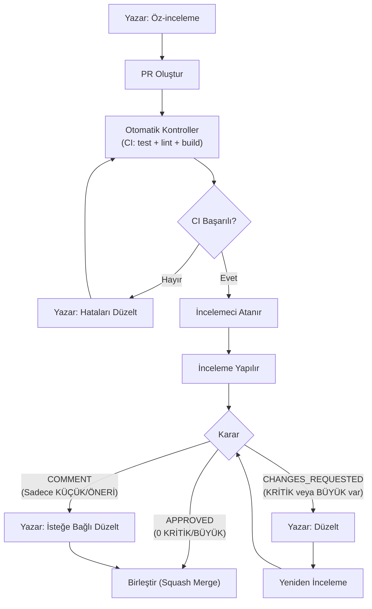

# Leakwatch - Kod İnceleme (Code Review) Standartları

> **Belge Versiyonu:** 1.0
> **Tarih:** 2026-03-24
> **Durum:** Taslak

---

## 1. Amaç ve Kapsam

Kod incelemeleri, `main` dalına giren kodun kalite kapısıdır. Her pull request birleştirilmeden önce en az bir geliştirici tarafından incelenmelidir. Bu belge, inceleme sürecini, kontrol listelerini, bulgu sınıflandırmasını ve inceleme çıktı formatını tanımlar.

Leakwatch bir **güvenlik aracı** olduğundan, kod incelemeleri standart yazılım kalitesinin ötesinde güvenlik, performans ve eşzamanlılık odaklı ek kontroller içerir.

---

## 2. İnceleme İlkeleri

| İlke | Açıklama |
|------|----------|
| **Standart Odaklı** | Her bulgu belgelenmiş bir standarda referans vermelidir, kişisel tercih değil |
| **Önem Doğruluğu** | Bulgular etkiye göre sınıflandırılır, düzeltme çabasına göre değil |
| **Eyleme Dönüştürülebilir** | Her bulgu somut bir düzeltme önerisi veya yön içermelidir |
| **Yanlış Pozitif Yok** | Her bulgu gerçek koda karşı doğrulanmalıdır |
| **Regresyon Farkındalığı** | Düzeltme commit'leri incelenirken, yeni hata kaynağı olarak değerlendirilmelidir |
| **Eksiksizlik** | Değişen tüm dosyalar incelenmelidir |

---

## 3. Bulgu Sınıflandırması

### 3.1 Önem Seviyeleri

| Seviye | Etiket | Birleştirme | Açıklama |
|--------|--------|-------------|----------|
| **KRİTİK** | `🔴 CRITICAL` | Engeller | Güvenlik açığı, veri kaybı riski, sır sızıntısı |
| **BÜYÜK** | `🟠 MAJOR` | Engeller | Mimari ihlal, hata, test eksikliği |
| **KÜÇÜK** | `🟡 MINOR` | Engellemez | Stil, adlandırma, küçük iyileştirmeler |
| **ÖNERİ** | `🔵 SUGGESTION` | Engellemez | Alternatif yaklaşım, gelecek iyileştirme |

### 3.2 Sıfır Tolerans Kuralları (Her Zaman KRİTİK)

Aşağıdaki durumlar tespit edildiğinde bulgu **her zaman KRİTİK** olarak sınıflandırılır:

| # | Kural | Referans |
|---|-------|----------|
| ZT-01 | Bulunan sır içeriğinin loglanması, konsola yazılması veya diske kaydedilmesi | CLAUDE.md, Güvenlik İlkeleri |
| ZT-02 | Test fixture'larında gerçek sır içeriği kullanılması | CLAUDE.md |
| ZT-03 | CGO gerektiren bağımlılık eklenmesi | ADR-0001 |
| ZT-04 | `cmd/` paketi içinde iş mantığı bulunması | CLAUDE.md, Paket Kuralları |
| ZT-05 | ADR'lara aykırı mimari karar alınması | CLAUDE.md |
| ZT-06 | `fmt.Println` veya `log.Printf` kullanımı (`log/slog` yerine) | 04-DEVELOPMENT-STANDARDS §2.5 |
| ZT-07 | Race condition: paylaşılan duruma senkronizasyonsuz erişim | Go Concurrency |
| ZT-08 | Goroutine sızıntısı: kapatılmayan kanal veya iptal edilmeyen context | ADR-0008 |
| ZT-09 | Hata yutma: `if err != nil` bloğunda sessizce devam etme | 04-DEVELOPMENT-STANDARDS §2.4 |
| ZT-10 | `go.sum` veya `vendor/` dizininin manuel düzenlenmesi | CLAUDE.md |
| ZT-11 | `--no-verify` ile git hook'larının atlanması | CLAUDE.md |
| ZT-12 | ASCII art diyagram kullanımı (Mermaid yerine) | 00-DOCUMENTATION-STANDARDS |

---

## 4. İnceleme Kontrol Listesi

### 4.1 Güvenlik (SEC)

Leakwatch bir güvenlik aracı olduğundan bu bölüm **en yüksek önceliğe** sahiptir.

| # | Kontrol | Önem |
|---|---------|------|
| SEC-01 | Bulunan sır verileri `Redacted` alan üzerinden maskeleniyor mu? `Raw` içerik asla loglanmıyor mu? | KRİTİK |
| SEC-02 | Doğrulama (verification) API çağrılarında sadece salt-okunur endpoint'ler mi kullanılıyor? (örn: STS GetCallerIdentity) | KRİTİK |
| SEC-03 | Kullanıcı girdileri (dosya yolları, URL'ler, regex desenleri) doğrulanıyor mu? | BÜYÜK |
| SEC-04 | Path traversal koruması var mı? (`filepath.Clean`, `filepath.Rel`) | BÜYÜK |
| SEC-05 | Regex desenleri ReDoS'a karşı güvenli mi? (Go'nun RE2 motoru garantisi yeterli, ancak karmaşık desenlerde performans kontrol edilmeli) | BÜYÜK |
| SEC-06 | Yeni eklenen bağımlılık güvenilir mi? Lisansı MIT/Apache/BSD uyumlu mu? | BÜYÜK |
| SEC-07 | `--show-raw` flag'i olmadan sır içeriği çıktıda görünmüyor mu? | KRİTİK |
| SEC-08 | Doğrulama sonuçları diske veya önbelleğe yazılmıyor mu? | BÜYÜK |

### 4.2 Eşzamanlılık ve Performans (CONC)

| # | Kontrol | Önem |
|---|---------|------|
| CONC-01 | Paylaşılan değişkenlere `sync.Mutex` veya `sync.RWMutex` ile erişiliyor mu? | KRİTİK |
| CONC-02 | Channel'lar uygun şekilde kapatılıyor mu? Kapatma sorumluluğu gönderici tarafta mı? | KRİTİK |
| CONC-03 | `context.Context` iptali her goroutine'de kontrol ediliyor mu? (`select` ile `ctx.Done()`) | BÜYÜK |
| CONC-04 | `sync.WaitGroup` doğru kullanılıyor mu? (`Add` goroutine başlatılmadan önce, `Done` `defer` ile) | BÜYÜK |
| CONC-05 | Goroutine sızıntısı riski var mı? Kanal yazımında bloklama olabilir mi? | KRİTİK |
| CONC-06 | Buffered channel boyutları makul mü? Bellek tüketimi kontrol edilmiş mi? | KÜÇÜK |
| CONC-07 | Worker pool graceful shutdown destekliyor mu? | BÜYÜK |
| CONC-08 | `-race` flag'i ile testler çalıştırılıyor mu? | BÜYÜK |

### 4.3 Mimari (ARCH)

| # | Kontrol | Önem |
|---|---------|------|
| ARCH-01 | İş mantığı `internal/` paketlerinde mi? `cmd/` sadece ince katman mı? | KRİTİK |
| ARCH-02 | Dışa açık tipler `pkg/` altında mı? | BÜYÜK |
| ARCH-03 | Yeni dedektör/formatter `init()` + blank import deseniyle mi kayıt ediliyor? (ADR-0004) | BÜYÜK |
| ARCH-04 | Arayüzlere (interface) bağımlılık mı var, somut tiplere mi? | BÜYÜK |
| ARCH-05 | Paket bağımlılık yönü doğru mu? (`internal/` → `pkg/`, tersi asla) | KRİTİK |
| ARCH-06 | Döngüsel bağımlılık (circular dependency) var mı? | KRİTİK |
| ARCH-07 | Yeni bir mimari karar alınıyorsa ADR yazılmış mı? | BÜYÜK |
| ARCH-08 | Standart kütüphane tercih edilmiş mi? Gereksiz bağımlılık eklenmemiş mi? | KÜÇÜK |

### 4.4 Hata Yönetimi (ERR)

| # | Kontrol | Önem |
|---|---------|------|
| ERR-01 | Hatalar `fmt.Errorf("bağlam: %w", err)` ile sarmalanıyor mu? | BÜYÜK |
| ERR-02 | Sentinel hatalar `errors.New` ile mi tanımlanıyor? | KÜÇÜK |
| ERR-03 | Hata kontrolleri atlanmamış mı? (her `err` kontrol edilmeli) | BÜYÜK |
| ERR-04 | Fatal hatalar (kaynak erişilemez) ile geçici hatalar (dosya okunamadı) doğru ayrıştırılmış mı? | BÜYÜK |
| ERR-05 | Panic kullanılıyorsa gerekçesi var mı? (sadece programlama hatası veya init) | BÜYÜK |

### 4.5 Test (TEST)

| # | Kontrol | Önem |
|---|---------|------|
| TEST-01 | Yeni kod için testler yazılmış mı? | BÜYÜK |
| TEST-02 | Table-driven test deseni kullanılmış mı? | KÜÇÜK |
| TEST-03 | Test adlandırması `Test<Fonksiyon>_<Senaryo>_<BeklenenSonuç>` formatında mı? | KÜÇÜK |
| TEST-04 | Kenar durumlar (edge cases) test edilmiş mi? (boş girdi, nil, büyük veri, context iptali) | BÜYÜK |
| TEST-05 | Mock'lar arayüzlere karşı mı yazılmış? | KÜÇÜK |
| TEST-06 | Dedektör testleri gerçek sır içeriği değil, format deseni mi kullanıyor? | KRİTİK |
| TEST-07 | `fstest.MapFS` ile bellek içi dosya sistemi testi tercih edilmiş mi? | ÖNERİ |
| TEST-08 | Test kapsamı hedefleri karşılanıyor mu? (dedektörler %95, engine %85, genel %80) | BÜYÜK |
| TEST-09 | Testler deterministik mi? Zamana, dosya sistemine veya ağa bağımlılık var mı? | BÜYÜK |
| TEST-10 | Race detector (`-race`) ile testler geçiyor mu? | BÜYÜK |

### 4.6 Kod Kalitesi (CQ)

| # | Kontrol | Önem |
|---|---------|------|
| CQ-01 | Adlandırma kurallarına uyuluyor mu? (PascalCase dışa açık, camelCase dahili, snake_case dosya) | KÜÇÜK |
| CQ-02 | Ölü kod (dead code) var mı? Kullanılmayan değişken, fonksiyon veya import? | KÜÇÜK |
| CQ-03 | Kod tekrarı (DRY ihlali) var mı? | KÜÇÜK |
| CQ-04 | Fonksiyonlar tek sorumluluk ilkesine uyuyor mu? | KÜÇÜK |
| CQ-05 | Dışa açık fonksiyon ve tiplerde godoc yorumu var mı? | KÜÇÜK |
| CQ-06 | Magic number/string var mı? Sabit olarak tanımlanmalı mı? | KÜÇÜK |
| CQ-07 | `gofumpt` formatlaması uygulanmış mı? | KÜÇÜK |
| CQ-08 | `golangci-lint` uyarısı var mı? | BÜYÜK |

### 4.7 Loglama ve Gözlemlenebilirlik (OBS)

| # | Kontrol | Önem |
|---|---------|------|
| OBS-01 | `log/slog` yapılandırılmış loglama kullanılıyor mu? | BÜYÜK |
| OBS-02 | Log mesajları İngilizce mi? Yapılandırılmış parametreler (key-value) kullanılıyor mu? | KÜÇÜK |
| OBS-03 | Log seviyeleri doğru mu? (Debug: geliştirme detayı, Info: iş olayları, Warn: kurtarılabilir sorunlar, Error: hatalar) | KÜÇÜK |
| OBS-04 | Sır içeriği log mesajlarında asla yer almıyor mu? | KRİTİK |
| OBS-05 | Performans açısından kritik yollarda gereksiz loglama var mı? | KÜÇÜK |

### 4.8 Dedektör Özel Kontrolleri (DET)

| # | Kontrol | Önem |
|---|---------|------|
| DET-01 | Regex, paket düzeyinde `regexp.MustCompile` ile bir kez mi derleniyor? (`Scan()` içinde değil) | BÜYÜK |
| DET-02 | `Keywords()` doğru anahtar kelimeleri döndürüyor mu? (Aho-Corasick ön-filtreleme için) | BÜYÜK |
| DET-03 | `Redacted` alan sır içeriğini yeterince maskeliyor mu? | KRİTİK |
| DET-04 | Yanlış pozitif oranı kabul edilebilir düzeyde mi? Test senaryoları bunu kapsıyor mu? | BÜYÜK |
| DET-05 | Dedektör ID'si benzersiz ve tutarlı formatta mı? (`kebab-case`) | KÜÇÜK |
| DET-06 | Severity doğru atanmış mı? (gerçek sır=Critical, olası sır=Medium, bilgilendirme=Low) | BÜYÜK |

---

## 5. İnceleme Süreci

### 5.1 İş Akışı



### 5.2 Yazar Sorumlulukları

- PR oluşturmadan önce **öz-inceleme** yap
- Değişiklik **400 satırı** aşmamalı (aşıyorsa bölünmeli)
- PR açıklamasında şunlar bulunmalı:
  - Ne yapıldı ve neden
  - Test planı
  - Kırılma değişikliği (breaking change) varsa belirtilmeli
- CI'ın geçtiğinden emin ol

### 5.3 İncelemeci Sorumlulukları

- PR açıklamasını oku
- Değişen **tüm dosyaları** incele
- Bulguları önem seviyesine göre sınıflandır
- Her bulgu için **somut düzeltme** öner
- Önemsiz olmayan değişikliklerde kodu yerel olarak çalıştır

### 5.4 Güvenlik Hassas Değişiklikler

Aşağıdaki değişiklikler **2 incelemeci** gerektirir:

- Doğrulama (verifier) kodu — API anahtarlarıyla etkileşim
- Tarama motoru (engine) değişiklikleri — eşzamanlılık ve veri akışı
- Çıktı formatlayıcıları — sır içeriğinin sızma riski
- Yapılandırma sistemi — güvenlik parametreleri
- Yeni bağımlılık eklenmesi

---

## 6. Yazar Öz-İnceleme Kapısı

PR oluşturmadan önce yazar şu listeyi kontrol etmelidir:

### Go Kodu

- [ ] `go test -race ./...` başarılı
- [ ] `golangci-lint run ./...` uyarısız
- [ ] Sır içeriği loglanmıyor, diske yazılmıyor
- [ ] Hatalar `fmt.Errorf("bağlam: %w", err)` ile sarmalanıyor
- [ ] Yeni dışa açık fonksiyon/tipler için godoc yorumu var
- [ ] Context iptali goroutine'lerde kontrol ediliyor

### Test

- [ ] Yeni kod için testler yazıldı
- [ ] Kenar durumlar kapsanıyor
- [ ] Test kapsamı hedefin altına düşmedi

### Genel

- [ ] Commit mesajları Conventional Commits formatında
- [ ] PR açıklaması ne yapıldığını ve neden yapıldığını belirtiyor
- [ ] Kırılma değişikliği varsa açıkça belirtiliyor

---

## 7. İnceleme Bulgu Formatı

### 7.1 Satır İçi Yorum Şablonu

```
🔴 **CRITICAL** | SEC-01

**Sorun:** Bulunan sır içeriği `slog.Info` ile loglanıyor.

**Düzeltme:**
Sadece `Redacted` alanını kullanın:
​```go
slog.Info("sır bulundu", "redacted", finding.Redacted)
​```

**Referans:** CLAUDE.md — Güvenlik İlkeleri
```

### 7.2 İnceleme Özet Şablonu

```markdown
## İnceleme Özeti

| Seviye | Sayı |
|--------|------|
| 🔴 KRİTİK | 0 |
| 🟠 BÜYÜK | 1 |
| 🟡 KÜÇÜK | 2 |
| 🔵 ÖNERİ | 1 |

**Karar:** CHANGES_REQUESTED

### Bulgular

1. 🟠 **MAJOR** | CONC-03 — `worker.go:45` — Context iptali kontrol edilmiyor
2. 🟡 **MINOR** | CQ-01 — `detector.go:12` — Fonksiyon adı camelCase olmalı
3. 🟡 **MINOR** | OBS-02 — `engine.go:78` — Log mesajı Türkçe, İngilizce olmalı
4. 🔵 **SUGGESTION** | TEST-07 — `filesystem_test.go` — `fstest.MapFS` kullanılabilir
```

---

## 8. İnceleme Öncelik Sırası

İnceleme sırasında aşağıdaki öncelik sırasına göre ilerleyin:

```
1. Güvenlik (SEC)           ← En yüksek öncelik
2. Sıfır Tolerans (ZT)
3. Eşzamanlılık (CONC)
4. Mimari (ARCH)
5. Hata Yönetimi (ERR)
6. Test (TEST)
7. Dedektör Özel (DET)
8. Loglama (OBS)
9. Kod Kalitesi (CQ)        ← En düşük öncelik
```

> **Kural:** 3 veya daha fazla KRİTİK bulgu tespit edildiğinde incelemeyi durdurun ve `CHANGES_REQUESTED` verin. Geri kalan sorunlar düzeltme commit'i sonrasında yakalanacaktır.

---

## 9. Yaygın Anti-Paternler

### 9.1 Go Anti-Paternleri

| Anti-Patern | Doğru Yaklaşım |
|-------------|----------------|
| `go func() { ... }()` context olmadan | `go func(ctx context.Context) { ... }(ctx)` |
| `select {}` ile sonsuz bekleme | `select { case <-ctx.Done(): return }` |
| `sync.Mutex` yerine `sync.RWMutex` gereken yerde Mutex | Okuma ağırlıklı erişimde `RWMutex` |
| Channel gönderiminde bloklama riski | Buffered channel veya `select` ile timeout |
| `regexp.Compile` her çağrıda | Paket düzeyinde `regexp.MustCompile` |
| `err != nil` kontrolünde hata yutma | Her zaman `return fmt.Errorf("bağlam: %w", err)` |
| `log.Fatal` üretim kodunda | `slog.Error` + uygun çıkış kodu |
| `interface{}` veya `any` gereksiz kullanımı | Somut tip veya generic |

### 9.2 Dedektör Anti-Paternleri

| Anti-Patern | Doğru Yaklaşım |
|-------------|----------------|
| Regex'i `Scan()` içinde derleme | Paket düzeyinde `var re = regexp.MustCompile(...)` |
| `Raw` alanını maskelemeden döndürme | Her zaman `Redacted` alanını doldur |
| Çok geniş regex (yanlış pozitif) | Daha spesifik desen + entropi kontrolü |
| Keyword'sız dedektör (her chunk'a regex) | Uygun `Keywords()` ile Aho-Corasick filtreleme |
| Test'te gerçek API anahtarı kullanma | Format deseni + rastgele karakterler |

---

## 10. İnceleme Metrikleri

| Metrik | Hedef |
|--------|-------|
| İlk inceleme süresi | < 24 saat |
| İnceleme döngüsü | ≤ 2 tur |
| PR boyutu | < 400 satır değişiklik |
| KRİTİK bulgu / PR | 0 (hedef) |
