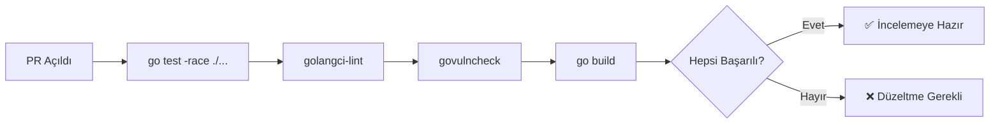
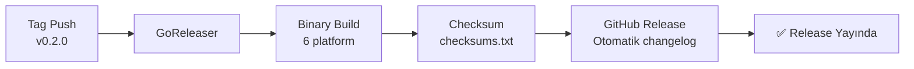

# Leakwatch - Sürüm ve Dağıtım Standartları

> **Belge Versiyonu:** 1.0
> **Tarih:** 2026-03-24
> **Durum:** Taslak

---

## 1. Sürüm Numaralama (Semantic Versioning)

Leakwatch, [Semantic Versioning 2.0.0](https://semver.org/) standardını takip eder.

```
v{MAJOR}.{MINOR}.{PATCH}[-{pre-release}]

MAJOR  — Geriye uyumsuz API/CLI değişiklikleri
MINOR  — Geriye uyumlu yeni özellikler
PATCH  — Geriye uyumlu hata düzeltmeleri
```

### 1.1 Sürüm Örnekleri

| Sürüm | Açıklama |
|-------|----------|
| `v0.1.0` | MVP — dosya sistemi tarama |
| `v0.2.0` | Git entegrasyonu |
| `v0.3.0` | Doğrulama ve Aho-Corasick |
| `v0.4.0` | Container tarama, SARIF |
| `v1.0.0` | Kararlı API, üretime hazır |
| `v1.0.1` | Hata düzeltme |
| `v1.1.0` | Yeni dedektörler |
| `v2.0.0` | CLI flag kaldırma, çıktı format değişikliği |

### 1.2 Ön-Sürüm Etiketleri

```
v1.0.0-alpha.1   → Erken geliştirme, kararsız
v1.0.0-beta.1    → Özellik tam, test aşamasında
v1.0.0-rc.1      → Sürüm adayı, son düzeltmeler
```

### 1.3 Kırılma Değişikliği (Breaking Change) Politikası

`v1.0.0` öncesi (`v0.x.x`): MINOR sürüm kırılma değişikliği içerebilir.

`v1.0.0` sonrası:
- CLI flag kaldırma/yeniden adlandırma → MAJOR
- JSON çıktı format değişikliği → MAJOR
- Çıkış kodu semantiği değişikliği → MAJOR
- Yeni dedektör ekleme → MINOR
- Yeni flag ekleme → MINOR
- Hata düzeltme → PATCH

Kullanımdan kaldırma süreci:
1. Eski davranışı `deprecated` olarak işaretle ve uyarı logla
2. En az 1 MINOR sürüm boyunca destekle
3. Sonraki MAJOR sürümde kaldır

---

## 2. Dallanma Stratejisi (GitHub Flow)

```mermaid
gitgraph
    commit id: "v0.1.0"
    branch feature/scan-git
    commit id: "feat: git source"
    commit id: "test: git tests"
    checkout main
    merge feature/scan-git id: "squash merge"
    commit id: "v0.2.0" tag: "v0.2.0"
    branch fix/race-condition
    commit id: "fix: worker pool race"
    checkout main
    merge fix/race-condition id: "squash merge fix"
    commit id: "v0.2.1" tag: "v0.2.1"
```

### 2.1 Dal Kuralları

| Dal | Kaynak | Hedef | Ömür |
|-----|--------|-------|------|
| `main` | — | — | Kalıcı, her zaman kararlı |
| `feature/<isim>` | `main` | `main` | Kısa ömürlü (< 1 hafta) |
| `fix/<isim>` | `main` | `main` | Kısa ömürlü |
| `docs/<isim>` | `main` | `main` | Kısa ömürlü |
| `hotfix/<isim>` | `main` | `main` | Acil düzeltmeler |

### 2.2 Birleştirme Kuralları

- Tüm değişiklikler **Pull Request** ile gelir
- **Squash merge** tercih edilir (temiz geçmiş)
- CI pipeline başarılı olmalıdır
- En az 1 onay (review) gereklidir
- Güvenlik hassas değişikliklerde 2 onay gereklidir

---

## 3. CI/CD Pipeline

### 3.1 PR Pipeline

Her pull request'te otomatik çalışır:



| Adım | Komut | Başarısızlık |
|------|-------|-------------|
| Test | `go test -race -coverprofile=coverage.out ./...` | PR birleştirilemez |
| Lint | `golangci-lint run ./...` | PR birleştirilemez |
| Güvenlik | `govulncheck ./...` | PR birleştirilemez |
| Build | `CGO_ENABLED=0 go build ./...` | PR birleştirilemez |

### 3.2 Main Pipeline

`main` dalına birleştirmede:

| Adım | Açıklama |
|------|----------|
| PR pipeline adımları | Test + lint + güvenlik + build |
| Çapraz derleme | linux/darwin/windows × amd64/arm64 |
| Kapsam raporu | Test kapsamı ≥ %80 kontrolü |

### 3.3 Release Pipeline

Tag push'ta (`v*`) otomatik tetiklenir:



| Adım | Araç | Çıktı |
|------|------|-------|
| Build | GoReleaser | 6 binary (3 OS × 2 arch) |
| Checksum | GoReleaser | `checksums.txt` (SHA256) |
| Release | GitHub Releases | Otomatik changelog + binary'ler |

---

## 4. Release Süreci

### 4.1 Release Öncesi Kontrol Listesi

- [ ] `main` dalında tüm testler geçiyor (`go test -race ./...`)
- [ ] `golangci-lint` uyarısız
- [ ] `govulncheck` temiz
- [ ] Test kapsamı ≥ %80
- [ ] CHANGELOG.md güncellenmiş
- [ ] README.md güncellenmiş (yeni özellikler varsa)
- [ ] Kırılma değişikliği varsa belgelenmiş
- [ ] Yeni dedektörler test edilmiş (yanlış pozitif oranı kabul edilebilir)
- [ ] Performans benchmark'ları kabul edilebilir düzeyde

### 4.2 Tag Oluşturma ve Yayınlama

```bash
# Sürüm etiketini oluştur
git tag -a v0.2.0 -m "feat: Git entegrasyonu ve geçmiş taraması"

# Etiket'i push et (release pipeline'ı tetikler)
git push origin v0.2.0
```

### 4.3 Release Sonrası Kontrol Listesi

- [ ] GitHub Release sayfası doğru görünüyor
- [ ] Binary'ler indirilebilir ve çalışıyor (en az 1 platform test edilmeli)
- [ ] `leakwatch version` doğru sürümü gösteriyor
- [ ] Checksum doğrulaması yapılmış

---

## 5. Changelog Formatı

[Keep a Changelog](https://keepachangelog.com/) formatı kullanılır:

```markdown
# Changelog

## [v0.2.0] - 2026-04-20

### Added
- `scan git` komutu ile Git deposu tarama (#12)
- `--since`, `--branch`, `--depth` flag'leri (#14)
- `--since-commit` ile diff tabanlı tarama (#15)
- Commit metadata (hash, author, tarih) bulgu çıktısında (#13)

### Fixed
- Worker pool context iptalinde goroutine sızıntısı (#18)

## [v0.1.0] - 2026-04-01

### Added
- `scan fs` komutu ile dosya sistemi tarama
- AWS Access Key ID dedektörü
- Private Key (RSA/SSH/DSA/EC/PGP) dedektörü
- Generic API Key dedektörü
- JSON çıktı formatı
- Worker pool ile eşzamanlı tarama
- Shannon entropi analizi
```

### Kategori Sırası

1. **Added** — Yeni özellikler
2. **Changed** — Mevcut özelliklerde değişiklik
3. **Deprecated** — Kaldırılacak özellikler
4. **Removed** — Kaldırılan özellikler
5. **Fixed** — Hata düzeltmeleri
6. **Security** — Güvenlik düzeltmeleri

---

## 6. Binary Dağıtım

### 6.1 Desteklenen Platformlar

| OS | Mimari | Dosya Adı |
|----|--------|-----------|
| Linux | amd64 | `leakwatch_v0.2.0_linux_amd64.tar.gz` |
| Linux | arm64 | `leakwatch_v0.2.0_linux_arm64.tar.gz` |
| macOS | amd64 | `leakwatch_v0.2.0_darwin_amd64.tar.gz` |
| macOS | arm64 | `leakwatch_v0.2.0_darwin_arm64.tar.gz` |
| Windows | amd64 | `leakwatch_v0.2.0_windows_amd64.zip` |
| Windows | arm64 | `leakwatch_v0.2.0_windows_arm64.zip` |

### 6.2 Build Gereksinimleri

- `CGO_ENABLED=0` — saf Go binary, harici bağımlılık yok
- `ldflags` ile sürüm bilgisi enjekte edilir:
  ```
  -X main.version={{.Version}}
  -X main.commit={{.Commit}}
  -X main.date={{.Date}}
  ```
- Binary boyutu hedefi: < 30MB

### 6.3 Kurulum Yöntemleri

```bash
# Go install
go install github.com/cemililik/leakwatch@v0.2.0

# Homebrew (planlanıyor)
brew install cemililik/tap/leakwatch

# Binary indirme
curl -sSfL https://github.com/cemililik/Leakwatch/releases/latest/download/leakwatch_$(uname -s)_$(uname -m).tar.gz | tar xz
```

---

## 7. Geri Alma (Rollback) Stratejisi

### 7.1 CLI Aracı İçin Rollback

Leakwatch bir CLI aracı olduğundan rollback nispeten basittir:

| Senaryo | Strateji |
|---------|----------|
| Hatalı release yayınlandı | GitHub Release'i `pre-release` olarak işaretle, kullanıcıları bilgilendir |
| Kritik güvenlik hatası | Yeni PATCH sürüm yayınla (ör: `v0.2.1`) |
| Kırılma değişikliği planlanmadı | Eski davranışı geri getiren PATCH sürüm yayınla |

### 7.2 Rollback Süreci

```bash
# 1. Sorunlu tag'i silinme
# (GitHub Release'i draft/pre-release yapılabilir ama tag silinmemelidir)

# 2. Düzeltme dalı oluştur
git checkout -b hotfix/fix-description main

# 3. Düzeltmeyi yap, test et
go test -race ./...

# 4. PR oluştur ve birleştir
# 5. Yeni tag oluştur
git tag -a v0.2.1 -m "fix: kritik hata düzeltmesi"
git push origin v0.2.1
```

### 7.3 Zamanlamalar

| Metrik | Hedef |
|--------|-------|
| Hotfix PR açma süresi | < 2 saat |
| Hotfix release süresi | < 4 saat |
| Sorunlu release'i işaretleme | < 30 dakika |

---

## 8. Güvenlik Sürümleri

Güvenlik düzeltmeleri özel bir süreç izler:

1. Güvenlik açığı tespit edilir
2. Önem derecesi belirlenir (CVSS veya dahili değerlendirme)
3. **Gizli düzeltme** — Düzeltme PR'ı kamuya açılmadan önce hazırlanır
4. Düzeltme birleştirilir ve **hemen** yeni sürüm yayınlanır
5. Güvenlik danışma belgesi (security advisory) GitHub'da yayınlanır
6. `govulncheck` veritabanına bildirilir

### Güvenlik Sürüm Adlandırması

Güvenlik düzeltmeleri PATCH sürümüdür ve changelog'da `### Security` kategorisinde belgelenir.
