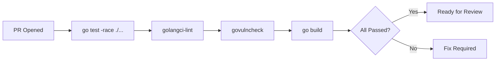
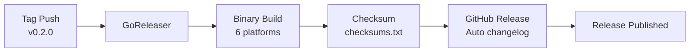

# Leakwatch - Release and Distribution Standards

> **Document Version:** 1.0
> **Date:** 2026-03-24
> **Status:** Draft

---

## 1. Version Numbering (Semantic Versioning)

Leakwatch follows the [Semantic Versioning 2.0.0](https://semver.org/) standard.

```
v{MAJOR}.{MINOR}.{PATCH}[-{pre-release}]

MAJOR  — Backward-incompatible API/CLI changes
MINOR  — Backward-compatible new features
PATCH  — Backward-compatible bug fixes
```

### 1.1 Version Examples

| Version | Description |
|---------|-------------|
| `v0.1.0` | MVP — filesystem scanning |
| `v0.2.0` | Git integration |
| `v0.3.0` | Verification and Aho-Corasick |
| `v0.4.0` | Container scanning, SARIF |
| `v1.0.0` | Stable API, production-ready |
| `v1.0.1` | Bug fix |
| `v1.1.0` | New detectors |
| `v2.0.0` | CLI flag removal, output format change |

### 1.2 Pre-release Tags

```
v1.0.0-alpha.1   → Early development, unstable
v1.0.0-beta.1    → Feature complete, in testing
v1.0.0-rc.1      → Release candidate, final fixes
```

### 1.3 Breaking Change Policy

Before `v1.0.0` (`v0.x.x`): MINOR versions may contain breaking changes.

After `v1.0.0`:
- CLI flag removal/renaming → MAJOR
- JSON output format change → MAJOR
- Exit code semantics change → MAJOR
- Adding a new detector → MINOR
- Adding a new flag → MINOR
- Bug fix → PATCH

Deprecation process:
1. Mark the old behavior as `deprecated` and log a warning
2. Support for at least 1 MINOR version
3. Remove in the next MAJOR version

---

## 2. Branching Strategy (GitHub Flow)

```mermaid
gitgraph
    commit id: "v0.1.0"
    branch feature/scan-git
    commit id: "feat: git source"
    commit id: "test: git tests"
    checkout main
    merge feature/scan-git id: "squash merge"
    commit id: "v0.2.0" tag: "v0.2.0"
    branch fix/race-condition
    commit id: "fix: worker pool race"
    checkout main
    merge fix/race-condition id: "squash merge fix"
    commit id: "v0.2.1" tag: "v0.2.1"
```

### 2.1 Branch Rules

| Branch | Source | Target | Lifetime |
|--------|--------|--------|----------|
| `main` | — | — | Permanent, always stable |
| `feature/<name>` | `main` | `main` | Short-lived (< 1 week) |
| `fix/<name>` | `main` | `main` | Short-lived |
| `docs/<name>` | `main` | `main` | Short-lived |
| `hotfix/<name>` | `main` | `main` | Emergency fixes |

### 2.2 Merge Rules

- All changes come through **Pull Requests**
- **Squash merge** is preferred (clean history)
- CI pipeline must pass
- At least 1 approval (review) is required
- Security-sensitive changes require 2 approvals

---

## 3. CI/CD Pipeline

### 3.1 PR Pipeline

Runs automatically on every pull request:



| Step | Command | On Failure |
|------|---------|------------|
| Test | `go test -race -coverprofile=coverage.out ./...` | PR cannot be merged |
| Lint | `golangci-lint run ./...` | PR cannot be merged |
| Security | `govulncheck ./...` | PR cannot be merged |
| Build | `CGO_ENABLED=0 go build ./...` | PR cannot be merged |

### 3.2 Main Pipeline

On merge to the `main` branch:

| Step | Description |
|------|-------------|
| PR pipeline steps | Test + lint + security + build |
| Cross-compilation | linux/darwin/windows x amd64/arm64 |
| Coverage report | Test coverage >= 80% check |

### 3.3 Release Pipeline

Automatically triggered on tag push (`v*`):



| Step | Tool | Output |
|------|------|--------|
| Build | GoReleaser | 6 binaries (3 OS x 2 arch) |
| Checksum | GoReleaser | `checksums.txt` (SHA256) |
| Release | GitHub Releases | Auto changelog + binaries |

---

## 4. Release Process

### 4.1 Pre-Release Checklist

- [ ] All tests pass on `main` branch (`go test -race ./...`)
- [ ] `golangci-lint` has no warnings
- [ ] `govulncheck` is clean
- [ ] Test coverage >= 80%
- [ ] CHANGELOG.md updated
- [ ] README.md updated (if new features)
- [ ] Breaking changes documented if applicable
- [ ] New detectors tested (false positive rate acceptable)
- [ ] Performance benchmarks at acceptable levels

### 4.2 Tag Creation and Publishing

```bash
# Create the version tag
git tag -a v0.2.0 -m "feat: Git integration and history scanning"

# Push the tag (triggers the release pipeline)
git push origin v0.2.0
```

### 4.3 Post-Release Checklist

- [ ] GitHub Release page looks correct
- [ ] Binaries are downloadable and working (at least 1 platform tested)
- [ ] `leakwatch version` shows correct version
- [ ] Checksum verification done

---

## 5. Changelog Format

[Keep a Changelog](https://keepachangelog.com/) format is used:

```markdown
# Changelog

## [v0.2.0] - 2026-04-20

### Added
- Git repository scanning with `scan git` command (#12)
- `--since`, `--branch`, `--depth` flags (#14)
- Diff-based scanning with `--since-commit` (#15)
- Commit metadata (hash, author, date) in finding output (#13)

### Fixed
- Goroutine leak on worker pool context cancellation (#18)

## [v0.1.0] - 2026-04-01

### Added
- Filesystem scanning with `scan fs` command
- AWS Access Key ID detector
- Private Key (RSA/SSH/DSA/EC/PGP) detector
- Generic API Key detector
- JSON output format
- Concurrent scanning with worker pool
- Shannon entropy analysis
```

### Category Order

1. **Added** — New features
2. **Changed** — Changes to existing features
3. **Deprecated** — Features to be removed
4. **Removed** — Removed features
5. **Fixed** — Bug fixes
6. **Security** — Security fixes

---

## 6. Binary Distribution

### 6.1 Supported Platforms

| OS | Architecture | File Name |
|----|-------------|-----------|
| Linux | amd64 | `leakwatch_v0.2.0_linux_amd64.tar.gz` |
| Linux | arm64 | `leakwatch_v0.2.0_linux_arm64.tar.gz` |
| macOS | amd64 | `leakwatch_v0.2.0_darwin_amd64.tar.gz` |
| macOS | arm64 | `leakwatch_v0.2.0_darwin_arm64.tar.gz` |
| Windows | amd64 | `leakwatch_v0.2.0_windows_amd64.zip` |
| Windows | arm64 | `leakwatch_v0.2.0_windows_arm64.zip` |

### 6.2 Build Requirements

- `CGO_ENABLED=0` — pure Go binary, no external dependencies
- Version info injected via `ldflags`:
  ```
  -X main.version={{.Version}}
  -X main.commit={{.Commit}}
  -X main.date={{.Date}}
  ```
- Binary size target: < 30MB

### 6.3 Installation Methods

```bash
# Go install
go install github.com/cemililik/leakwatch@v0.2.0

# Homebrew (planned)
brew install cemililik/tap/leakwatch

# Binary download
curl -sSfL https://github.com/cemililik/Leakwatch/releases/latest/download/leakwatch_$(uname -s)_$(uname -m).tar.gz | tar xz
```

---

## 7. Rollback Strategy

### 7.1 Rollback for CLI Tool

Since Leakwatch is a CLI tool, rollback is relatively straightforward:

| Scenario | Strategy |
|----------|----------|
| Faulty release published | Mark GitHub Release as `pre-release`, notify users |
| Critical security bug | Publish a new PATCH version (e.g., `v0.2.1`) |
| Unplanned breaking change | Publish a PATCH version that restores old behavior |

### 7.2 Rollback Process

```bash
# 1. Do not delete the problematic tag
# (GitHub Release can be made draft/pre-release but tag should not be deleted)

# 2. Create a hotfix branch
git checkout -b hotfix/fix-description main

# 3. Apply the fix and test
go test -race ./...

# 4. Create PR and merge
# 5. Create a new tag
git tag -a v0.2.1 -m "fix: critical bug fix"
git push origin v0.2.1
```

### 7.3 Timelines

| Metric | Target |
|--------|--------|
| Time to open hotfix PR | < 2 hours |
| Hotfix release time | < 4 hours |
| Time to flag problematic release | < 30 minutes |

---

## 8. Security Releases

Security fixes follow a special process:

1. Security vulnerability is identified
2. Severity is determined (CVSS or internal assessment)
3. **Private fix** — Fix PR is prepared before public disclosure
4. Fix is merged and a new version is **immediately** released
5. Security advisory is published on GitHub
6. Reported to the `govulncheck` database

### Security Release Naming

Security fixes are PATCH versions and are documented under the `### Security` category in the changelog.
