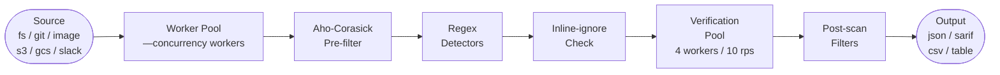

# How It Works

Understanding the Leakwatch pipeline helps you tune performance, interpret results, and decide which flags to reach for. This page explains what happens from the moment you run a scan command to the moment a finding appears in your output.

## The pipeline at a glance



Each stage is described in detail below.

## 1. Source

Every scan starts with a **Source** — an abstraction that emits chunks of data for the engine to process. Leakwatch ships six sources:

| Source | Command | What it emits |
|--------|---------|---------------|
| Filesystem | `scan fs` | File contents from a local directory tree |
| Git history | `scan git` | Every blob across the full commit history |
| Container image | `scan image` | Layer contents of an OCI/Docker image, daemonless |
| AWS S3 | `scan s3` | Object contents from an S3 bucket |
| Google Cloud Storage | `scan gcs` | Object contents from a GCS bucket |
| Slack | `scan slack` | Message text from channels and DMs |

:::note
Slack scanning covers **message text only**. The contents of files uploaded to Slack are not scanned.
:::

Chunks flow into a buffered channel consumed by the worker pool.

## 2. Worker pool

The engine maintains a fixed pool of **goroutines** — one per `--concurrency` value (default: number of CPUs). Each worker pulls a chunk from the channel and runs the detection pipeline independently. Because workers share no mutable state, the pool scales linearly with concurrency up to the limits of I/O and memory.

Scans respond to `SIGINT` / `SIGTERM`: when a cancellation signal arrives, the context is cancelled, workers drain their current chunk and stop, and partial results are collected before output is written.

## 3. Aho-Corasick keyword pre-filter

Running 63 regex patterns on every chunk would be slow. Instead, the engine builds a single **Aho-Corasick multi-pattern automaton** at startup from the keyword lists declared by each detector. For each chunk, this automaton does a single linear pass and returns only the detectors whose keywords appeared in the chunk's bytes.

This means most detectors never run their regex on most chunks. Detectors that declare no keywords always run (they skip the pre-filter and proceed directly to regex).

The Aho-Corasick implementation comes from [cloudflare/ahocorasick](https://github.com/cloudflare/ahocorasick).

## 4. Regex detectors

Each shortlisted detector runs its compiled **regular expression** against the chunk bytes. When a pattern matches, the detector returns a `RawFinding` containing:

- The raw secret bytes (held in memory only for verification; never logged or written to disk).
- A **redacted** representation safe for output.
- Optional extra metadata (e.g. account ID for an AWS key).

Leakwatch ships **63 built-in detectors** across 60 packages, covering cloud providers, AI APIs, payment platforms, databases, messaging tools, version control, and more. You can add your own patterns via [custom YAML rules](#/detectors/custom-rules).

All detectors are registered at compile time using Go's `init()` function and blank imports (ADR-0004). There is no plugin loader or dynamic discovery at runtime.

## 5. Inline-ignore check

Before a finding is sent to verification, the engine checks whether the source line contains an **inline ignore marker**:

```go
// leakwatch:ignore
```

or a detector-scoped variant:

```go
// leakwatch:ignore:aws-access-key-id
```

If the marker is present, the finding is silently dropped **before any network call is made**. This is intentional: ignored secrets should never trigger a live API request.

## 6. Verification

After detection completes for all chunks, the engine passes findings to a separate **verification worker pool** (default 4 workers). Verification:

- Is guarded by a global **rate limiter** (default 10 requests per second) shared across all workers.
- Applies a **per-request timeout** (default 10 seconds) to every API call.
- Makes only **read-only, non-destructive** calls to the provider (e.g. `sts:GetCallerIdentity` for AWS keys).
- Marks each finding with one of four statuses: `verified:active`, `verified:inactive`, `unverified`, or `verify:error`.

Leakwatch ships **54 verifiers**, covering 85.7% of the 63 built-in detector types. The remaining 9 types (such as JWTs and generic API keys) cannot be safely verified and are always reported as `unverified`.

Pass `--no-verify` to skip this stage entirely — useful for fast, offline scans.

For a deep dive into verification behavior and status meanings, see [How Verification Works](#/verification/how-verification-works).

## 7. Finding ID and entropy

Each finding receives a **deterministic ID** computed as:

```
sha256(detectorID + redacted + filePath + line)  →  truncated to 16 hex characters
```

The same secret at the same location always produces the same ID, making it safe to deduplicate findings across runs or track them in issue trackers.

**Shannon entropy** (range 0–8) is computed for each finding and exposed in output for informational purposes. At the engine level, entropy does **not** gate or drop built-in findings — a low-entropy match still appears in results. Entropy thresholds only apply inside custom rules, where each rule can declare its own minimum.

## 8. Post-scan filters

After verification, two filters apply:

- `--only-verified` — drops all findings that are not `verified:active`.
- `--min-severity` — drops findings below the specified severity level (`low` | `medium` | `high` | `critical`; default `low`).

Both filters run after verification so that verification status is available when `--only-verified` is evaluated.

## 9. Output

Surviving findings are passed to one of four **formatters**:

| Format | Flag | Common use |
|--------|------|------------|
| JSON | `--format json` (default) | Machine-readable, pipeline-friendly |
| SARIF v2.1.0 | `--format sarif` | GitHub Code Scanning, security dashboards |
| CSV | `--format csv` | Spreadsheets, data analysis |
| Table | `--format table` | Terminal review, color-coded by severity |

Output goes to stdout by default; use `--output <file>` to write to a file.

A **scan summary** (date, source type, target, files scanned, duration, findings count, interrupted status) is always printed to **stderr** after every scan, regardless of format or output destination.

## Secret safety

Leakwatch is designed so that discovered secrets never leave the process boundary except for verification calls:

- Raw secret bytes live only in memory during detection and verification.
- The `--show-raw` flag is `false` by default; without it, only the redacted representation appears in output.
- Secrets are never written to disk, logged via `slog`, or cached between runs.

## Design decisions

The architecture reflects several deliberate choices documented as ADRs:

- **Go + CGO disabled** (ADR-0001) — single static binary, no runtime dependencies, cross-compiles to all platforms.
- **Cobra + Viper** (ADR-0002) — hierarchical CLI with `flag > env > config > default` precedence.
- **go-git** (ADR-0003) — pure Go Git library; no external `git` binary required.
- **Compile-time detector registration** (ADR-0004) — `init()` + blank imports; type-safe, no runtime plugin loader.
- **Aho-Corasick hybrid matching** (ADR-0005) — pre-filter eliminates most regex work on irrelevant chunks.
- **go-containerregistry** (ADR-0006) — daemonless layer analysis; no Docker daemon required to scan images.
- **Worker pool** (ADR-0008) — fixed goroutine count, channel-based fan-out; predictable memory and CPU usage.

## See also

- [Quick Start](#/getting-started/quick-start)
- [How Verification Works](#/verification/how-verification-works)
- [Configuration File](#/configuration/config-file)
- [CLI Reference](#/reference/cli-reference)
- [Custom Rules](#/detectors/custom-rules)
