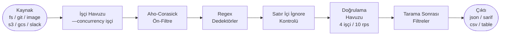

# Nasıl Çalışır

Leakwatch hattını anlamak, performansı ayarlamanıza, sonuçları yorumlamanıza ve hangi bayrakları kullanacağınıza karar vermenize yardımcı olur. Bu sayfa, bir tarama komutunu çalıştırdığınız andan bir bulgunun çıktınızda göründüğü ana kadar neler olduğunu açıklar.

## Hatta genel bakış



Her aşama aşağıda ayrıntılı olarak açıklanmaktadır.

## 1. Kaynak

Her tarama, motorun işlemesi için veri parçaları yayan bir soyutlama olan **Kaynak** ile başlar. Leakwatch altı kaynak ile birlikte gelir:

| Kaynak | Komut | Ne yayar |
|--------|-------|----------|
| Dosya sistemi | `scan fs` | Yerel bir dizin ağacındaki dosya içerikleri |
| Git geçmişi | `scan git` | Tüm commit geçmişindeki her blob |
| Konteyner imajı | `scan image` | Bir OCI/Docker imajının katman içerikleri, daemonsuz |
| AWS S3 | `scan s3` | Bir S3 kovasındaki nesne içerikleri |
| Google Cloud Storage | `scan gcs` | Bir GCS kovasındaki nesne içerikleri |
| Slack | `scan slack` | Kanal ve DM'lerdeki mesaj metni |

:::note
Slack taraması yalnızca **mesaj metnini** kapsar. Slack'e yüklenen dosyaların içerikleri taranmaz.
:::

Parçalar, işçi havuzu tarafından tüketilen tamponlu bir kanala akar.

## 2. İşçi havuzu

Motor, sabit sayıda **goroutine** içeren bir havuz yönetir — her biri `--concurrency` değerine karşılık gelir (varsayılan: CPU sayısı). Her işçi kanaldan bir parça alır ve tespit hattını bağımsız olarak çalıştırır. İşçiler değişebilir durum paylaşmadığından havuz, I/O ve bellek sınırlarına kadar eşzamanlılıkla doğrusal ölçeklenir.

Taramalar `SIGINT` / `SIGTERM`'e yanıt verir: iptal sinyali geldiğinde bağlam iptal edilir, işçiler mevcut parçalarını tamamlayıp durur ve kısmi sonuçlar çıktı yazılmadan önce toplanır.

## 3. Aho-Corasick anahtar kelime ön-filtresi

Her parça üzerinde 63 regex desenini çalıştırmak yavaş olur. Bunun yerine motor, başlangıçta her dedektörün bildirdiği anahtar kelime listelerinden tek bir **Aho-Corasick çok-desenli otomat** oluşturur. Her parça için bu otomat tek bir doğrusal geçiş yapar ve yalnızca anahtar kelimeleri parçanın baytlarında görünen dedektörleri döndürür.

Bu, çoğu dedektörün çoğu parça üzerinde regex'ini hiç çalıştırmadığı anlamına gelir. Anahtar kelime bildirmeyen dedektörler her zaman çalışır (ön filtreyi atlayarak doğrudan regex'e geçerler).

Aho-Corasick uygulaması [cloudflare/ahocorasick](https://github.com/cloudflare/ahocorasick) kütüphanesinden gelmektedir.

## 4. Regex dedektörler

Kısa listeye alınan her dedektör, derlenmiş **düzenli ifadesini** parça baytları üzerinde çalıştırır. Bir desen eşleştiğinde dedektör şunları içeren bir `RawFinding` döndürür:

- Ham sır baytları (yalnızca doğrulama için bellekte tutulur; asla loglanmaz veya diske yazılmaz).
- Çıktı için güvenli olan **maskelenmiş** bir gösterim.
- İsteğe bağlı ek meta veri (örneğin bir AWS anahtarı için hesap kimliği).

Leakwatch, 60 paket genelinde **63 yerleşik dedektör** ile birlikte gelir; bulut sağlayıcılarını, yapay zekâ API'lerini, ödeme platformlarını, veritabanlarını, mesajlaşma araçlarını, sürüm kontrolünü ve daha fazlasını kapsar. [Özel YAML kuralları](#/detectors/custom-rules) aracılığıyla kendi desenlerinizi ekleyebilirsiniz.

Tüm dedektörler, Go'nun `init()` işlevi ve boş importlar kullanılarak derleme zamanında kaydedilir (ADR-0004). Çalışma zamanında eklenti yükleyici veya dinamik keşif yoktur.

## 5. Satır içi ignore kontrolü

Bir bulgu doğrulamaya gönderilmeden önce motor, kaynak satırın bir **satır içi ignore işareti** içerip içermediğini kontrol eder:

```go
// leakwatch:ignore
```

veya dedektöre özgü bir varyant:

```go
// leakwatch:ignore:aws-access-key-id
```

İşaret mevcutsa bulgu, **herhangi bir ağ çağrısı yapılmadan önce** sessizce bırakılır. Bu kasıtlıdır: yoksayılan sırlar asla canlı bir API isteğini tetiklememeli.

## 6. Doğrulama

Tüm parçalar için tespit tamamlandıktan sonra motor, bulguları ayrı bir **doğrulama işçi havuzuna** geçirir (varsayılan 4 işçi). Doğrulama:

- Tüm işçiler arasında paylaşılan global bir **hız sınırlayıcı** (varsayılan saniyede 10 istek) ile korunur.
- Her API çağrısına **istek başına zaman aşımı** (varsayılan 10 saniye) uygular.
- Sağlayıcıya yalnızca **salt-okunur, yıkıcı olmayan** çağrılar yapar (örneğin AWS anahtarları için `sts:GetCallerIdentity`).
- Her bulguyu dört durumdan biriyle işaretler: `verified:active`, `verified:inactive`, `unverified` veya `verify:error`.

Leakwatch **54 doğrulayıcı** ile birlikte gelir; 63 yerleşik dedektör türünün %85,7'sini kapsar. Kalan 9 tür (JWT'ler ve genel API anahtarları gibi) güvenli biçimde doğrulanamaz ve her zaman `unverified` olarak raporlanır.

Bu aşamayı tamamen atlamak için `--no-verify` geçirin — hızlı, çevrimdışı taramalar için kullanışlıdır.

Doğrulama davranışı ve durum anlamları hakkında derinlemesine bilgi için [Doğrulama Nasıl Çalışır](#/verification/how-verification-works) sayfasına bakın.

## 7. Bulgu kimliği ve entropi

Her bulgu, şu şekilde hesaplanan **deterministik bir kimlik** alır:

```
sha256(dedektörID + maskelendi + dosyaYolu + satır)  →  16 hex karaktere kısaltıldı
```

Aynı konumdaki aynı sır her zaman aynı kimliği üretir; bu da bulguları çalıştırmalar arasında yinelenenleri kaldırmayı veya sorun izleyicilerde takip etmeyi güvenli kılar.

**Shannon entropisi** (aralık 0–8) her bulgu için hesaplanır ve bilgilendirme amacıyla çıktıda gösterilir. Motor düzeyinde entropi, yerleşik bulguları **engellemez veya düşürmez** — düşük entropili bir eşleşme yine de sonuçlarda görünür. Entropi eşikleri yalnızca özel kuralların içinde geçerlidir; her kural kendi minimumunu bildirebilir.

## 8. Tarama sonrası filtreler

Doğrulamadan sonra iki filtre uygulanır:

- `--only-verified` — `verified:active` olmayan tüm bulguları bırakır.
- `--min-severity` — belirtilen önem düzeyinin (`low` | `medium` | `high` | `critical`; varsayılan `low`) altındaki bulguları bırakır.

Her iki filtre de doğrulama sonrasında çalışır; böylece `--only-verified` değerlendirildiğinde doğrulama durumu kullanılabilir olur.

## 9. Çıktı

Hayatta kalan bulgular dört **biçimleyiciden** birine iletilir:

| Biçim | Bayrak | Yaygın kullanım |
|-------|--------|-----------------|
| JSON | `--format json` (varsayılan) | Makine tarafından okunabilir, hat dostu |
| SARIF v2.1.0 | `--format sarif` | GitHub Code Scanning, güvenlik panoları |
| CSV | `--format csv` | Elektronik tablolar, veri analizi |
| Tablo | `--format table` | Terminal incelemesi, önem derecesine göre renklendirilmiş |

Çıktı varsayılan olarak stdout'a gider; bir dosyaya yazmak için `--output <dosya>` kullanın.

Biçim veya çıktı hedefi ne olursa olsun, her taramadan sonra bir **tarama özeti** (tarih, kaynak türü, hedef, taranan dosyalar, süre, bulgu sayısı, kesme durumu) her zaman **stderr**'e yazdırılır.

## Sır güvenliği

Leakwatch, bulunan sırların doğrulama çağrıları dışında süreç sınırını asla terk etmemesi için tasarlanmıştır:

- Ham sır baytları yalnızca tespit ve doğrulama sırasında bellekte yaşar.
- `--show-raw` bayrağı varsayılan olarak `false`'tur; bu olmadan çıktıda yalnızca maskelenmiş gösterim görünür.
- Sırlar asla diske yazılmaz, `slog` aracılığıyla loglanmaz veya çalıştırmalar arasında önbelleğe alınmaz.

## Tasarım kararları

Mimari, ADR'ler olarak belgelenmiş çeşitli bilinçli seçimleri yansıtır:

- **Go + CGO devre dışı** (ADR-0001) — tek statik ikili dosya, çalışma zamanı bağımlılığı yok, tüm platformlara çapraz derlenir.
- **Cobra + Viper** (ADR-0002) — `bayrak > env > yapılandırma > varsayılan` önceliğiyle hiyerarşik CLI.
- **go-git** (ADR-0003) — saf Go Git kütüphanesi; harici `git` ikili dosyası gerekmez.
- **Derleme zamanı dedektör kaydı** (ADR-0004) — `init()` + boş importlar; tür güvenli, çalışma zamanı eklenti yükleyicisi yok.
- **Aho-Corasick hibrit eşleştirme** (ADR-0005) — ön filtre, alakasız parçalardaki regex çalışmasının çoğunu ortadan kaldırır.
- **go-containerregistry** (ADR-0006) — daemonsuz katman analizi; imajları taramak için Docker daemon gerekmez.
- **İşçi havuzu** (ADR-0008) — sabit goroutine sayısı, kanal tabanlı fan-out; öngörülebilir bellek ve CPU kullanımı.

## Ayrıca bakın

- [Hızlı Başlangıç](#/getting-started/quick-start)
- [Doğrulama Nasıl Çalışır](#/verification/how-verification-works)
- [Yapılandırma Dosyası](#/configuration/config-file)
- [CLI Referansı](#/reference/cli-reference)
- [Özel Kurallar](#/detectors/custom-rules)
